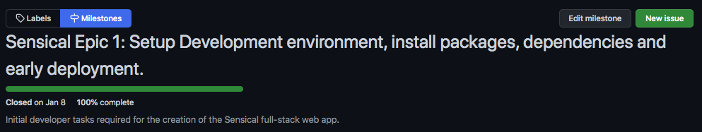
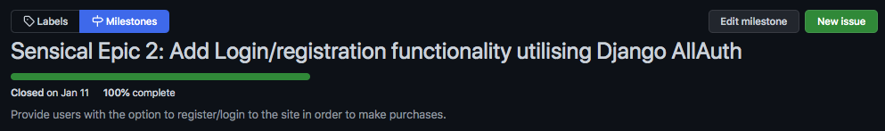
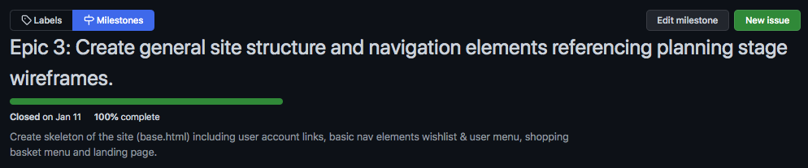
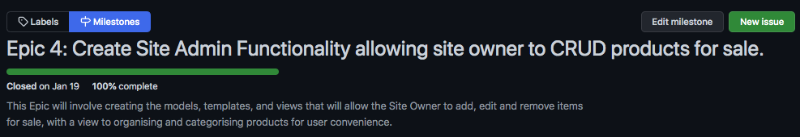
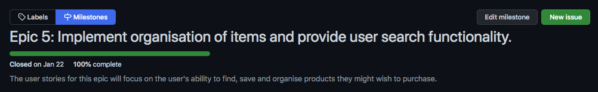
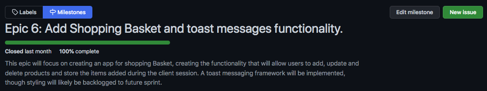
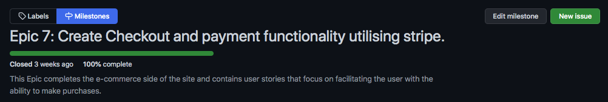
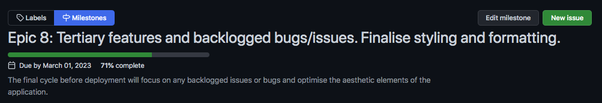
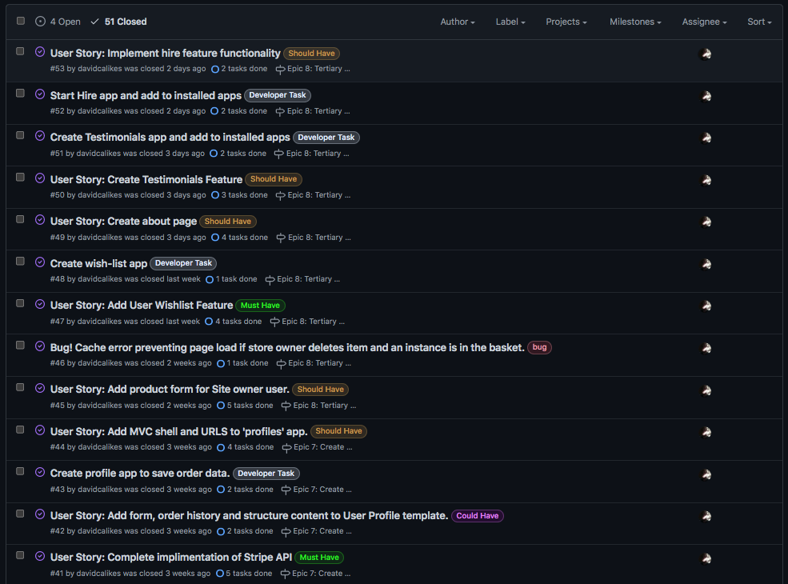
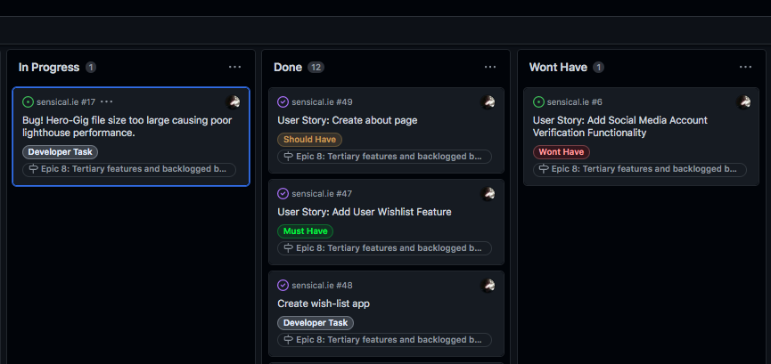

# Agile

## Overview

The Agile planning methodology was used during the development of Sensical.ie. GitHub Projects, Boards, Milestones and Issues were utilised to Organise the development into Sprints, Kanban Boards, Epics, and User Stories respectively.

 

This was just my second time approaching a project using Agile, and I applied many of the lessons I learned during my first experience to the Sensical project.

These include:

* Creating More Sprints/Cycles

During the last project, I struggled initially with the planning of sprints due to my unfamiliarity with the Django Framework.
This time around, I feel I gave much more thought to the development tasks and planning phase at the beginning of the project,
including them in the overall Agile process. As the codebase and scope of this project was larger than the last, 
I doubled the amount of sprints to more effectively separate and manage the units of work.

* Using a waterfall approach when creating Epics

As I will explain, during the first Agile project I managed, I made the mistake of slipping into the traditional 'Waterfall' project management method the further I progressed into the project. I attributed this to the fact that the Agile process is usually followed by a team of people, enfusing multiple work units together simultaniously.

With this project, I decided not to worry too much on the sequence of the process and instead embrace a psuedo-waterfall approach, as by working alone some sort of linear pattern to the development was always going to manifest itself. I am aware that this is not what will happen in real world situations, and that the reason agile cycles, meetings and backlogs etc are essential to modern development, is the ability to adapt and change the project quickly and efficiently from any rigid plan or structure.

So the Epics I created were designed using a linear approach and organised in order of the importance of the features they contributed to the project.

* Add more user stories during development

In essence, using the Agile tool when working alone on a project of this size is far more beneficial than not, regardless of its real-world, practical use.
One of the absolutely essential benefits of creating Epics, User Stories and boards is the ability to focus soley on one particualar area of the project code at a time. During the last project however, I was too rigid in my approach to adding and removing user stories as the project started to develop.

During this project, I was much more forthright in my actions and pushed many items from each cycle to the project backlog and added user stories to add value to the project as I went along. I felt like this was a true reflection of the Agile approach.

 

## MoSCoW

When utilising MoSCow prioritisation I felt I had a good mix of 'Must Have', 'Could Have', 'Should Have' and 'Wont Have This Time' cards. I re-organised many of the 'Should Have' priority cards by creating time and space to address the project backlog in the final development cycle.

 

## Epics

Eight Epics in total were created for reference during the agile process and used GitHub 'Milestones' to link the 'User Stories' created during the User Experience Design phase of the project planning. 

 

The Eight Epics Created:

1. [Sensical Epic 1: Setup Development environment, install packages, dependencies and early deployment.](https://github.com/davidcalikes/sensical.ie/milestone/1)

This Epic contains the initial development tasks including setting up the dev environment, installing packages, setting up the skeleton project, and Early deployment to Heroku.

 

2. [Sensical Epic 2: Add Login/registration functionality utilising Django AllAuth](https://github.com/davidcalikes/sensical.ie/milestone/2)

This Epic helps users to login/register to use the app and recieve benifits, such as the ability to save their purchase history and delivery details and also access the user wishlist feature. 

 

3. [Epic 3: Create general site structure and navigation elements referencing planning stage wireframes.](https://github.com/davidcalikes/sensical.ie/milestone/3)

The user stories associated with Epic 3 create the skeleton of the site that will allow most users to navigate through its contents. Add placeholder styles and content.

 

4. [Epic 4: Create Site Admin Functionality allowing site owner to CRUD products for sale.](https://github.com/davidcalikes/sensical.ie/milestone/5)

This Epic focuses on providing the site owner with the ability to upload and edit products for sale on the e-Commerce Webstore.

 

5. [Epic 5: Implement organisation of items and provide user search functionality.](https://github.com/davidcalikes/sensical.ie/milestone/7)

This Epic provides the users with search functionality and product categorisation features. Making it easier for users to find products they might like to purchase.

 

6. [Epic 6: Add Shopping Basket and toast messages functionality.](https://github.com/davidcalikes/sensical.ie/milestone/6)

The user stories and work units associated with Epic 6 Focus on helping users add items to a virtual shopping basket and providing visual feedback in the form of toast messages.

 

6. [Epic 7: Create Checkout and payment functionality utilising stripe.](https://github.com/davidcalikes/sensical.ie/milestone/8)

By far the most time-consuming and complex series of user stories where derived from Epic 7 and largely focused on adding payment functionality with Stripe.

 

6. [Epic 8: Tertiary features and backlogged bugs/issues. Finalise styling and formatting.](https://github.com/davidcalikes/sensical.ie/milestone/4)

Epic 8 implimented the tiertiary features of the application like hire packages and testimonials. There was also a significant project backlog of incomplete issues from earlier user stories that were addressed here.

 

## Agile User Stories

 

The User Stories created for reference within the Agile framework were derived from both the Epics created and also the empathetic User Stories I created as a result of planning research during the 'User Experience Design' phase of the project. I used GitHub Issues to create cards for Agile User Stories, Development Tasks, and Bugs.

The structure of a Sensical.ie Agile User Story can be seen below.

 _Agile User Story_

As evidenced above, the title of Each Agile User Story Issue can be more accurately thought of as a descriptive overview of the tasks within the Issue. The actual UX design User Story or Multiple Stories this issue will address is written at the top part of each Issue Card.

Each Issue Card contains:

* A Title: Descriptive overview of the issue/ticket

* The User Story the issue addresses

* Acceptance Criteria for each issue/ticket

* Tasks required to satisfy the acceptance criteria

* A label that determines the priority of each issue

* An assigned Kanban board

* An assigned Epic

 

The final amount of issues created totalled 55, of which 24 had the 'Developer Tasks' label, 18 had the 'Must Have' user story label 14 were labelled 'Should Have' 4 were tagged 'Could Have' and one was re-badged to a 'Won't have'. 5 were labelled as 'bugs' that I added during development. Some issues were given more than one label.

_Agile Issues_

The full list of issues for the project is available [here](https://github.com/davidcalikes/sensical.ie/issues?q=is%3Aissue+is%3Aclosed)

 

## Sprints

### Sprints Duration

Although I had a little experience working with the Agile methodology and Django as a framework from my previous project, I still felt I had few reference points that could inform my decision making when it came to allowing sufficient time for each sprint, whilst setting a realistic, achievable deadlines. Tackling unfamiliar API's like Stripe and Mailchimp meant that timeboxing for this project was always going to be more fluid than it would be for a more experienced developer or development team. 

### [Sensical.ie Sprint 1 -- Overview](https://github.com/users/davidcalikes/projects/12/views/1)

Learning from my last encounter with the Agile process I attributed significant amount of time just to get my development environment set up and th proper packages installed. This Sprint was very short and I included parts of project planning and creating the referance wireframes during this cycle.

 

### Developer Tasks and User Stories Completed During Sprint 1
 

* [Install Django and Gunicorn HTTP Server](https://github.com/davidcalikes/sensical.ie/issues/1)

* [Install Cloudinary storage and add requirements.txt file](https://github.com/davidcalikes/sensical.ie/issues/2)

* [Start Django Project and create Heroku App](https://github.com/davidcalikes/sensical.ie/issues/3)

 

### Sprint 1 Evaluation

Development time -- 3 days.

Sprint one was relatively straight forward as mentioned befor, I used time attributed to this cycle plan outside of the development environment. 

 

### [Sensical.ie Sprint 2 -- Overview](https://github.com/users/davidcalikes/projects/13)

Sprint 2 focused on adding Django Allauth user authentication functionality. 

 

### User Stories Completed During Sprint 2
 

* [Install Django Allauth](https://github.com/davidcalikes/sensical.ie/issues/4)

* [Add authentication and Email backends for Email account verification](https://github.com/davidcalikes/sensical.ie/issues/5)

* [Developer Task: Import allauth templates for customisation](https://github.com/davidcalikes/sensical.ie/issues/7)

 

### Sprint 2 Evaluation

Development time -- 2 days.

The Second sprint was completed ahead of schedule and I found that my relative lack of experience in using both Django and Agile had caused me to create sprints with less work units than required. I think this was a reaction to my last project using Django where I tended to add to many user stories and tasks to each sprint. I compensated here by increasing the level of work units in sprint three.

 

### [Sensical.ie Sprint 3 -- Overview](https://github.com/users/davidcalikes/projects/14/views/1)

Sprint 3 focused on creating the skeleton structure for the front-end of the application. 

 

### User Stories Completed During Sprint 3
 

* [Developer Task: Create Home App for Landing page](https://github.com/davidcalikes/sensical.ie/issues/11)

* [User Story: Add base template and header content.](https://github.com/davidcalikes/sensical.ie/issues/8)

* [User Story: Add fontawesome Icons and create default Icon style rules.](https://github.com/davidcalikes/sensical.ie/issues/9)

* [Bug! Content overlapping in smaller screen widths](https://github.com/davidcalikes/sensical.ie/issues/12)

* [User Story: Add main navigation bar to base template.](https://github.com/davidcalikes/sensical.ie/issues/13)

* [User Story: Add footer with developer links.](https://github.com/davidcalikes/sensical.ie/issues/14)

 

### Sprint 3 Evaluation

Development time -- 5 days.

The third sprint was completed on schedule and again I found following each issue in turn to be extremely productive. This sprint focused on the creating the basic site structure and implimenting all of the main navigation functionality. I feel the amount of user stories and tasks in this sprint was close to optimal for a project of this scope.

 

### [Sensical.ie Sprint 4 -- Overview](https://github.com/users/davidcalikes/projects/16)

Sprint 4 focused on developing the products app functionality which creates stores and displays products for sale in the e-Commerce Webstore. 

 

### User Stories Completed During Sprint 4

 

* [Start new 'Products' app in Sensical project and add to installed apps in settings file.](https://github.com/davidcalikes/sensical.ie/issues/15)

* [User Story: Create Product and Category Models for Products app.](https://github.com/davidcalikes/sensical.ie/issues/16)

* [User Story: Create Products Management feature for site owner with full CRUD functionality.](https://github.com/davidcalikes/sensical.ie/issues/18)

* [User Story: Maximise responsivity in products template.](https://github.com/davidcalikes/sensical.ie/issues/21)

* [User Story: Refine Products Template to properly display items to the user.](https://github.com/davidcalikes/sensical.ie/issues/19)

* [User Story: Create MVT for Product Detail Page.](https://github.com/davidcalikes/sensical.ie/issues/20)

 

### Sprint 4 Evaluation

Development time -- 6 days.

The fourth sprint was again very close to optimal and appeared to contain the ideal amount of work units for this part of the project.

### [Sensical.ie Sprint 5 -- Overview](https://github.com/users/davidcalikes/projects/19)

The user stories in this sprint created the search and sort functionality that allows users to find products more easily.

 

### Developer Tasks and User Stories Completed During Sprint 5
 

* [User Story: Add Search and Categorisation features.](https://github.com/davidcalikes/sensical.ie/issues/23)

* [User Story: Add sorting by price and name functionality.](https://github.com/davidcalikes/sensical.ie/issues/24)

* [User Story: Add "Availability' toggle to products page.](https://github.com/davidcalikes/sensical.ie/issues/25)

* [Bug! Availability checkbox state not stored across products categories!](https://github.com/davidcalikes/sensical.ie/issues/26)

 

### Sprint 5 Evaluation

Development time -- 5 days.

Sprint five was proved more difficult than I anticipated and adding a javascript availabilty toggle during the development was probably not a good idea although I feel the project overall does benefit from this feature.

 

### [Sensical.ie Sprint 6 -- Overview](https://github.com/users/davidcalikes/projects/18/views/1)

Sprint 6 was about creating the shopping basket funtionality and adding toast messages for user feedback.

 

### User Stories Completed During Sprint 6
 

* [Start shopping basket app and add to installed apps](https://github.com/davidcalikes/sensical.ie/issues/27)

* [Add contexts file to basket app.](https://github.com/davidcalikes/sensical.ie/issues/29)

* [User Story: Add shopping basket view, template and urls.](https://github.com/davidcalikes/sensical.ie/issues/28)

* [User Story: Add quantities of products/items and display sum total of items to user.](https://github.com/davidcalikes/sensical.ie/issues/30)

* [User Story: Add alert overlay that shows number of items in basket.](https://github.com/davidcalikes/sensical.ie/issues/32)

* [User Story: Refine basket template to display basket items summary.](https://github.com/davidcalikes/sensical.ie/issues/31)

* [User Story: Add messaging toasts framework to provide interactive user feedback.](https://github.com/davidcalikes/sensical.ie/issues/33)

 

### Sprint 6 Evaluation

Development time -- 7 days.

This sprint took much more time as the code base began to grow significantly and the relationships between models became more complex. The number of work units in this sprint seemed to be optimal.

 

### [Sensical.ie Sprint 7 -- Overview](https://github.com/users/davidcalikes/projects/21)

Sprint 7 was the most important cycle of all of the 8 sprints. This cycle contained the core functionality of any e-Commerce Webstore by implimenting secure payments via an Payment Processing API. (Stripe)

 

### User Stories Completed During Sprint 7
 

* [Create Checkout App.](https://github.com/davidcalikes/sensical.ie/issues/34)

* [User Story: Create Checkout page Models and CrispyForms Order form](https://github.com/davidcalikes/sensical.ie/issues/35)

* [User Story: Register Checkout models in Django Admin](https://github.com/davidcalikes/sensical.ie/issues/36)

* [User Story: Add Views and templates for checkout app.](https://github.com/davidcalikes/sensical.ie/issues/37)

* [Developer Task: Install stripe.](https://github.com/davidcalikes/sensical.ie/issues/38)

* [User Story: Add card element for user to input payment card details.](https://github.com/davidcalikes/sensical.ie/issues/39)

* [User Story: Complete implimentation of Stripe API](https://github.com/davidcalikes/sensical.ie/issues/41)

* [User Story: Add Stripe Core functionality](https://github.com/davidcalikes/sensical.ie/issues/40)

* [Create profile app to save order data.](https://github.com/davidcalikes/sensical.ie/issues/43)

* [User Story: Add MVC shell and URLS to 'profiles' app.](https://github.com/davidcalikes/sensical.ie/issues/44)

* [User Story: Add form, order history and structure content to User Profile template.](https://github.com/davidcalikes/sensical.ie/issues/42)

 

### Sprint 7 Evaluation

Development time -- 11 days.

The integration of the Stripe payments API with this project made Sprint 7 the most challenging and time consuming part of developing the Sensical.ie site. I was pleased to complete the work units associated with this cycle in what I consider to be a respectable amount of time. I certainly benefited from the encouragement and guidance of Richard Wells, with whom I have developed a solid Junior Developer - Senior Developer working relationship.  

 

### [Sensical.ie Sprint 8 -- Overview](https://github.com/users/davidcalikes/projects/15)

The final Sprint of the Project cleared the project management board of outstanding backlogged user stories and added tiertiary features that to the site that were not associated with the core e-commerce functionality such as Client Testimonials and Hire Packages

 

### User Stories Completed During Sprint 8

 

* [User Story: Create about page](https://github.com/davidcalikes/sensical.ie/issues/49)

* [User Story: Add User Wishlist Feature](https://github.com/davidcalikes/sensical.ie/issues/47)

* [Create wish-list app](https://github.com/davidcalikes/sensical.ie/issues/48)

* [Start Hire app and add to installed apps](https://github.com/davidcalikes/sensical.ie/issues/52)

* [User Story: Implement hire feature functionality](https://github.com/davidcalikes/sensical.ie/issues/53)

* [Create Testimonials app and add to installed apps.](https://github.com/davidcalikes/sensical.ie/issues/51)

* [User Story: Create Testimonials Feature.](https://github.com/davidcalikes/sensical.ie/issues/50)

* [User Story: Add wish-list, In-stock, checkout and sensory links to product template cards.](https://github.com/davidcalikes/sensical.ie/issues/22)

* [User Story: Add product form for Site owner user.](https://github.com/davidcalikes/sensical.ie/issues/45)

* [Bug! Cache error preventing page load if store owner deletes item and an instance is in the basket.](https://github.com/davidcalikes/sensical.ie/issues/46)

* [Start a Django app called 'packages' and add to installed apps in settings](https://github.com/davidcalikes/sensical.ie/issues/54)

* [User Story: Create MVC for Packages app, wire up URLS and add form functionality.](https://github.com/davidcalikes/sensical.ie/issues/55)

 

### Sprint 8 Evaluation

Development time -- 14 days.

The final sprint was probably too long and contained too many user stories. These issues were smaller and less complex than the more complex coding of the e-Commerce related sprints but when combined with the project backlog of outstanding bugs and unfinished user stories.

I was aware of this as I progressed through the development and I will certainly aim to create a more even spread of work units to avoid a similar situation in future projects.

### User Stories Not Completed

The following issues were marked as 'wont have' and moved to the 'Future Features' column on the Sprint 8 Kanban board.

* [User Story: Add Social Media Account Verification Functionality](https://github.com/davidcalikes/sensical.ie/issues/6)

_Agile Issues_

 

## Agile Summary

The resulting minimum viable product, of the first iteration of Sensical.ie would not have been possible without the myriad benefits of Agile. These include, the rapid development of a marketable MVP, the simple prioritisation and implementation of features, focus on individual tasks and the continuous feeling of improvement and delivery of tangible progress moving through the tasks.

* Given how much I have learned about creating Kanban boards, Issues etc, I think I will be more confident in my ability moving forward to predict the time it will take to complete each unit of work. This is especially applicable for future Django projects as my skill with the framework has grown significantly.

* Prioritisation is another area I feel I have a much better understanding of. With an app like Sensical.ie it was very difficult to prioritise say accessibility features over security and payment features.

Return to main [README](https://github.com/davidcalikes/sensical.ie/blob/main/docs/README.md) document.