# Sensical.ie

## Overview

Sensical.ie is a full stack, E-commerce, web application offering affordable, multi-sensory products and solutions to a growing and diverse target audience.

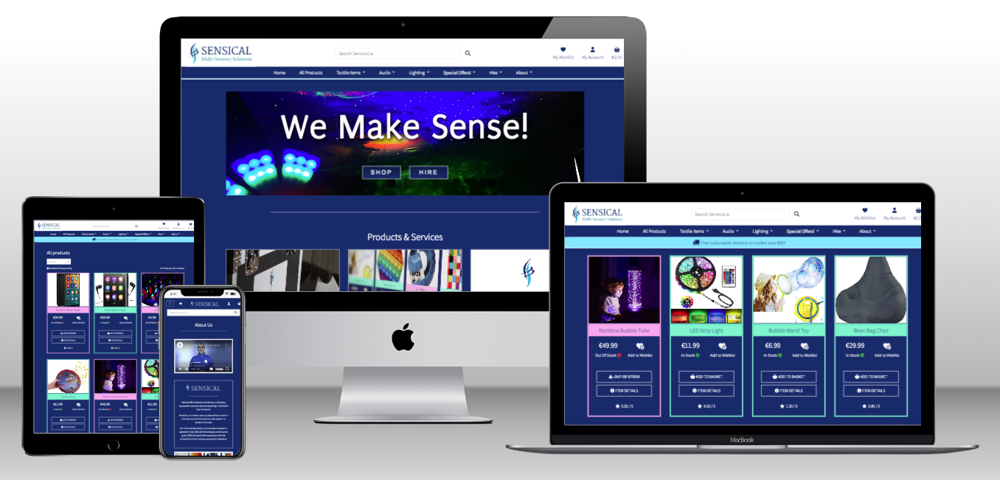

 

When it comes to creating multi-sensory environments, a custom-built, dedicated multi sensory space is always the optimal solution. 

Where this is not possible, Sensical Multi-Sensory Solutions can provide a pop-up style multi-sensory experience at an affordable price.

Originally called Sensical 'Mobile Sensory Environments', the business was established in 2018, operating as a business-to-client sole-trader. Like most small enterprises the project was severely impacted by the global COVID-19 pandemic.

In an attempt to protect the venture from future existential threats, the business owner developed a new growth-through-diversification strategy for the enterprise.

Offering affordable, high-quality, sensory products that enhance the experience of sensory therapy service users, the Sensical.ie, e-Commerce Webstore will create a vital second revenue stream, for the business owners whilst developing a more robust, synergetic business strategy with the 'Mobile Sensory Environments' (Equipment Hire) branch of the Sensical enterprise.

Utilising the Django Full Stack Web Framework, Bootstrap, Stripe API for secure payments, and underwritten by the principles of User Experience design and Search Engine Optimisation, the Sensical.ie Webstore offers its customers an effortless, logical, and rewarding user experience.

 

## Background Information

I established Sensical 'Mobile-Sensory Environments' in 2018 and operated the business as a sole trader. Throughout the rest of this project's documentation including the README, AGILE and TESTING.md files, I will refer to "The Business Owner" or "Site Owner" in an attempt to make the distinction between myself as a software developer and as the owner-operator of the Sensical enterprise.

'Sensical MSE' was borne out of the real-world need for low-cost multi-sensory rooms/experiences in the ever-changing landscape of disability care provision in Ireland.

 

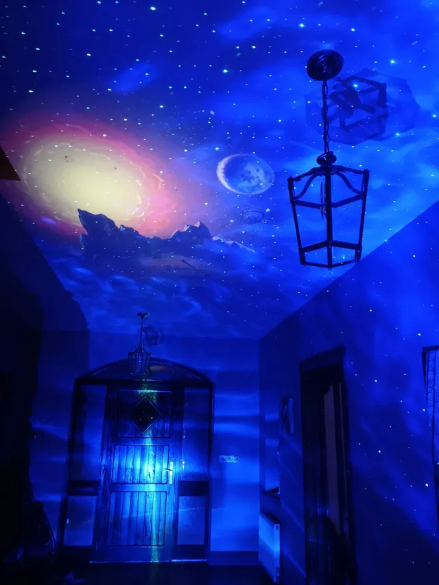 
_Senso~1 Portable Lighting System in 2018_

 

[Live project: Sensical.ie](https://sensical-ireland.herokuapp.com/)

 

# Contents

* [Planning & Research](https://github.com/davidcalikes/sensical.ie#planning--research)
    * [Prior Business Model](https://github.com/davidcalikes/sensical.ie#prior-business-model)
    * [Primary Audience](https://github.com/davidcalikes/sensical.ie#primary-target-audience)
    * [Secondary Audience](https://github.com/davidcalikes/sensical.ie#secondary-target-audience)
    * [Drawbacks](https://github.com/davidcalikes/sensical.ie#drawbacks)
    * [New Business Model](https://github.com/davidcalikes/sensical.ie#new-business-model)
    * [Problem Statement](https://github.com/davidcalikes/sensical.ie#project-problem-statement)
    * [User Experience Design](https://github.com/davidcalikes/sensical.ie#user-experience-design)
    * [User Stories](https://github.com/davidcalikes/sensical.ie#user-stories)
    * [Database Schema](https://github.com/davidcalikes/sensical.ie#database-schema)
    * [Data Flow](https://github.com/davidcalikes/sensical.ie#data-flow)

* [Agile](https://github.com/davidcalikes/sensical.ie#agile)

* [Visual Design](https://github.com/davidcalikes/sensical.ie#visual-design)
    * [Wireframes](https://github.com/davidcalikes/sensical.ie#wireframes)
    * [Color Scheme](https://github.com/davidcalikes/sensical.ie#color-scheme)
    * [Typography](https://github.com/davidcalikes/sensical.ie#typography)

* [Features](https://github.com/davidcalikes/sensical.ie#features)
    * [Existing Features](https://github.com/davidcalikes/sensical.ie#existing-features)
        * [Features present across all pages](https://github.com/davidcalikes/sensical.ie#features-present-across-all-pages)
            * [The Navbar](https://github.com/davidcalikes/sensical.ie#the-navbar)
            * [The Delivery Banner](https://github.com/davidcalikes/sensical.ie#the-delivery-banner)
            * [Footer](https://github.com/davidcalikes/sensical.ie#the-footer)

        * [Individual Pages](https://github.com/davidcalikes/sensical.ie#individual-pages)
            * [Home Page](https://github.com/davidcalikes/sensical.ie#home-page)
            * [Products Page](https://github.com/davidcalikes/sensical.ie#products-page)
            * [Product Detail Page](https://github.com/davidcalikes/sensical.ie#product-detail-page)
            * [Wishlist Page](https://github.com/davidcalikes/sensical.ie#wishlist-page)
            * [Checkout Page](https://github.com/davidcalikes/sensical.ie#checkout-page)
            * [Hire Page](https://github.com/davidcalikes/sensical.ie#hire-page)
            * [Packages Page](https://github.com/davidcalikes/sensical.ie#packages-page)
            * [Testimonials Page](https://github.com/davidcalikes/sensical.ie#testimonials-page)
            * [Other Features](https://github.com/davidcalikes/sensical.ie#other-notable-features)
            * [Future Features](https://github.com/davidcalikes/sensical.ie#future-features)

* [Testing](https://github.com/davidcalikes/sensical.ie#testing)
* [Deployment](https://github.com/davidcalikes/sensical.ie#deployment)
    * [Database](https://github.com/davidcalikes/sensical.ie#database)
    * [Deploying to Heroku](https://github.com/davidcalikes/sensical.ie#deploying-to-heroku)
    * [Forking Sensical.ie](https://github.com/davidcalikes/sensical.ie#forking-the-github-repository)
    * [Cloning Sensical.ie](https://github.com/davidcalikes/sensical.ie#forking-the-github-repository)

* [Technologies](https://github.com/davidcalikes/sensical.ie#technologies)
    * [Software](https://github.com/davidcalikes/sensical.ie#software)

* [Media](https://github.com/davidcalikes/sesnical.ie#media)

* [Credits](https://github.com/davidcalikes/sensical.ie#credits)

* [Thanks](https://github.com/davidcalikes/sensical.ie#thanks)

 

# Planning & Research

## Prior Business Model

 

### Primary Target Audience:

 

Having witnessed first-hand the scale and impact of sweeping [deinstitutionalisation](https://en.wikipedia.org/wiki/Deinstitutionalisation) reforms within Irish state-run healthcare facilities, the business owner noticed an opportunity to provide patients and service users with affordable, sensory experiences.

Whilst wholeheartedly agreeing that the rights and dignity of residential service users should always be paramount, there are [many issues](https://journals.sagepub.com/doi/full/10.1177/1468017318793620) that arise when deinstitutionalisation occurs.

There are two key negative consequences that affect the provision of Multi-Sensory Services as a result of this process.

* The decentralisation of resources leading to limited access/availability.

* Lack of funding for therapeutic activites due to increased cost of living

As mentioned above, there is no substitute for a purpose-built, well-maintained, fully stocked Multi-Sensory Room. Many residential care centers(institutions) would offer residents scheduled access to such a facility on a regular basis. Situated on campus grounds, the MSR would be wheelchair accessable and just a short distance from a place of residence. Moving service users into community housing severely removes or obstructs this access due to remote housing locations and transportation issues.

There are also issues with finding the funds, physical space, and expertise to build and maintain a high-quality, sensory room within community housing.

This is where Sensical Mobile-Sensory Environments can help. For a nominal fee, the pop-up sensory service can transform almost any room into a viable sensory space. 

This is achieved by the following. 

* Bringing the Sensory Equipment to the service user at their point of need.

* Setting up the space by safely blacking-out natural light and implimenting a custom-built, industry standard, sensory lighting system.

* Applying relaxing sensory sounds and fragrances to suit the clients needs.

* Supplying supplementary tactile items to enhance the service users enjoyment.

Benefits of the service include:

* Continuity of service. Users can enjoy the familiarity of having a recognisible service even if they move house or use the service in different areas like day care or school.

* No maintenance costs or storage issues. Sensical maintains its own equipment to the highest standard and removes it when you are finished.

* No travel or dedicated space required. Sensical systems are set up within minutes.

* No huge outlay or lengthy contract. Just pay as you go.

### Secondary Target Audience

The original business was also aimed at customers who needed sensory services in their own private residences. The service proved popular with parents and children with autistic spectrum disorder and learning disabilities. Another way customers utilised the service was block-booking sensory equipment for private residential birthday parties, where one or more of the attendees could avail of a relaxing space should they become overstimulated. 

 

_Prior business model._
  

## Drawbacks

There are of course drawbacks to any business plan and Sensical is no different.

Firstly, the business model is, in essence, part of what many call 'the gig economy'. This means that the business will not produce revenue unless it is consistently finding new customers and providing the service on a regular basis.

Initially, this was not an immediate problem, as the business owner was highly motivated, technically minded, and had a huge wealth of knowledge and transferable skills from many years working as a successful touring musician.

Unfortunately, like every other small enterprise, Sensical MSE was badly affected by the COVID-19 pandemic. Due to restrictions on movement, entering residences, social distancing guidelines, and the closure of schools and day centers, the project ground to a halt in 2020.

As with many other startup owners during Covid, the year 2020 proved to be a time of reflection and creative restructuring for the owner operator of Sensical Mobile Sensory Environments.

I have outlined in the sections below the owner's new vision for the re-imagined company, and the role they hope this e-commerce website will have in making the new business commercially successful.

 

## New Business Model

 

_New business model._

 

Updated Business Strategy
 

Adopting the principles of [concentric diversification](https://www.monash.edu/business/marketing/marketing-dictionary/c/concentric-diversification#:~:text=a%20growth%20strategy%20in%20which,customers%3B%20also%20called%20convergent%20diversification.), the business owner decided to expand the scope of the Sensical enterprise to include an online Webstore offering a range of affordable multi-sensory products that would appeal to it's established customer base as well as a more general target audience.

Growing the business in this way will provide the newly rebranded 'Sensical Multi-Sensory Solutions' with a crucial, additional revenue stream that will help the business stay profitable should any losses occur on the "Mobile Sensory Environments Hire" side of the business. 

Such loss can occur when:

* There are 'lock-down' situations in private residential/residential care settings such as localised outbreaks, epidemics or pandemics.

* The Mobile Sensory Environment Hire service is fully booked.

* The Mobile Sensory Hire Equipment is under repair.

The purpose of selling good quality, carefully selected, supplementary, products is to provide hygenic, affordable enhancements to a customer's multi-sensory experience, without the risk of making our 'Mobile Sensory Environments' equipment hire service redundant.

 

e-Commerce Strategy
 

As referenced above, the business owner does not want the 'Equipment Hire' side of the business to suffer as a result of sales from the e-Commerce store. 

In order to mitigate against this, the Sensical.ie Webstore will only stock supplementary products that can enhance a customers enjoyment during a sensory session, but can in no way recreate the unique sensory experience of a custom Mobile Sensory Environment, when used in isolation.

As [this article](https://www.ctvnews.ca/health/coronavirus/parents-are-not-ok-after-3-years-of-covid-and-a-brutal-winter-of-children-s-respiratory-illness-1.6231476) from January 2023 demonstrates, many parents and care providers are still wary of COVID (and other respiratory illnesses) community spread.

The Sensical.ie Webstore will allow customers to purchase their own sensory items, musical instruments, accessories and more, ensuring peace of mind that all items are sanitary. This also significantly reduces the hire services maintenance and cleaning budget.

The site should make it as simple as possible for the user to identify products they wish to purchase, identify their availability, suitablity, and aspect and also seemlessly complete payment of products they have added to their shopping basket via a checkout feature.

The Webstore should encourage users to create and account in order to make return visits even easier, by storing delivery information and a wishlist of possible future purchases to their user profile.

The Webstore should be easy to navigate and offer the user the ability to see products from specific categories, subcategories and availability.

The Website (outwith the Webstore) should also include information about the Equipment Hire side of the business, and provide links to the already established Facebook Business Page to encourage purchasing customers to also make a booking. This would increase the sites rating on popular search engines like Google and Bing by underlining the legitimacy of the site, its content and subject-matter. See below for how the business owner hopes the Webstore will synergise with the hire business and help maximise profitability.

 

Synergetic Approach
 

Whilst diversification for its own sake may prove enough of a reason for the introduction of the e-Commerce Webstore, there are other benefits that may also be advantageous. To demonstrate how this might work I have created the following persona:
 
Persona Name: 
* Emma Kearns.

Age:
* 14

Job/Role: 
* School Pupil

Status:
* Minor.

Other Information:
* Highly Functioning Autistic School Pupil.
* Loves water, marine life and the seaside.
* Struggles with concentration due to anxiety.
* Both parents are separated.
* Lives with Mum and sometimes stays with Dad.

Goals:
* To alleviate anxiety/stress
* To relax enough to think and perform tasks
* To enjoy my spare time.

Pain Point/Concerns:
* I love my Mum, She understands me more than anyone, but she never has time to take me to the beach or swimming anymore.
* I love my Dad, but I feel like there's no relaxing space for me when Mum is on nights and I stay over at his house.
* I wish I could take my water basin with me when I visit the sensory room at the solas centre, but I'm not allowed.
* I love listening to the sea in seashells I find at the beach, but mum says they're too dirty to bring home.

Likes/Dislikes

* I love water, the sea and the ocean. It helps me relax just thinking about it.

* I dislike loud noises and have a phobia of spiders.

Sensical Multi-Sensory Solutions could, hypothetically, provide Emma with a relaxing, yet stimulating underwater-themed sensory experience whether she stays with her Mum or Dad. When liaising with hiring customers, the business owner will conduct a thorough interview and determine which elements of their technical inventory would be best suited to create the perfect sensory environment.

It is at this stage however, that this particular customer and her parents could be directed towards the Sensical.ie Webstore. Emma likes to listen to the sound of the ocean, but Mum is worried about hygiene? Well the Webstore currently have an 'Ocean Drum' in stock. An 'Ocean Drum' is a traditional percussion instrument that replicates the sound of the ocean in the palm of your hand... and it has a wipe-clean hygienic surface.

Should the Kearns family purchase such an item, plus say perhaps a bubble-tube lighting fixture and a heavy-duty blackout blind, then not only will the Webstore generate revenue in the short term, but the Hire service will no longer have to load those items the next visit during setup, saving the customer time and providing better value for money. (Less time filling and emptying bubble tubes means more time enjoying the Sensory Environment)

When developing real-world business relationships like this, it will inform the business owners decisions when purchasing future products to sell in the Webstore. A business plan with its own in-built market research strategy.

 

## Project Problem Statement

I developed the following problem statement to refer to during development.

"To help facilitate the provision of sensory services and products via the most synergetic approach possible, for the mutual benefit of both the customer and business".

I'm aware that problem statements like this shouldn't really incorporate the well-being of the business, but I have decided to include it here due to the simple fact that it is the only business of its kind in Ireland and the experiences and benefits it can offer to its service users and customers depends entirely on its commercial success.

 

## User Experience Design

### Target Audience

Sensical.ie is aimed at providing existing service-users of Sensical Multi-Sensory Solutions and new customers with the ability to purchase supplementary sensory items to enhance the customer's enjoyment of any sensory environment. The website is specifically aimed at users who have recently moved from residential care homes to community houses where there is a deficit of therapy provision due to the lack of centralised resources.
 

### Target Audience summary

* Users who with disabilities who live in community housing and have no access to 
holistic therapies. 

* Users who are relatives of people with disabilities who live in community housing and have no access to holistic therapies.

* Users who are parents of children with autistic spectrum disorder or intellectual disabilities.

* Private residential users who wish to use Sensical Multi-Sensory Solutions equipment hire services for a special event or party.

* Users who are existing customers of Sensical Multi-Sensory Solutions equipment hire service.

* Users who wish to purchase products anonymously.

* Users who wish to learn more about Sensical Multi-Sensory Solutions.

 

## User Stories

#### __General User Stories__:

* As a General User, I want to navigate through the site easily and intuitively, regardless of the screen size of my device, in order to access the sites features and information.

* As a General User, I want to access a simple, logical, overview of the site helping me to understand its purpose and features without the need for registration.

* As a General User, I want the site to be easy to read, consistent in design, and pleasing to the eye, so I can enjoy a positive user experience.

* As a General User I would like to be given visual feedback to help me navigate through the site.

 

#### __Purchasing Customer User Stories__:

* As a Purchasing Customer User, I want to see a selection of products I might want to purchase.

* As a Purchasing Customer User, I want detailed information about individual products that will inform my purchase.

* As a Purchasing Customer User, I want to easily search through lists and categorise products in order to find product I might like to purchase.

* As a Purchasing Customer User, I want the ability to filter search results that display only those items that are available to purchase immediately.

* As a Purchasing Customer, I want to view products and make purchases using mobile, tablet or desktop devices.

* As a Purchasing Customer, I want to view my shopping basket items on the checkout page prior to payment, and add or remove items from the checkout page.

* As a Purchasing Customer User, I want to create a user account, so I can make and manage my purchases and view a list of previous purchases.

* As a Purchasing Customer User, I want to verify my user account via social media, so I can log register my account more easily.

* As a Purchasing Customer User, I want to verify my account by email in order to improve the security of my account and receive feedback that the registration process was successful.

* As a Purchasing Customer user, I want my payment to be handled safely and securely in order to protect my personal information.

* As a Purchasing Customer User, I want to access a virtual shopping basket, so I review items before I purchase them.

* As a Purchasing Customer User, I want to add items to a virtual shopping basket.

* As a Purchasing Customer User, I want the ability to remove items from my virtual shopping basket.

 

#### __Hiring Customer User Stories__: 

* As a Hiring Customer User, I want to easily access the hiring section of the site.

* As a Hiring Customer User, I want to access an external booking page, so I can inquire about a booking.

* As a Hiring Customer User, I want to access information about the 'Mobile Sensory Environments Service.

* As a Hiring Customer user, I want to request custom hiring packages to match my specific needs.

 

#### __User Stories Site Owner__:

* As a Site Owner, I want to provide the user with the ability to access the Facebook business page to inquire about hiring our Mobile Sensory Equipment.

* As a Site Owner, I want to upload items for sale via the site’s online store.

* As a Site owner I want to upload testimonials that relay positive customer experiences that will encourage future customers.

* As a Site owner I want to promote my site via social media and Search engine optimisation. 

* As a Site Owner, I want to view and remove custom package requests in order to provide a quote for hiring customers and organise them.
 

## Objectives of Sensical.ie

 

* To make Sensical.ie a viable solution to an existing problem.

* To make the purpose of the app obvious to the user.

* To provide users with an enjoyable, intuitive and easy to use interface.

* To provide users with a positive user experience, underwritten by feelings of familiarity, confidence and security.

* To provide a positive user experience whilst protecting user data.

 

## Planning Summary & Approach

 

* A Secure, Full Stack, e-Commerce web application will be created.

* The Webstore will be intuitively designed and use standard e-Commerce business practices to promote uninhibited purchases and multiple return visits. (Three-click rule, wishlist, user profiles etc.)

* The Webstore will only sell products that are supplementary to the 'Multi Sensory Environments'(equipment hire) business within the umbrella of Sensical Multi-Sensory Services.

* The Site will also include links, information and media about the 'equipment hire' business.

* Any products and information featured will be displayed to the user logically and informed by planning and research.

* The app will be created following the principles of user experience design.

* The app will be simple to use and provide visual feedback for all users.

* The app will contain links to relevant external websites and contain metadata keywords to improve Search Engine Optimisation.

 

## Database Schema

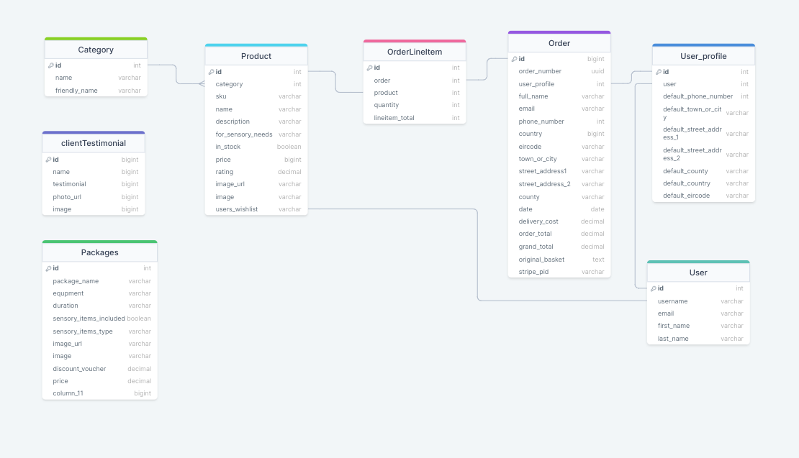 _Sensical.ie Database Schema._

The above image shows the Data Schema for the Sensical.ie project and the relationships between the models.

The e-Commerce store has 4 main models, 2 product related and 2 purchase related.

A unique feature of the product model is the for_sensory_needs data point, where the site owner can add prescriptive phrases that will result in the displaying of informative text icons in the DOM. (Rainbow for Autism etc)

The Product Wishlist Data is also stored in this model. I stored this data point here as it seemed the simplest and less verbose way of coding the wishlist functionality. 

The Client Testimonial, Packages are for administrative users(site owners) only and facilitate the creation and maintenance of Testimonials and Packages within the site. 

The Package Request model allows users to submit a request for a custom sensory hire package through a simple contact form.

 

## Data Flow 

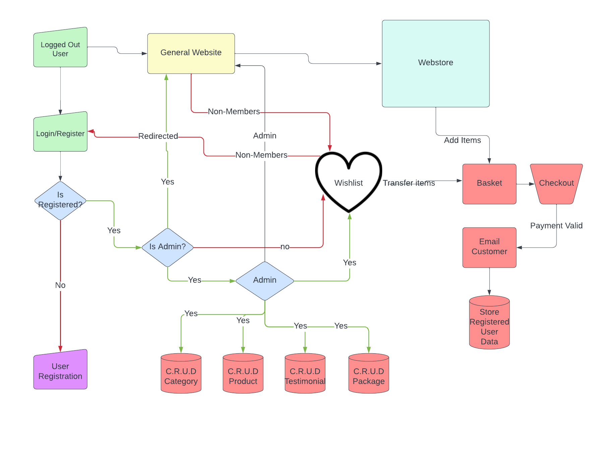 _Sensical.ie Data Flow._

The above example is a simplistic overview of how the website works. The ability for visiting/unregistered users to make purchases is important, so the flow is unrestricted in that respect. The storage of delivery information and purchase history to a registered user's profile however should encourage future visits and make the checkout process even simpler. The wishlist functionality will also encourage future transactions, affording users the chance to save desired out-of-stock items for a later date. The site owners will benefit from the ability to promote the Equipment Hire side of the business by adding and editing heartfelt testimonials and tempting package deals.

 

# Agile

Sensical.ie was developed using the Agile Development Methodology. A detailed overview of the Agile process is available [here.](https://github.com/davidcalikes/sensical.ie/blob/main/docs/AGILE.md)

 

# Visual Design

## Wireframes

I designed wireframes for reference as I began to develop the application. They are instructive as to how I wanted the app to display across multiple device widths. I deviated slightly from the original designs as the overall style became more refined. For example, to give the site a more dynamic look on some of the information pages I staggered the order of the elements using Bootstraps order classes.

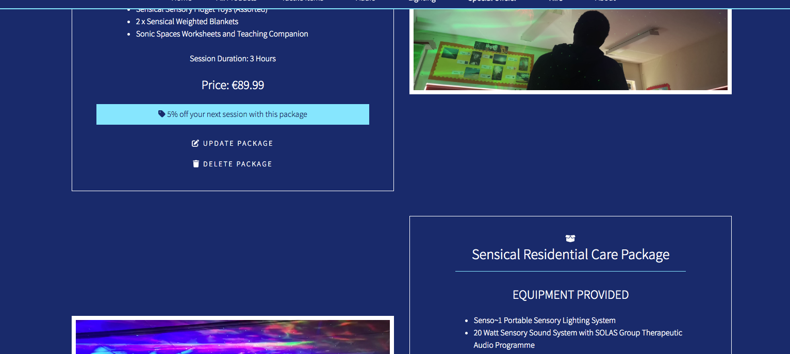 
_Staggered Elements_

Here are the wireframes:

 

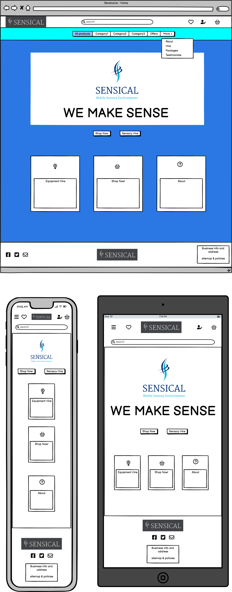 
_Home Page Wireframe_

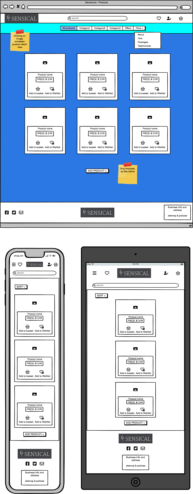 
_Products Page Wireframe_

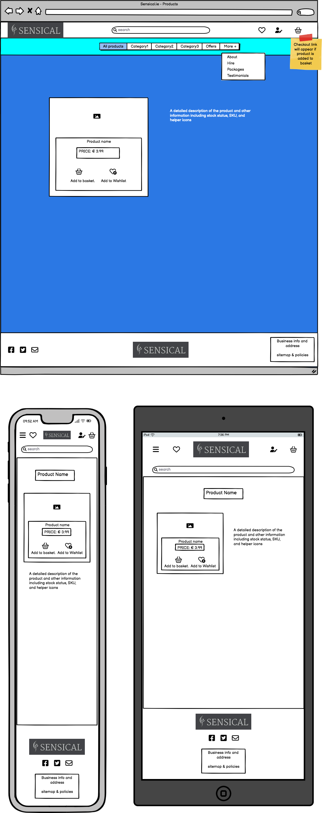 
_Product Detail Page Wireframe_

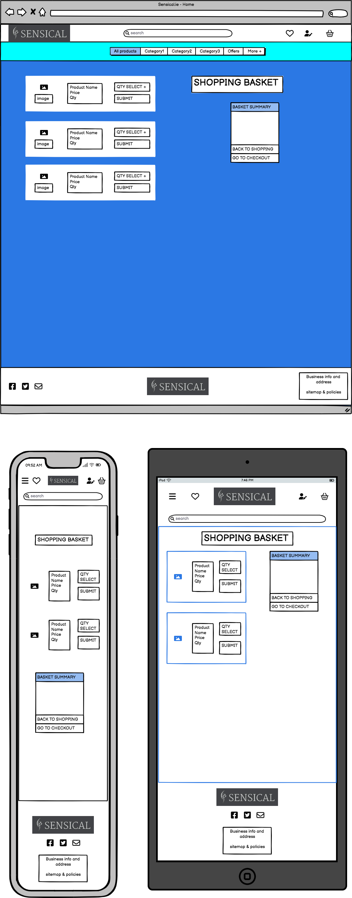 
_Basket Page Wireframe_

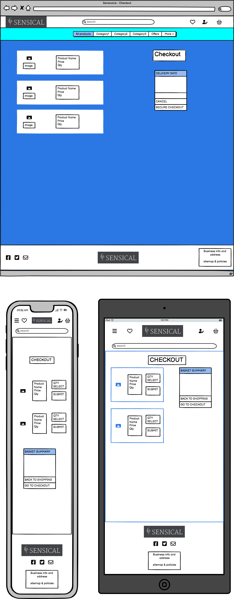 
_Checkout Page Wireframe_

 
_About Page Wireframe_

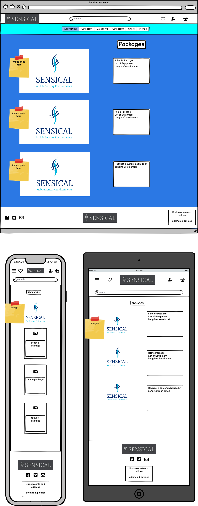 
_Packages Wireframe_

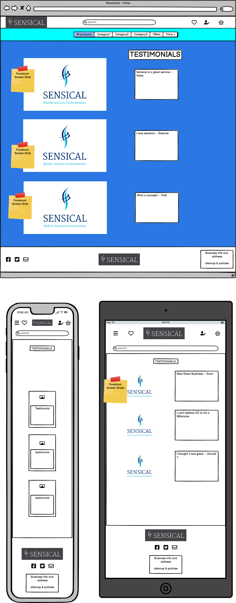 
_Testimonials Wireframe_

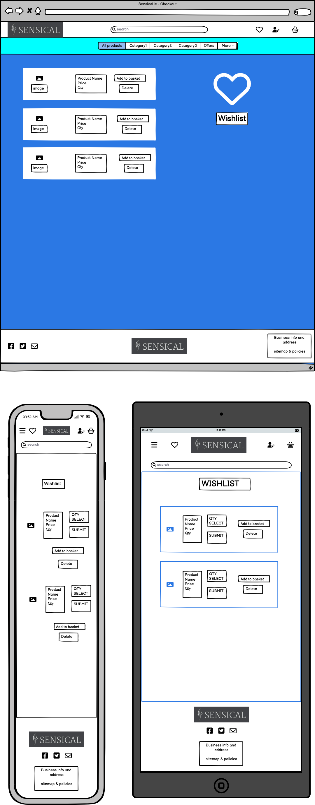 
_Wishlist Wireframe_

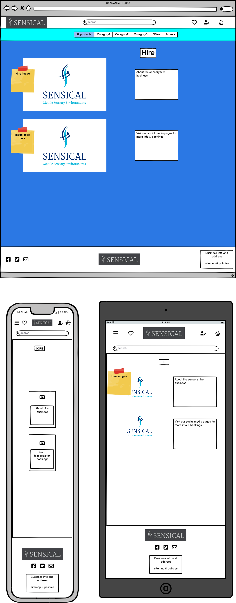 
_Hire Wireframe_

Due to the scope of this application and how similar many of the pages are, I thought it was unnecessary to include every single page here. Like the auth pages for example.

## Color Scheme

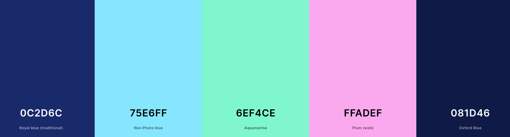 
_Sensical.ie Color Scheme_
 

The color scheme of the site was derived from marketing material submitted by the business owner. The Mobile Sensory Environments side of the business still had an excess of flyers, posters and leaflets remaining so it seemed prudent to continue with the original color scheme used throughout most of the business's promotional media.

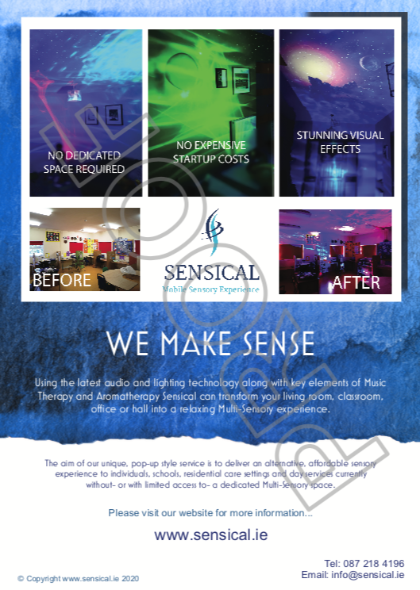 
_Sensical.ie Color Scheme_

 

After some consideration for users who may have light sensitivity issues, I used a dark blue background almost as a default "dark mode" for most of the site. The general tone of the color scheme is almost medical, and this is reflected in the pastel green and pink shades used to indicate stock status by framing the borders of product cards. I feel the color scheme works well. It reflects the purpose of the business and looks professional enough without taking itself too seriously.

 

## Typography

*  There are two fonts used throughout the application.

    * Assistant: A strong, elegant font for heading elements adopted from the business's promotional media.
   
    * Helvetica: A clear, familiar and accessible font is used in paragraph text.

    The fonts were imported to the project head element.

 

# Features

## Existing Features

### Features present across all pages

 

## The Navbar

### Upper Nav

The navbar is present across all pages of the app and sticks to the top of the page as a user scrolls downwards, providing an optimal navigational experience.

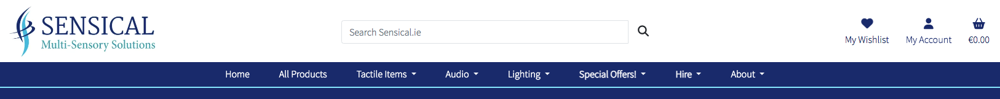 
_Sensical.ie Nav Bar_

 

The navbar contains the business logo which links back to the homepage when clicked. There is also a Search bar that allows users to query the 'products' database. There are three icon links in the upper right of the navbar that link to the user wishlist, user profile/ account management, and shopping basket features. 

 

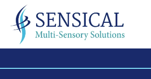 
_Sensical.ie Nav Logo_

 

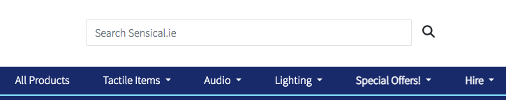 
_Sensical.ie Nav Search Bar_

 

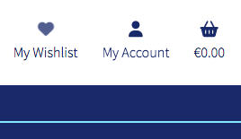 
_Sensical.ie Nav Links_

 

## Link Icon Features

The Menu Links icons have different behaviors that offer user feedback. 

The My Wishlist Icon becomes animated when a user adds an item in their wishlist and stays animated as long as the wishlist has at least one item contained within it.

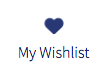 
_Sensical.ie Wishlist icon_

 

The Basket icon has similar functionality and displays a red number when a user adds and item or items to their shopping basket.

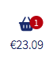 
_Sensical.ie BAsket icon_

The totaliser beneath the icon also informs the user of the total cost of their basket items.

## Lower Nav

The lower nav 

 
_Sensical.ie Main Nav Menu_

The Menu Contains links to the Home, About, Hire, Packages, and Testimonials pages as well as the Products page and product Categorisation.

## Collapsed Menu

At smaller screen widths, the nav bar collapses into a burger-style dropdown menu to enhance user experience on mobile and tablet devices.

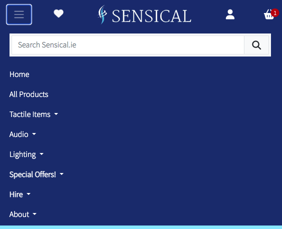 
_Sensical.ie Collapsible Menu_

 

## The Delivery Banner

Although the delivery banner is not technically available across every page of the site, I've included it here as it felt like it belonged to the nav section of the project. 

The Delivery Banner provides dynamic visual feedback to purchasing customers regarding a free delivery offer when users spend more than €50.

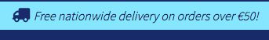 
_Delivery Banner_

If a user adds a product to their basket the Delivery Banner Updates.

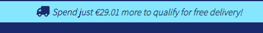 
_Delivery Banner_

When the delivery threshold has been met by the user the banner changes to the following.

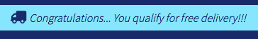 
_Delivery Banner_

I included the Delivery Banner only on pages related to the e-Commerce side of the site as I felt it could free up a usable section of screen real estate for the information pages.

 

## The Footer

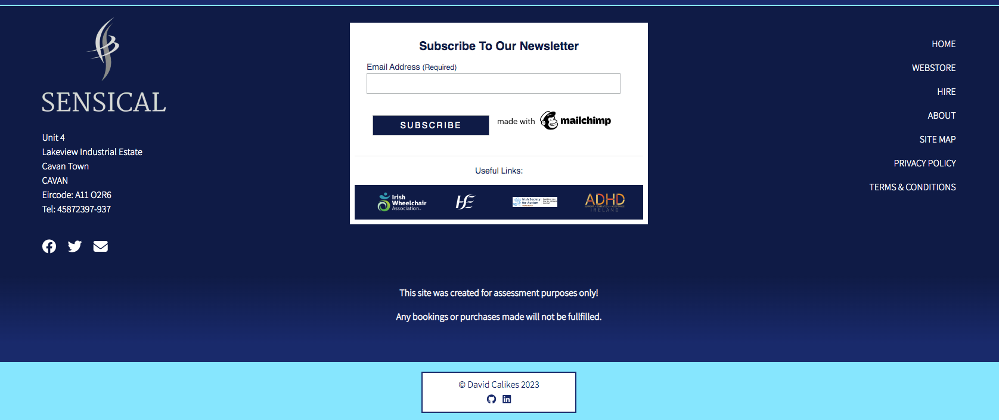 
_Sensical.ie Footer_

The fully responsive footer is present across all pages of the site and contains two main sections.

### Upper Footer

The Upper Footer section contains the following features:

### Footer Contacts

Located in the upper left section of the footer and centered on medium and small-sized screens. The footer contact area contains the business contact information, responsive links, and social media links. Each link opens in a new tab.

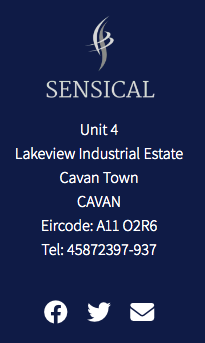 
_Sensical.ie Footer Contacts_

 

### Footer Subscibe form and Useful Links

Located in the upper-middle section of the footer and wrapping beneath the contact information links on smaller devices, the Footer Subscription Form and Useful Links section contains a Mailchimp subscription form and useful links that may be of some benefit to the user. External links enhance the Search Engine Optimisation of Sensical.ie and each link opens in a new tab.

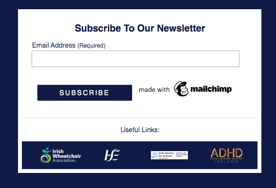 
_Sensical.ie Footer Subscription Form and Useful Links_

 

### Footer Nav

The Footer nav is located on the right side of the upper footer, centering on medium and small sized screens. The Footer nav contains links to the most prominent areas of the site as well as downloadable links to the privacy and terms & conditions policy documents of the company.

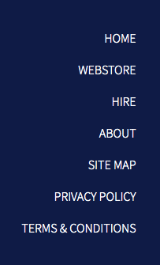 
_Sensical.ie Footer Nav_

 

### Lower Footer

The lower Footer section hugs the bottom of each page of the site and contains a disclaimer and subtle color gradient that is evocative of LED strip lighting effect. Beneath the disclaimer is the Copyright and Developer information including social links that open in a new tab.

 

 
_Sensical.ie Lower Footer_

## Existing Features (cont)

### Individual Pages

 

## Home Page

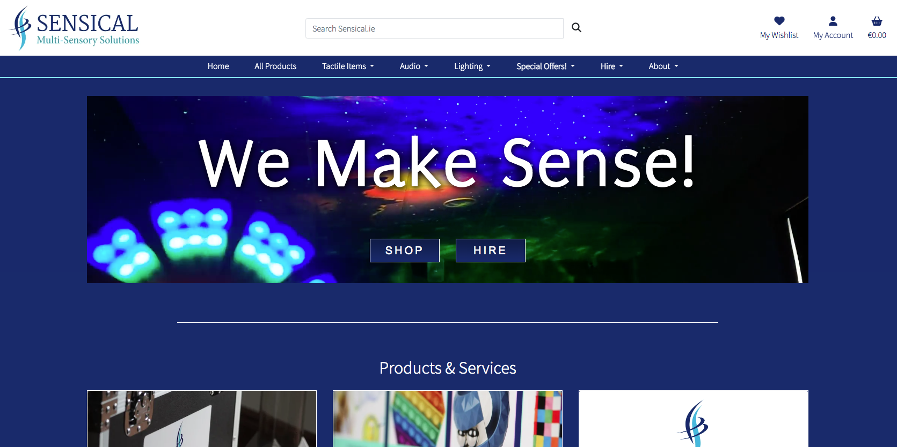 
_Sensical.ie Home Page_

Home Page
 

* The Home page contains a high-quality hero video with clever heading text that is relevant to the business and informative to the user. The heading text has a shadow quality that allows it to maintain readability despite the dynamic background. I thought about using a nice blur filter here to make the text really legible, however, the business owner wanted the background to be clearly recognisable as a classroom, so potential customers would recognise the transformative power of the sensory equipment hire business. The hero video is strategically placed to allow some content to show from the base of the page, encouraging users to scroll further.

 

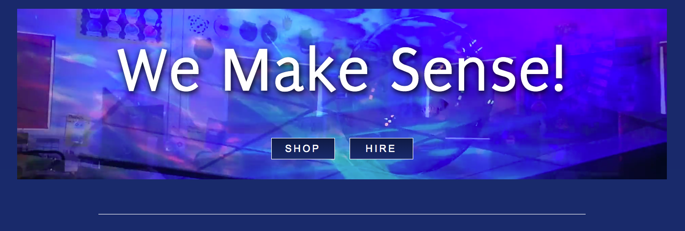 
_Sensical.ie Hero Video & CTA Buttons_

* The call-to-action buttons provides the user with instant access to the two main data streams of the site. The first button, SHOP leads to the e-Commerce side of the application where the second button leads to the Hiring/Information side.

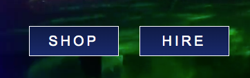 
_Sensical.ie Hero Video & CTA Buttons_

* There are three 'Home Cards' That provide the user with information regarding the purpose and functionality of both the site and the business. The home cards are elegantly designed and contain images and links to the three main site areas.

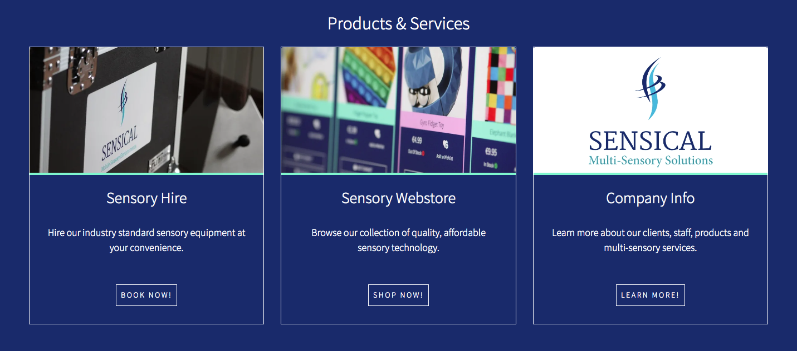 
_Sensical.ie Home Cards_

The Home Page is fully responsive across multiple device widths.

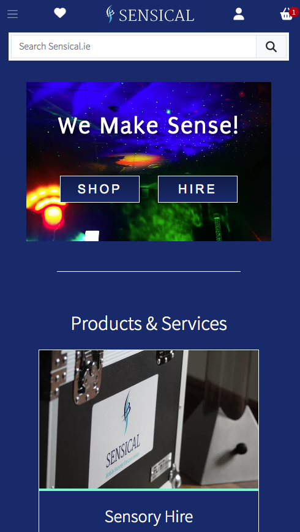 
_Sensical.ie Home Mobile_

 

## Products Page

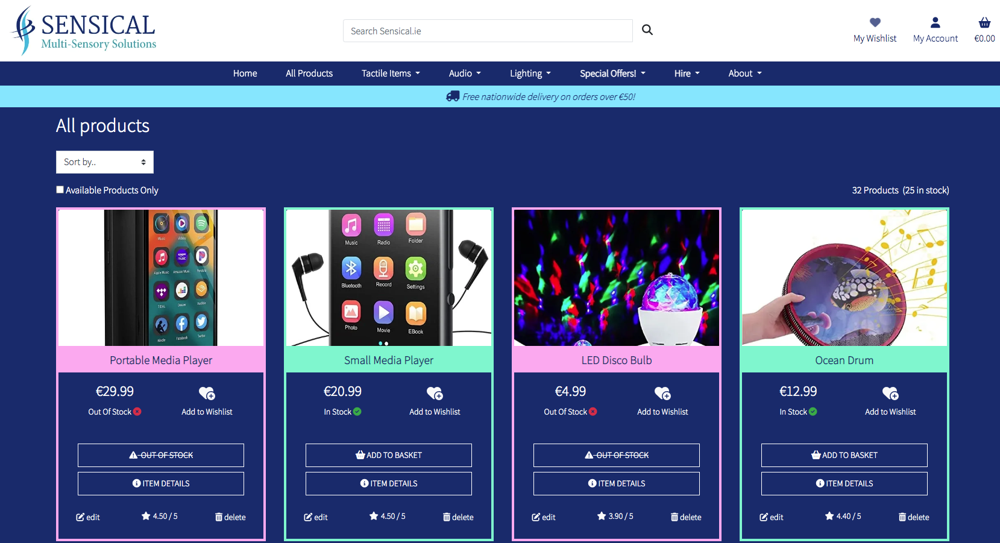 
_Sensical.ie Products Page_

Products Page
 

* The Products Page features a sort selector at the top left of the page with a toggle switch that hides/displays unavailable products for the convenience of the user. Users can sort products by alphabetical order or by price.

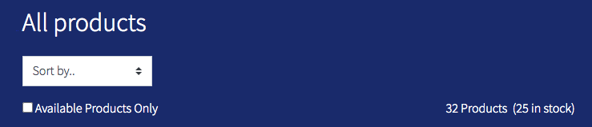 
_Sensical.ie Products Page Sort Selector_

* The Products page contains product cards that have a border color depending on the stock status of the item. If the product is in stock, the border color is a pastel green, and this changes to a pastel pink if the product is unavailable.

 
_Sensical.ie Products Page Cards_

* Each card contains an image inside an anchor element, that links to the product detail view of the item. There is a generous heading with the product name. They also contain the price of the item and the stock status to further inform the user. A stylised link with heart shaped fontawesome icon is available for users to add or remove items from their wishlist. The wish list link redirects to the login page for anonymous users. There are also two button elements on each card, one for adding an item directly to the user's shopping basket and another for accessing the product detail page. Each button has a style consistent with other clickable elements of the site and has an informative fontawesome basket or info icon. 

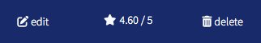 
_Sensical.ie Products Lower Card_

* The lower part of each card contains links for Site Admin users to edit or delete the product, either side of the product rating, which provides feedback to the user about the overall customer satisfaction rating of the product.

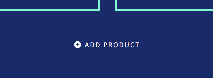 
_Sensical.ie Product Add_

* At the base of the products page, there is a button that links to the product management page, which allows Admin Users to add new products. This button is not available to non-admin users.

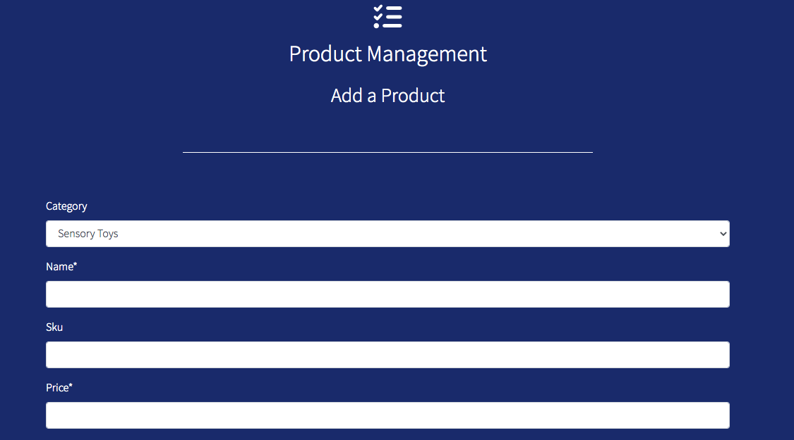 
_Sensical.ie Product Management Form_

* Admin users can add a product to sell via the store. The form will return errors if filled incorrectly and a placeholder image will be used for the product if an image is not uploaded.

 

## Product Detail Page

 
_Sensical.ie Product Detail Page_

Product Detail Page
 

* The Product Detail Page contains more information about the product. In addition to its price and stock status, a larger image is available plus a sensory-needs indicator feature.

 
_Sensical.ie Sensory Needs Indicator_

* This row of icons contains visual feedback to the user regarding the suitability of each item. The key for the feature is as follows: 

* The RAINBOW icon denotes this item may help people living with an autistic spectrum disorder.
* The HANDS icon denotes this item may help people living with Tactile sensory needs.
* The EYE icon denotes this item may help people living with ADHD.
* The HEADPHONES icon denotes this item may help people with Auditory Sensory Needs.
* The MOON icon denotes this item may help people living with Anxiety.
* The LIGHTBULB icon denotes this item may not be suitable for people with photo-sensitive epilepsy.

The Site Administrator can attach each Icon to a product using the following keywords in the For Sensory Needs Form Field.

* ADHD for ADHD
* ASD for ASD
* TOUCH for Tactile sensory issues.
* AUDIO for Auditory sensory issues
* RELAX for anxiety issues.
* LIGHT for Photosensitivity issues.

* The next noteworthy feature is the product quantity selector. This will allow users to add up to 10 of any given items at a time to their shopping basket.

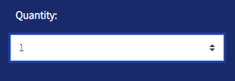 
_Sensical.ie Quantity Selector_

* As the business carries a very small inventory at affordable prices, it was important to the business owners to limit bulk purchases in this way, in order to properly expand, the company wished to reach as many different customers as possible rather than wholesale to just a few bulk buyers. This feature will be adapted in future iterations of the site, where the selector will feature only the amount of products available in stock at any given time providing feedback for the user and managing stock level issues at the point of sale.

At the base of the page the consistently styled Product Detail Buttons allow users to continue shopping or add the current product to their basket or wishlist.

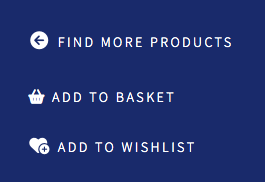 
_Sensical.ie Product Detail Buttons_

The Product Detail Page is fully responsive across multiple screen widths.

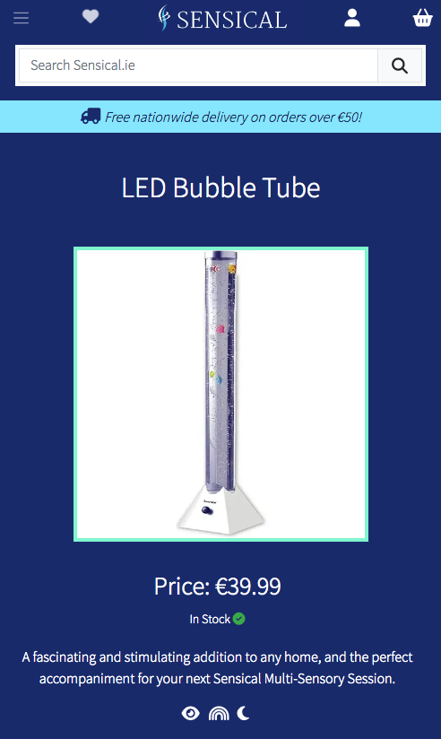 
_Sensical.ie Product Detail Responsiveness_

 

## Wishlist Page

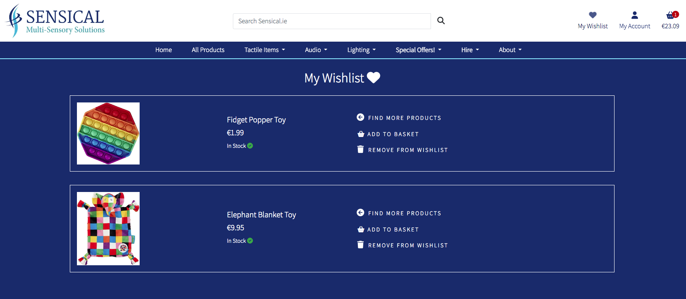 
_Sensical.ie Wishlist Page_

Wishlist Page
 

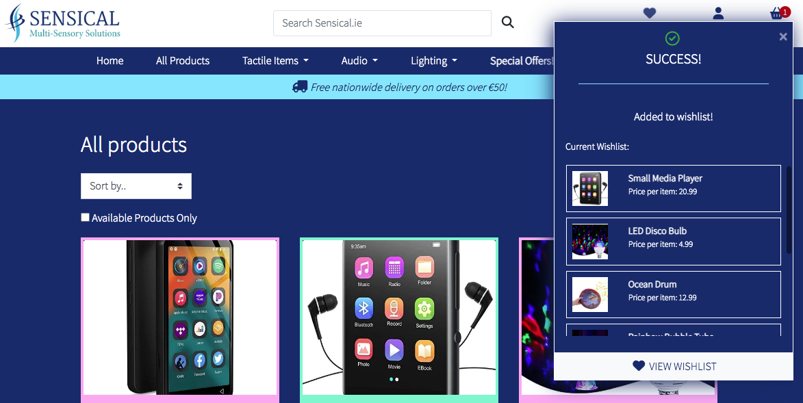 
_Sensical.ie Wishlist Success_

* Whenever a registered user adds a product to their wishlist, they are informed by a success message. If the wishlist contains many items the wishlist messages container allow the user to scroll through the items on the message container itself. Users can also directly access the wishlist from the message container. A users wishlist, and the items within it are saved for the users convenience even if they log out or refresh their browser.

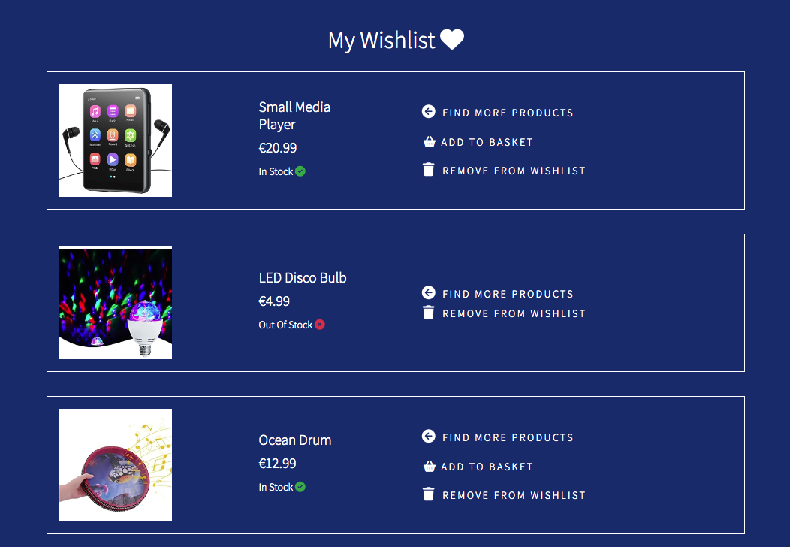 
_Sensical.ie Wishlist Items_

The Wishlist Page itself is elegant in its simplicity and maintains many of the design features consistent with the rest of the site. Including the pleasing contrast between the vibrant foreground images and the background and the familiar looking 'Find More Products' 'Add to Basket' and 'Remove Form Wishlist buttons. The Move to Basket feature is designed to maximise convenience for user. Adding a product to the basket from the wishlist does not remove it from the wishlist. This is entirely intentional, as the business owners insist that many users will be clients or the carers or parents of clients that will often have to re-order products because of damage or wear from overuse, so having all your favorite products in the one place will be of maximum benefit to users in these situations. 

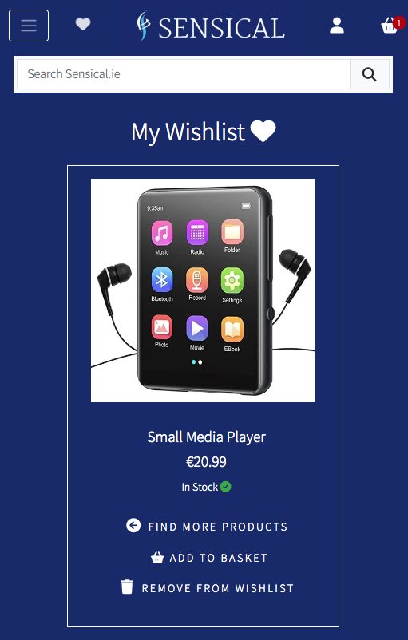 
_Sensical.ie Wishlist Responsiveness_

The Wishlist Page has been tested across many screen widths and is fully responsive.

 

Shopping Basket Page

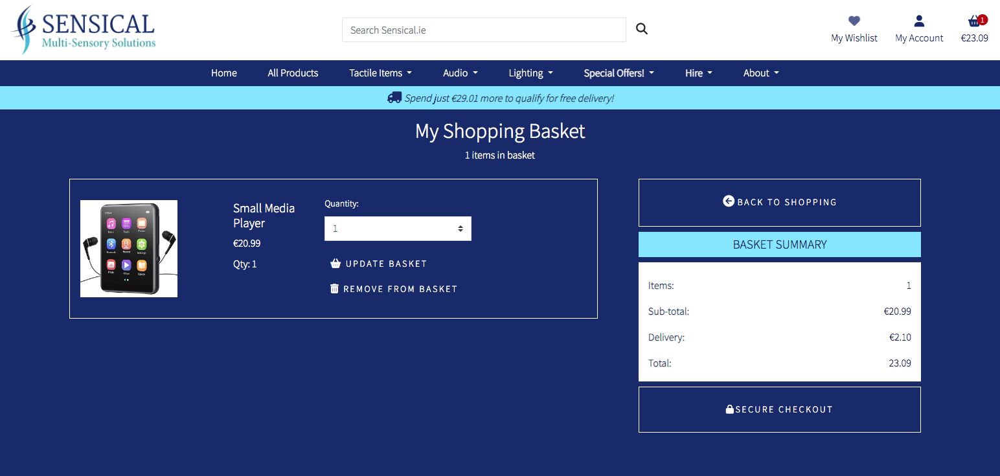 
_Sensical.ie Shopping Basket Page_

Shopping Basket Page
 

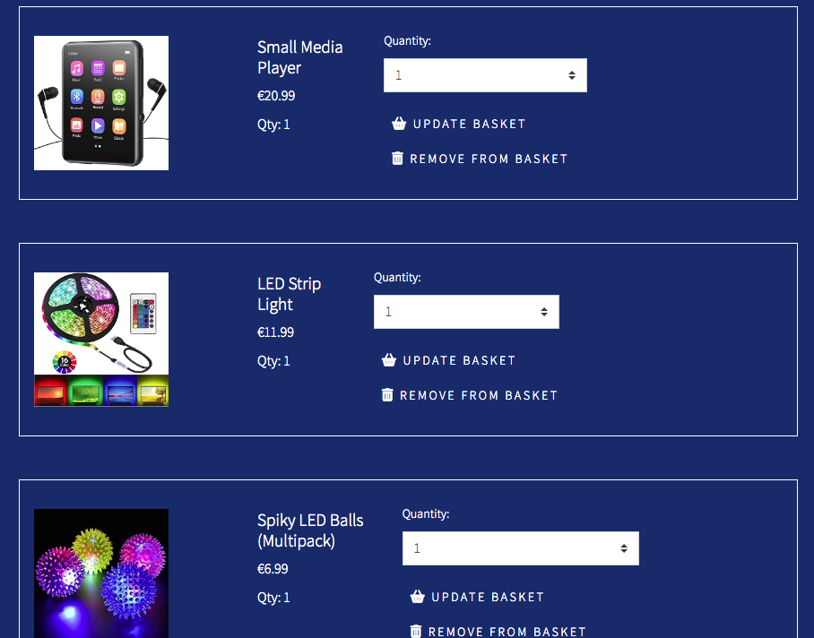 
_Sensical.ie Shopping Basket Items_

* The basket items section contains horizontal product cards each displaying a thumbnail image, name, price and quantity of each basket item. Every card has its own sort selector and update button allowing users to modify their basket without having to return to the products page. There is also a feature that allows the user to remove the entire quantity of an item from the basket if they desire. I think this page justifies the intentional design choice to have a darker background, as the colorful products really pop out in contrast to the neutral backdrop.

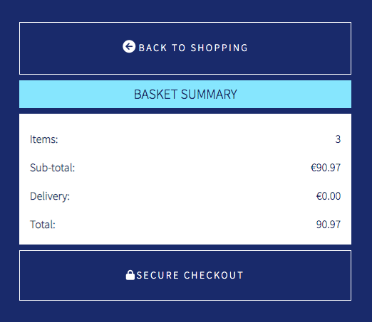 
_Sensical.ie Shopping Basket Summary_

* The shopping basket summary section contains an efficient overview of the cost of the user's basket items. The summary section allows users to return to the products page or continue to the checkout to complete their purchases.

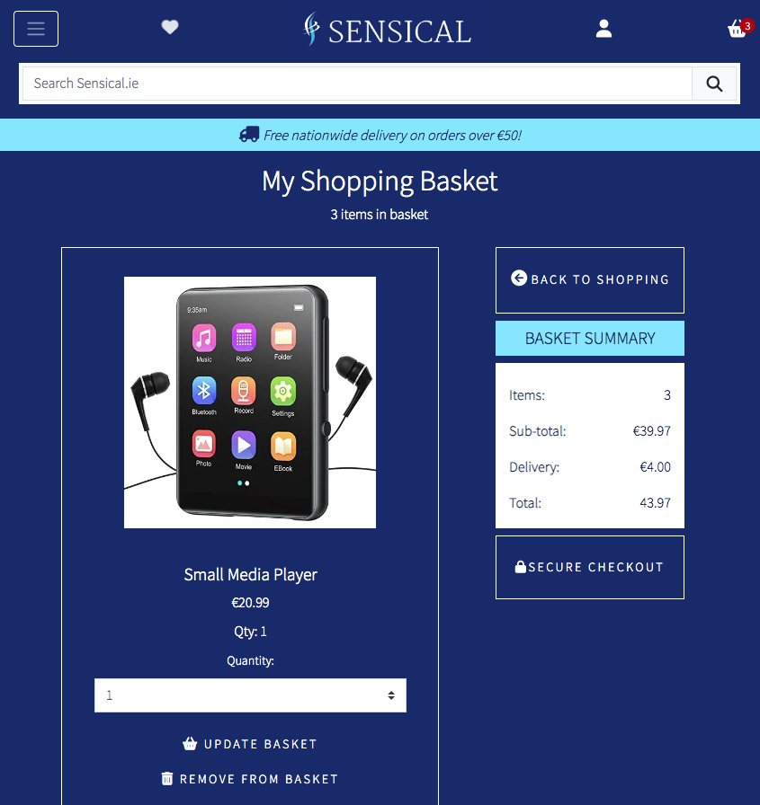 
_Sensical.ie Shopping Basket Responsiveness_

The Shopping Basket Page is fully responsive across multiple screen widths.

 

## Checkout Page

 
_Sensical.ie Checkout Page_

Checkout Page
 

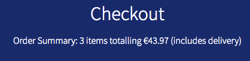 
_Sensical.ie Checkout Page Summary_

* The Checkout Page has a heading summary that carries the total cost information over from the basket page.

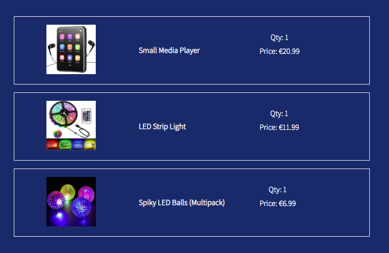 
_Sensical.ie Checkout Page Items_

* The Checkout page also has a similar items list to the basket page, but with truncated features. This was purposely designed to not only differentiate the Checkout Page from the Shopping Basket Page but to also discourage users from changing their minds and removing items from their basket at the last minute.

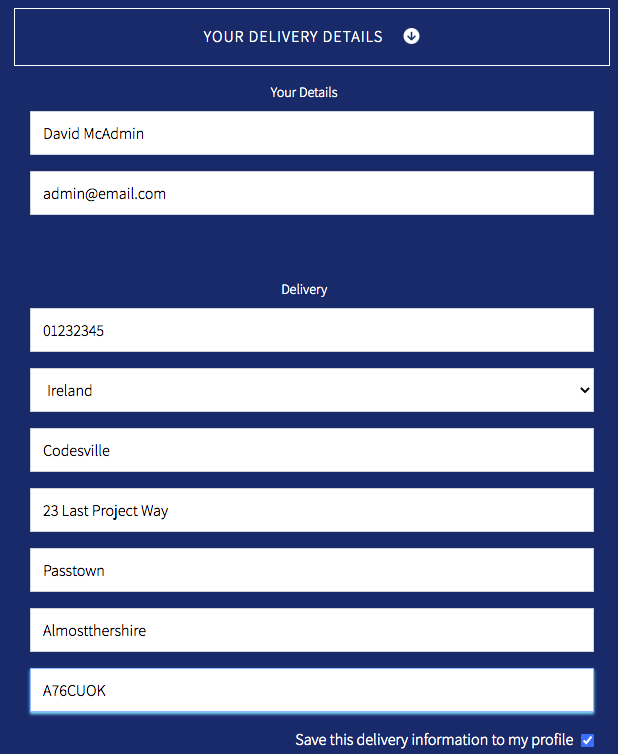 
_Sensical.ie Checkout Delivery Accordion_

The Checkout Delivery Accordion contains a user's delivery information in a handy dropdown accordion. 

The delivery information is prepopulated in the form if a user has it saved to their profile. There is also the option for registered users to save their information to their profile if they have not already done so.

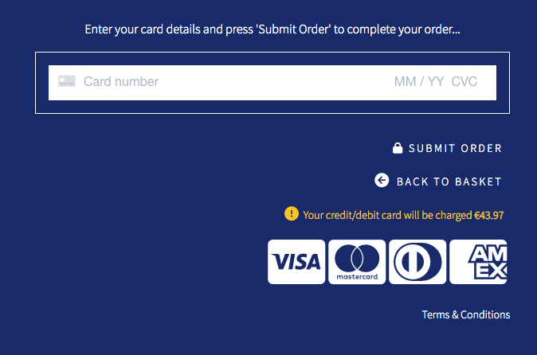 
_Sensical.ie Checkout Payment Details Section_

At the base of the checkout page, there is a form input for a user to enter their credit/debit card. The area contains a field for the users card number, a 'submit order' button for users to complete the order and a back to basket button for users to return to the shopping basket without submitting the order. There us some warning text that provides feedback for the user regarding how much their card will be charged. I have included some out size fontawsome card icons here. I think the globally recognised financial institutions would inspire customer confidence in the site and promote multiple visits and purchases. 

Also included in this section is a link to the terms and conditions of the site, to protect the business against contingent liabilities.

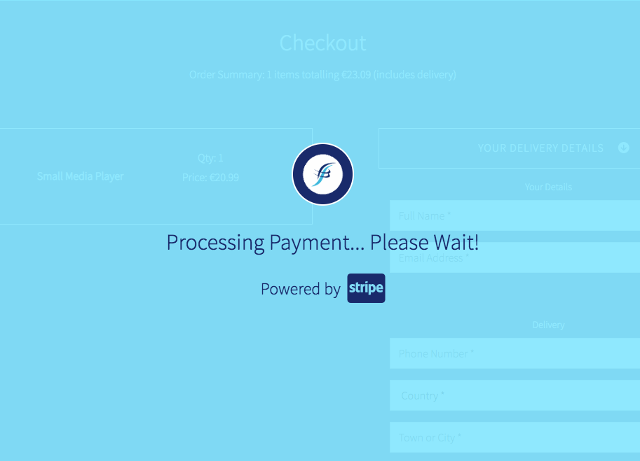 
_Sensical.ie Checkout Loading Modal_

When a payment is submitted a spinning logo and feedback message fills the page as the request is being processed by the Stripe API. The modal is important as it prevents the user from interacting with the site during the payment process whilst keeping them informed that the payment is being processed.

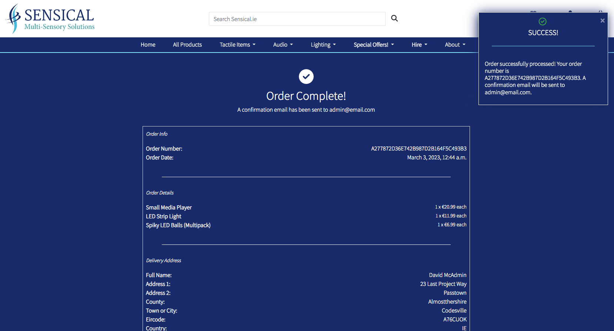 
_Sensical.ie Checkout Success Page_

If an order is successfully completed, the user is notified, and returned to the checkout success page. This page provides the user details of their purchase and is backed u to their user profile if they have one. There is a link to return to the users profile page if they are registered users and a link back to the home page if they are not.

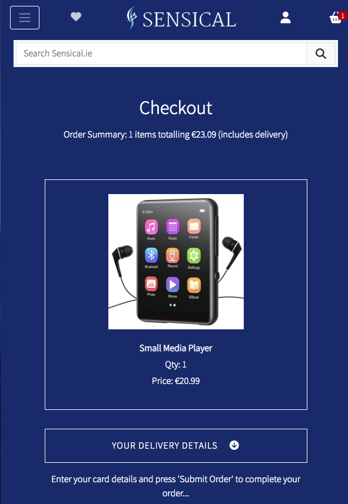 
_Sensical.ie Checkout Responsiveness_

Like the rest of the site, the checkout page is fully responsive across many device widths.

 

## Hire Page

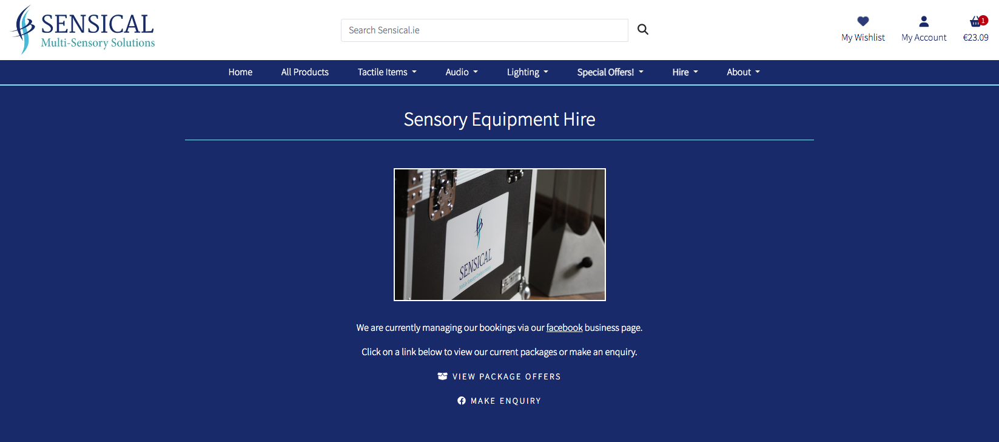 
_Sensical.ie hire Page_

Hire Page
 

* The Hire page is a static page within the site that links to information and resources users require to make a booking.
The hire side of the business, known as "Mobile Sensory Environments" is managed via the business owners Facebook business page.

* There are links to the Facebook page from the Hire Page that open in a separate tab. There is also a link that redirects the user to the packages page, where they can learn more about the hire packages on offer.

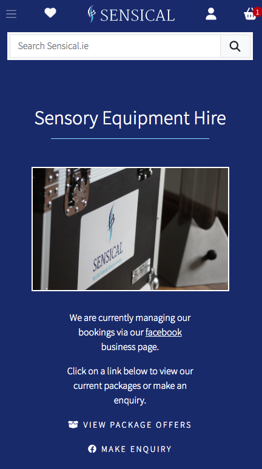 
_Sensical.ie Hire Page_

* The Hire Page of Sensical.ie is fully responsive across all devices and is consistent in its design.

 

## Packages Page
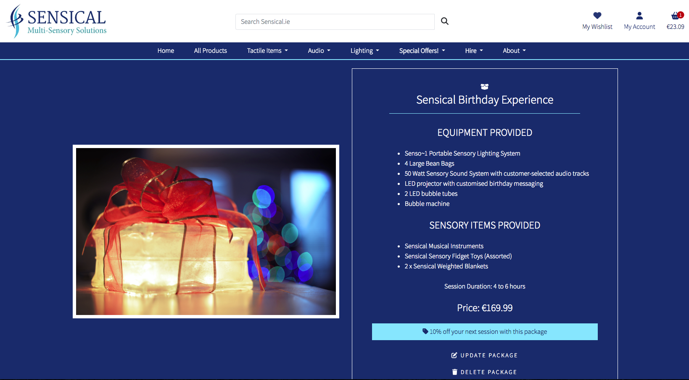 
_Sensical.ie Packages Page_

Packages Page
 

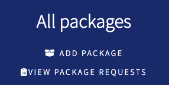 
_Sensical.ie Package Manegment Options_

* Package Management Options
At the top of the Packages Page there are links to the 'Add Packages Page' and the 'Package Requests Page'.
These options are only available to Admin users.

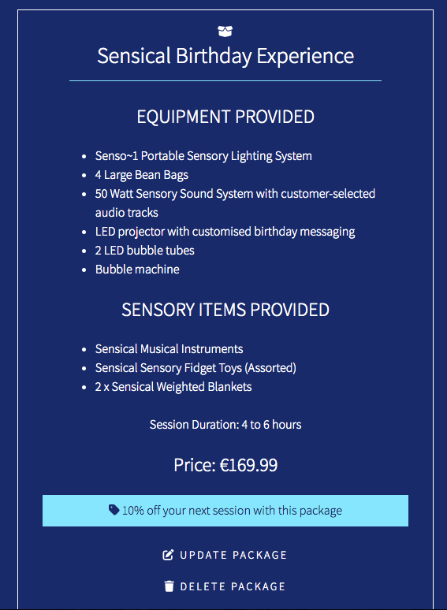 
_Sensical.ie Package Card_

* Beneath the Package Management Options Buttons the current packages offered by the Equipment Hire Business are displayed. Any packages added by Admin Users will be displayed here. Each Package has a bordered image and a Package Detail Card that contains information regarding the equipment and items provided, as well as the session duration and price. There is a discount banner that displays a percentage discount available to first time package customers above the package card buttons. If the user has Admin level authoristation, the buttons will allow the Admin to either update, or delete the package. If the user is a non-admin registered user or an unauthenticated user, the card will display a button that externally links to the Sensical Facebook Business Page. There is also a button to 'Request a Custom Package'. Each Package Card and image are staggered using the Bootstrap 'order' class to make the page appear more interesting and dynamic. 

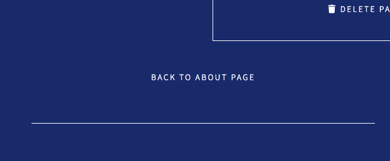 
_Sensical.ie Package Back Button_

* Beaneath the stylish Hire Packages is a button that allows the user to link 'Back to About Page'

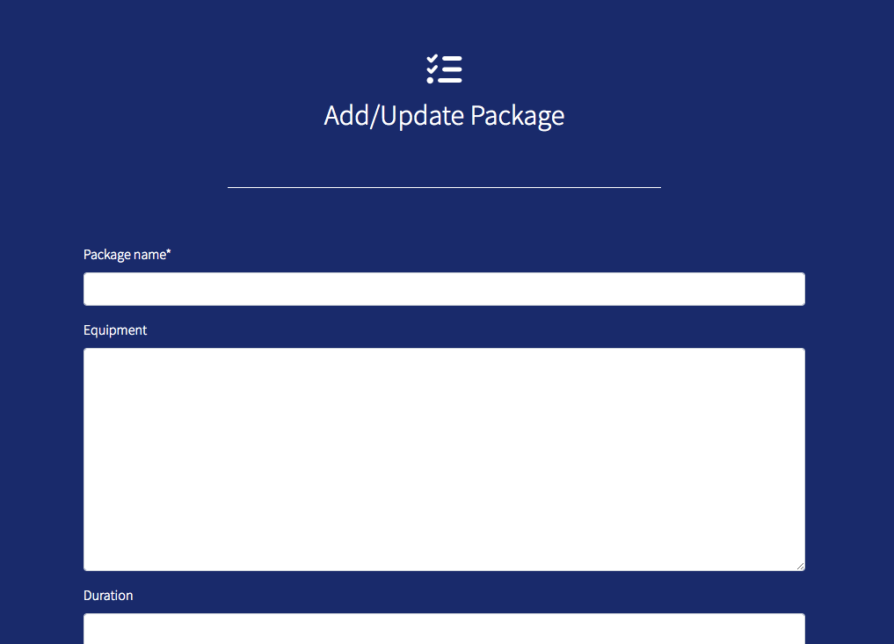 
_Sensical.ie Add Package Form_

* Admin users can add a new Hiring Package via the aforementioned 'Package Management' section at the top of the page. The Admin can submit the form and will be returned to the packages page if the form is valid. If an image is not provided within the upload, a placeholder image will be used instead. The placeholder can be replaced with an image at a later time or date.

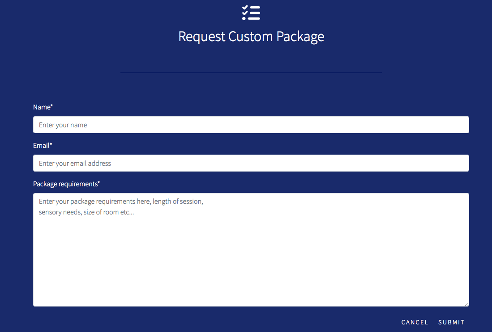 
_Sensical.ie Package Request Form_

* Non admin users can request a quote from the business via a Package Request Form. The form has instructive placeholder text providing feedback for the user on how to use the form. The user submits the form with by adding their Name, Email Address and Package Requirements. They are then informed that the business will be in touch with a quote in due course.

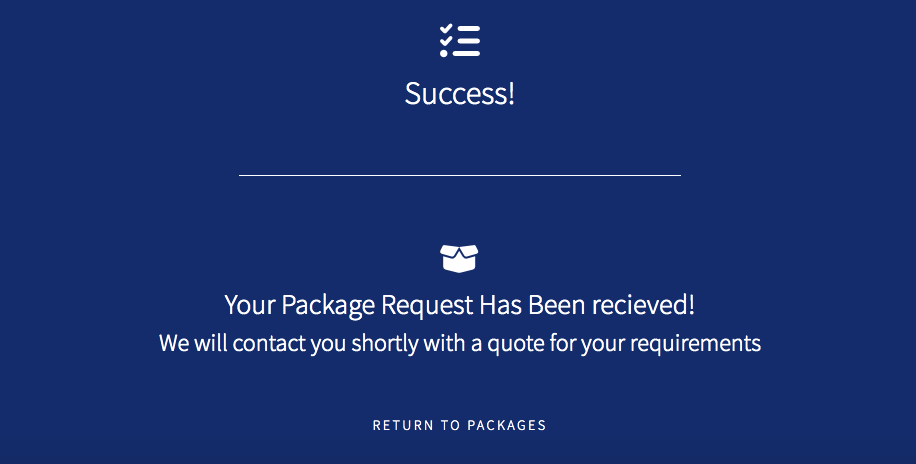 
_Sensical.ie Package Request Success_

* Site administrator users can view a list of any package requests via the Package Management 'view package requests' button at the top of the Package Requests Page.

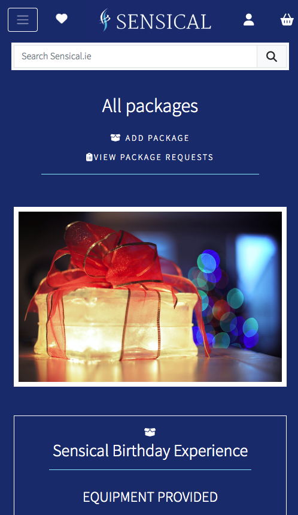 
_Sensical.ie Packages Responsiveness_

The Packages pages are fully responsive across most device widths.

 

## About Page

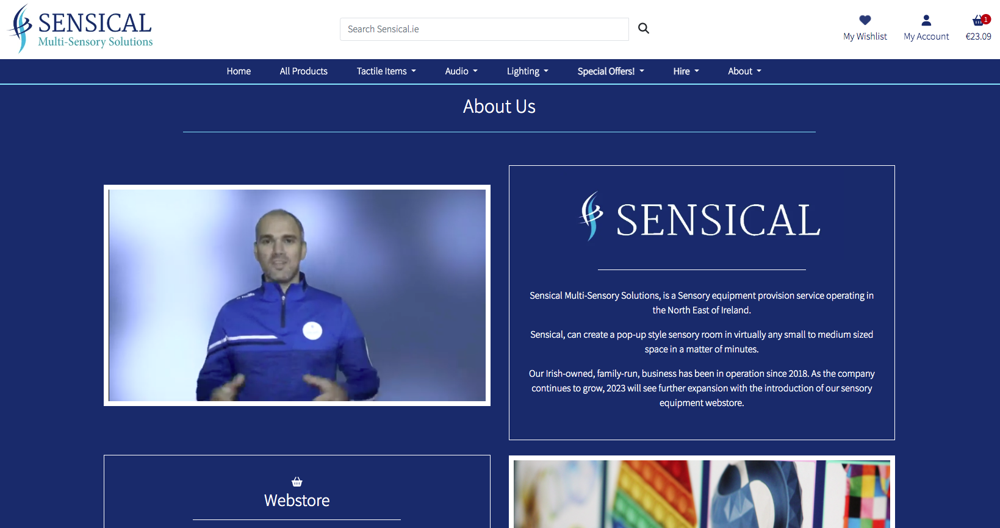 
_Sensical.ie About Page_

About Page
 

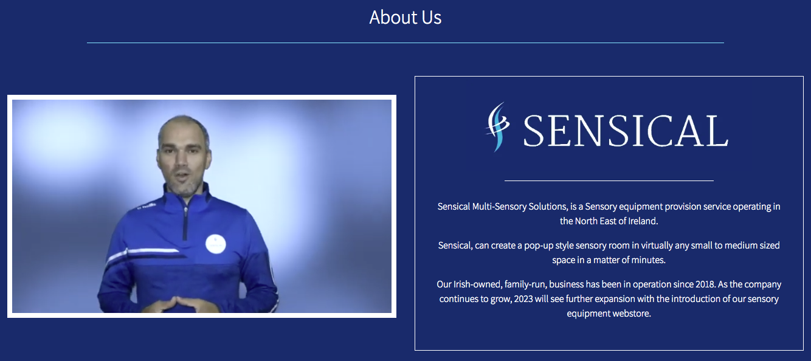 
_Sensical.ie About Video_

* The upper about page features a demonstration video that informs the user about the equipment hire side of the business. The video is framed inside a white border and plays automatically when the page loads.(Autoplays on desktop only) Accompanying the video is a text box featuring more information about the history and direction of the business.

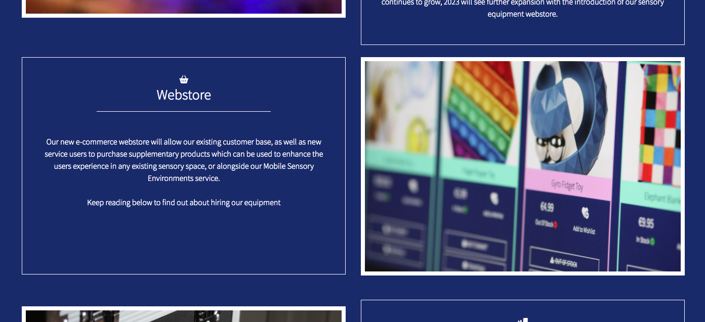 
_Sensical.ie About Webstore_

* Underneath the about video, is an image and info card providing information to the user about the business's new e-Commerce webstore.

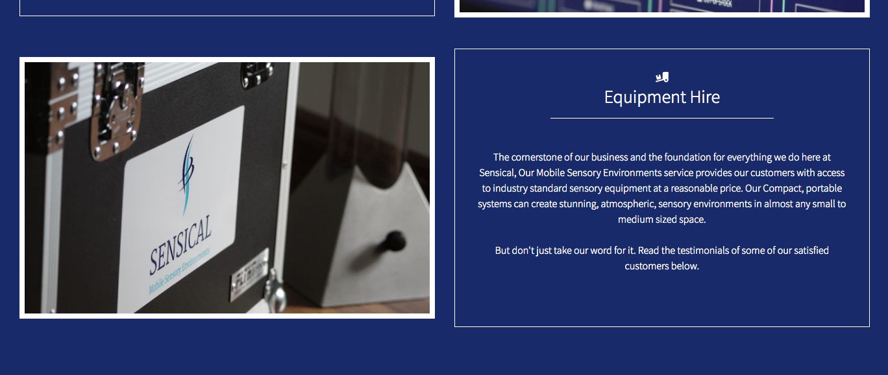 
_Sensical.ie About Hire_

* Further on down the page there is an image and more information about the equipment hire side of the business.

 
_Sensical.ie About Contact Banner_

Below the about video, images and information cards, there is a 
page-width banner element that contains extra large fontawesome social media, email and phone logos. Each logo contains a link for users to contact the business, with all external resources opening in a new tab.

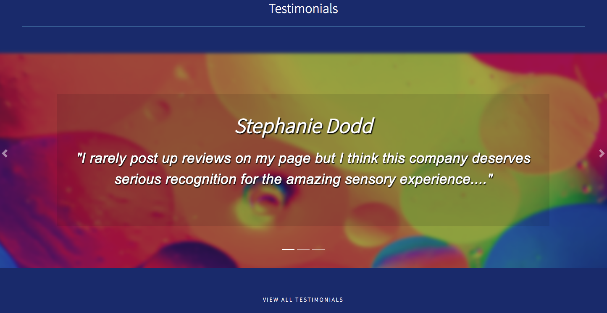 
_Sensical.ie About Testimonials Carousel_

* The last feature of the about page is an attractive carousel, that contains three testimonial text elements which cycle automatically. A user can control the carousel using the intuitively placed left and right arrow buttons provided. A position indicator strip is also available to provide visual user feedback. 

* Below the Carousel is a button that allows the user to view all the testimonials of the site, not just the first three.

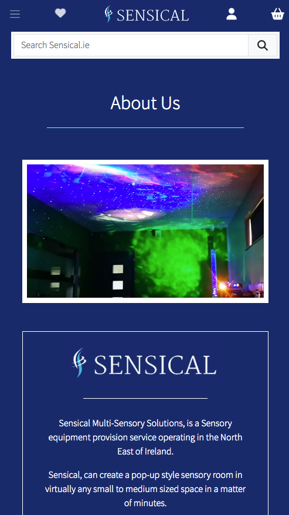 
_Sensical.ie About Responsiveness_

The about page is fully responsive across most device widths.

 

## Testimonials Page

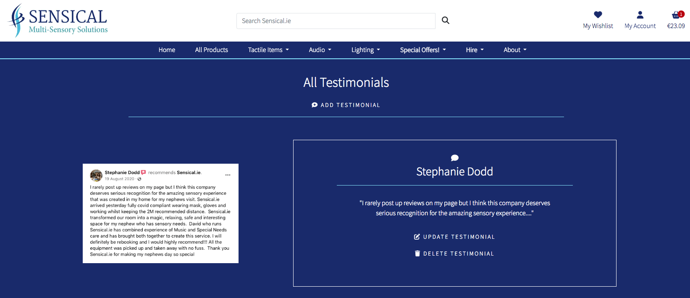 
_Sensical.ie Testimonials Page_

Testimonials Page
 

 
_Sensical.ie Testimonials Page_

* The Testimonials page displays a sylised list of testimonials for to inform the users hiring decisions. The top of the page contains a button available to Admin users only to add a testimonial to the list. Each testimonial consists of information in the form of quoted text, that provides a positive appraisal of the business and a supporting image. The testimonial text and images are staggered in a similar way to the about and packages pages, maintaining a consistent site-wide design. Each text card contains links for Admin users to Update or Delete a testimonial. If the user is not an Admin user, a 'Make Enquiry' button is displayed that relays the user to the external Facebook business page, which opens in a new tab.

 
_Sensical.ie Testimonials Page_

* Beneath the last card in the list is a button to returns users 'Back To (the) About Page' when clicked.

 

## Other Notable Features

### User Profile

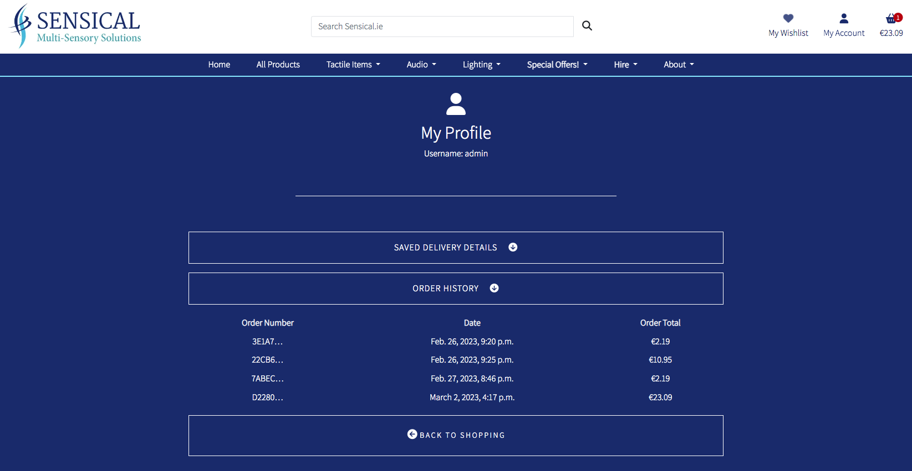 
_Sensical.ie User Profile Page_

* The user profile page contains the saved delivery information and order history of a logged-in user or admin. The Information is neatly arranged in a classy Bootstrap accordion element that closes one section when the other is opened. Users can open delivery data form and edit their stored data. The page also contains a button that allows users to return to the products page. 

 

### Toast Messages

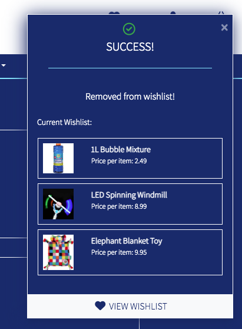 
_Sensical.ie Toast Messages_

* Toast messages are used to inform the user as they interact with the site. Toast messages appear on the top right of the screen and are customised to show information relevant to each action or submission by the user. 

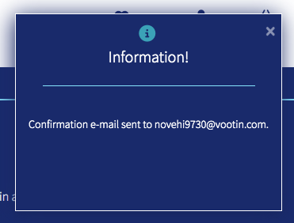 
_Sensical.ie Toast Messages_

 

### User Authentication

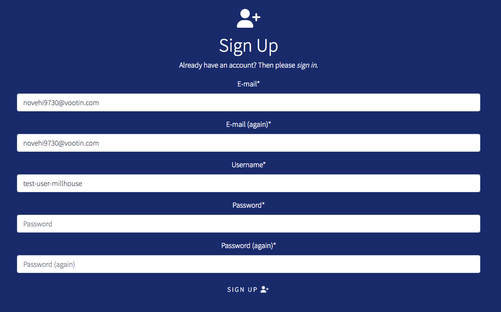 
_Sensical.ie Authentication_

* Sensical.ie's user authorisation features allow users to sign up for an account if they can provide a valid, verifiable, email address.

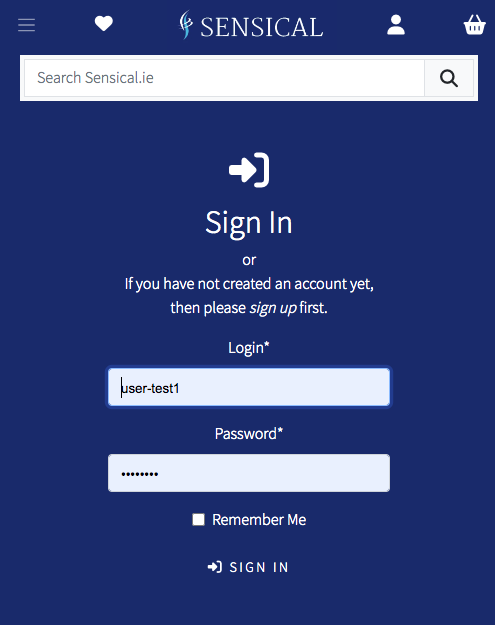 
_Sensical.ie Authentication_

Once they have registered, users can log in and out of the site to enjoy extra benefits, such as user wishlist access and the ability to store delivery information to their user profile.

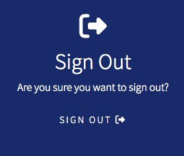 
_Sensical.ie Authentication_

 

## Future Features

The Sensical application has been designed with one eye on the next several iterations of the site.

### Stock Level Selector

The future-proof design of the site will allow the future development of Stock Level Quantity Selectors. This feature will become more useful as the business grows and was unnecessary for the first MVP version of Sensical.ie, especially as the Webstore has such a small inventory, but in the future the current Quantity selectors present in the product detail and shopping basket pages can be adapted to only display the qty of each item available to the user at any given moment. An example of this functionality can be seen at the checkout page of [this](https://www.fields.ie/) website.

### Products Packages based on user needs

Another cool feature to mirror the Package Request option of the current site would be to include a number of custom product packages where users can take a short survey of their needs and be directed to a suitable package within their budget that includes a choice of products included in the promotion. The resulting product packages would provide better monetary and emotional value for the user.  

### Expand the Hire app to manage online bookings through the website.

To manage the hiring side of the business in the same place as the Webstore would result in much more efficient business practices further synergising the e-Commerce and Equipment Hire ends of the business. Creating a fully synergetic approach here, where the company can sell products and hire equipment from the same place to the same, captured audience at the same time would be truly optimal for the growth and expansion of the enterprise.  

 

# Testing

The app was conscientiously tested during and post development.
The testing results for Sensical.ie are available [here.](https://github.com/davidcalikes/sensical.ie/blob/main/docs/TESTING.md)

 

# Deployment

Sensical.ie was deployed to Heroku during the early stages of development. I wanted to make sure the database and static files were all accessible from the beginning of the project, so I wouldn't have to worry about deployment issues closer to releasing the app.

The live site can be viewed [here:](https://sensical-ireland.herokuapp.com/)

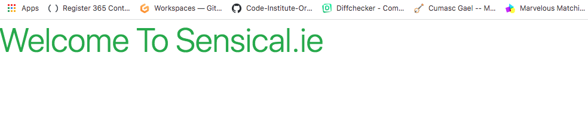 
_Early Deployment Screenshot_

 

## Database

### ElephantSQL

To create a managed Postgres database go to [ElephantSQL](https://www.elephantsql.com/) and Signup/Signin to your account.

* Click on 'Create New Instance'.

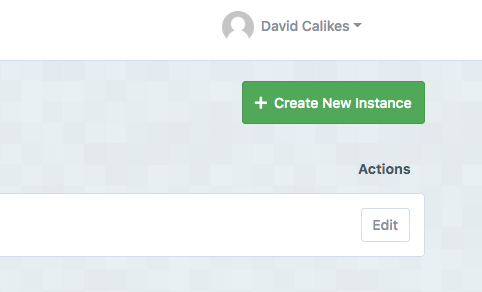 
_ElephantSQL_

* Name your database, choose the 'Tiny Turtle' payment plan and click 'Select Region'.

* Choose your region and then create the database.

* In the instances page, click the name of your chosen database.

* In the 'details' section of the following page copy the Postgres url.

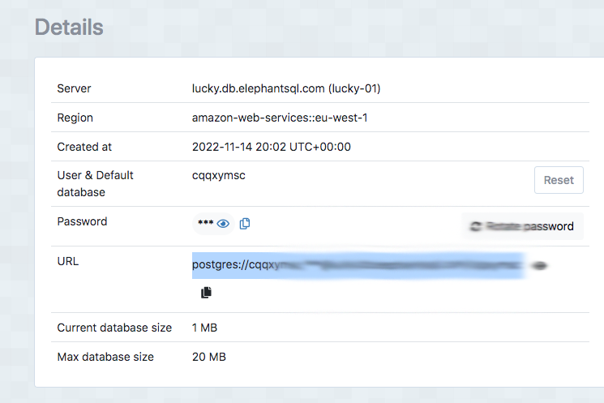 
_ElephantSQL_

You can now use this URL when linking the database to the project's GitHub repository.

 

## Deploying to Heroku

* Signup/Signin to Heroku.

* Create a new app from the Heroku dashboard.

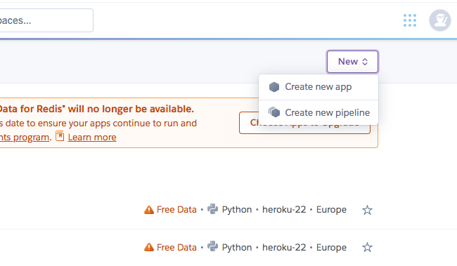 
_Heroku Deployment_

* Give the app a unique name and enter the region of operation then click 'create app'.

* From your newly created app choose the settings tab and navigate to 'Reveal Config Vars'.

* Paste the ElephantSQL Database URL into the DATABASE_URL environment variable.

* Create an env.py file in the root directory of your Django project. (At the same directory level as requirements.txt and manage.py)

The file should look like the image below, with the os library imported at the top of the file.

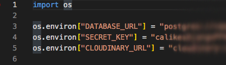 
_env.py_

* Paste the ElephantSQL url for the DATABASE_URL value.

* Add the following libraries to the settings.py file: Import Path from pathlib, dj_database_url and os.

* Create a secret key to replace the insecure SECRET_KEY variable in the settings.py file. Link the secure key in env.py to the settings.py SECRET_KEY variable with the following code: SECRET_KEY = os.environ.get('SECRET_KEY')

* Add your secret key to HEROKU Config Vars.

* Link the DATABASES value to the env.py file with the following code: DATABASES = {
    'default': dj_database_url.parse(os.environ.get('DATABASE_URL'))
    }

* You can now migrate the app models to the new database using the command: "python3 manage.py makemigrations" then Python3 manage.py migrate.

The final part of setting up the env.py file concerns static files. To manage the static files for the project execute the following steps:

* Signup/Signin to [Cloudinary](https://cloudinary.com/)

* Copy the 'cloudinary url' from your account dashboard and paste it as the CLOUDINARY_URL value in env.py.

* Add the CLOUDINARY_URL to the Config Vars in Heroku.

* Also Add the DISABLE_COLLECTSTATIC Key with the value of 1

* Change the static file settings in Django by altering the following.

 * The STATIC_URL
 * STATICFILES_STORAGE
 * STATICFILES_DIRS
 * STATIC_ROOT
 * MEDIA URL
 * DEFAULT_FILE_STORAGE

 The STATIC section of settings.py should resemble the following image:

 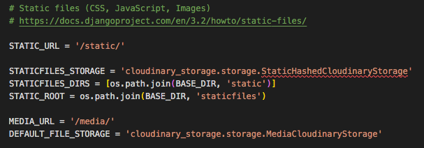 
_STATIC settings.

* Change the TEMPLATES 'DIRS' Setting in Settings.py to [TEMPLATES_DIR] TEMPLATES configuration for the project should resemble the following image:

 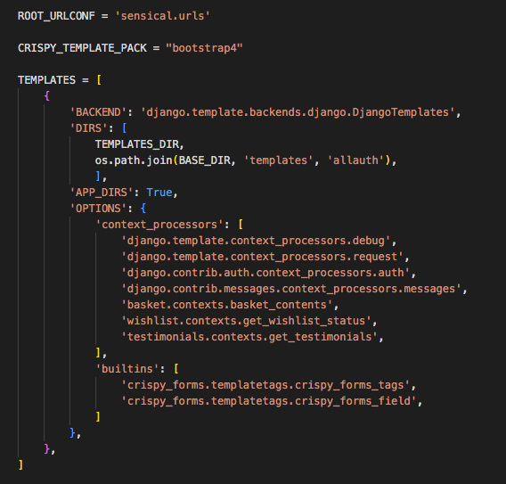 
_TEMPLATES Setting in settings.py

* Create 3 new folders for static files, media files and HTML templates. (At the same directory level as requirements.txt and manage.py.)

* Create a Procfile(capital P) and add the following: web: gunicorn NAME_OF_THE_APP_GOES_HERE.wsgi 

* Add the app name and herokuapp.com to the list of ALLOWED_HOSTS.

* Add and commit the changes to GitHub.

* Remove DISABLE_COLLECTSTATIC from Heroku Config Vars

* Deploy via the 'Deploy Main Branch' button in the Deployment page of HEROKU.

* If you receive an success message, you can click the link provided to view the app in the web browser.

 

## Forking the GitHub Repository

If you want to make an independent copy of the Sensical.ie GitHub repository please follow these steps:

* Signup/Signin to GitHub.

* Follow this link to the Sensical.ie repository: https://github.com/davidcalikes/sensical.ie

* Click on the 'Fork' button at the top-right of the page.

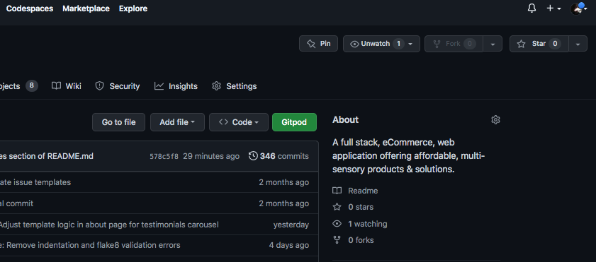 
_Forking the repo_

* A copy of the Sensical.ie repository should now be available in your list of GitHub repositories.

Forking the GitHub repo will not affect the original codebase. 

 

## Cloning the GitHub Repository

If you want to contribute to the Sensical.ie project, You can clone the Sensical.ie repo. A clone creates a linked copy of the repository that will run on a local machine which can then be synchronized with the original repo. To clone Sensical.ie please follow these steps:

* Signup/Signin to GitHub.

* Follow this link to the Sensical.ie repository: https://github.com/davidcalikes/sensical.ie

* Click on the <> Code button near the top-right of the page.

* Access the 'Code' menu from above the main directory window and choose a preferred cloning option by selecting either HTTPS or GitHub CLI. An SSH key is required should you prefer that option. 

* Press the overlapping squares icon to copy the link to the repository.

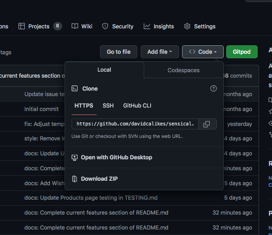 
_Cloning the repo_

* Open the code editor of your choice.

* Create a new working directory for the cloned repo.

* Use the 'git clone command and paste in the copied link.

* Press enter and the repo will be cloned locally to your machine.

* Setup and activate your local development environment.

* Install the project requirements using the command -- pip3 install -r requirements.txt

* Create a Heroku app for your Clone and add the appropriate Config Vars using the [aforementioned instructions](https://github.com/davidcalikes/sensical.ie#deploying-to-heroku).

* Create an env.py file that includes the appropriate DATABSE_URL, SECRET_KEY and CLOUDINARY_URL settings.

* Add 'localhost' to ALLOWED_HOSTS in settings.py

* Use the command -- python3 manage.py makemigrations followed by -- python3 manage.py migrate to setup a local copy of the project database.

* Use the command python3 manage.py runserver to run the app on a development server.

 

# Technologies

Sensical.ie was developed using the following languages, frameworks and dependencies.

* Python (Version 3.8.11) The requirements.txt file contains all the projects Python packages.

* Django was the main python framework used while developing Sensical.ie.

* Django AllAuth was used for user account management/authentication.

* Bootstrap (Version 4.6.2) was used to rapidly develop the layout, responsiveness and core frontend elements of Sensical.ie.

* ElephantSQL was implemented as the Postgres, database management system for Sensical.ie

* HTML was used in developing the templates for Senscial.ie.

* CSS was used to add custom styling to the site, overriding many of Bootstrap's core style rules.

* JavaScript was used to implement interactivity and manipulatethe DOM from the front end.

* Font Awesome Instructive icons were used to provide visual feedback in many areas. 

* Heroku. Sensical.ie was deployed to the cloud-based hosting service Heroku.

* Stripe API. Sensical.ie utilised Stripe to manage secure payments

 

## Software

### Gitpod

Gitpod was used as the primary development environment for this application. As the scope of this project was considerable from the beginning of development, I thought it would be wise to have a system in place that supporting devs could access remotely.

### Git & GitHub

The version control and storage system used for Sensical.ie is Git and GitHub respectively. 

### Lucidchart

I created a flowchart during the planning of Sensical.ie using Lucidchart.

### DrawSQL

I used DrawSQL to create the database schema during the planning stages of the project.

### Adobe Photoshop CS6

I am moderately skilled at using Photoshop and created many of the graphics, page-heading images and logo's on display throughout the site.

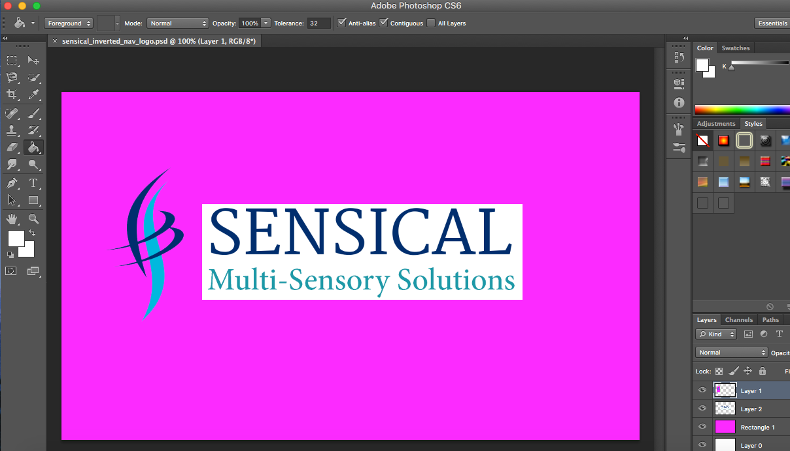 
_Forking the repo_

### Tiny PNG

For resizing larger image files

### WebP Converter

For converting images to nextgen web formats.

### RedKetchup Batch Image Converter

For batch converting product images. https://redketchup.io/bulk-image-resizer

### Balsamiq

I used Balsamiq to create wireframes for the project.

### Favicon

I used [Favicon](https://favicon.io/favicon-converter/) generator to make the Sensical.ie favicon

### Other Notable Resources

* Diffchecker -- To compare code in a web browser when searching for bugs and subtle changes.

* Grammarly -- To check the spelling and grammar of the text content of Sensical.ie and its documentation.

* [Policymaker.io](https://policymaker.io/) -- To create policy documents for the site.

 

# Media

The following are images, to which I personally hold the copyright.

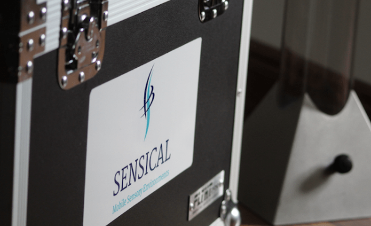 
_Sensical.ie Image_

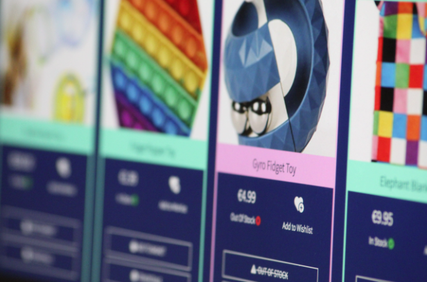 
_Sensical.ie Image_

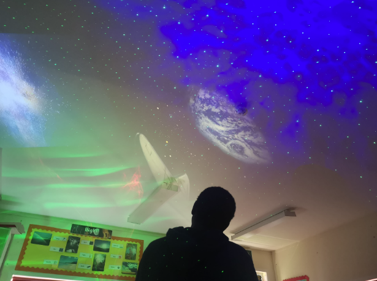 
_Sensical.ie Image_

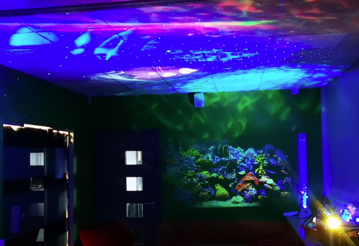 
_Sensical.ie Image_

The error page image was downloaded from Adobe: Credit: teerapon - stock.adobe.com: Copyright: ©teerapon - stock.adobe.com

All product images are from Amazon.com: This site will never be developed into a site for commercial use, and is only for assessment purposes.

The warning logo used was downloaded from: https://www.subpng.com/png-v5sg3x/download.html

All other images used throughout the development of this site were downloaded from [Pexels.com](https://www.pexels.com/photo/photo-of-woman-teaching-935943/) and are free to use.

 

# Credits

### Boutique Ado

Many elements of the the e-commerce part of this project have been adapted from the Code Institute's "Boutique Ado" Code-through Project.

### Shopping Basket Item counter

The principles of design for the Shopping Basket Item Counter is loosely base was from this [Youtube](https://www.youtube.com/watch?v=3xQRJqxdgK4
) video.

 

### Shopping Basket Item counter

I was inspired by both this [Article](https://www.youtube.com/watch?v=3xQRJqxdgK4) on Stack Overflow and this [Youtube](https://www.youtube.com/watch?v=D-sSNQfz_1s) video when designing the Availability Toggle Feature.

 

### Submit button outside form

This page helped me move the submit button outside the form element.
https://davidwalsh.name/submit-button-outside-form

 

### Video element

When converting the Hero Gif image to video I referenced this article from [Codepen](https://codepen.io/remersonc/pen/JXyvbZ)

 

### Icons in form submit

To Maintain a consistent style, I referenced this [article](https://medium.com/@woraperth/bootstrap-how-to-use-font-awesome-in-form-submit-button-969000a9c7dd) when learning how to use fontawesome icons in form submit buttons.

 

### Wishlist

I followed this excellent wishlist [tutorial](https://www.google.com/search?q=easiest+django+wishlist&rlz=1C5CHFA_enIE874IE875&sxsrf=AJOqlzWO2EJ2F4aBPmJPcQFIh0L2yLdNeg:1675522806587&source=lnms&tbm=vid&sa=X&ved=2ahUKEwjlmMztkPz8AhWKJ8AKHYarDd8Q_AUoAnoECAEQBA&biw=1700&bih=661&dpr=0.9#fpstate=ive&vld=cid:5d7de03e,vid:OgA0TTKAtqQ) when adding the wishlist feature to the e-Commerce webstore.

 

### Getting cloudinary image urls from the view.

The referenced the following articles when using cloudinary's backend uploader feature. 

* https://cloudinary.com/documentation/django_image_and_video_upload#uploading_images_to_cloudinary_with_python

* https://cloudinary.com/documentation/django_image_and_video_upload#server_side_upload

* https://stackoverflow.com/questions/46236810/how-to-let-a-user-upload-an-image-in-django/46237099#46237099

* https://alphacoder.xyz/image-upload-with-django-and-cloudinary/

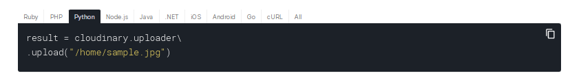 
_Sensical.ie Cloudinary Documentation_

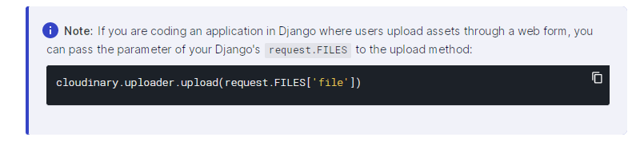 
_Sensical.ie Cloudinary Documentation_

 

# Thanks

### Michelle Calikes

I am hugely thankful for the time my wife has afforded me to work on this project and the course overall. Thank you, Michelle! (It's Done... YAAAS!)

 

### Saoirse & Lochlainn Calikes

Having a Dad who is studying cannot be fun. I am fully aware we have a whole year of Monkey Islanding and Football and walks to catch up on. 

 

### Irene Neville: Code Institute Cohort Facilitator.

I'd like to thank Irene for facilitating the Code Institute Cohort during this project.

 

### Kasia Boguka: Code Institute Facilitator.

Thank you, Kasia, for all of your guidance and wisdom throughout my time studying with CI.

 

### Richard Wells: Code Institute Mentor.

There's a point in the Joseph Campbell Monomyth "The Hero's Journey" called 'Meeting with the mentor', where the hero of a given quest, (Harry Potter, Frodo, Luke Skywalker etc.) meets a mentor figure (Dumbledore, Gandalf, Obi Wan) and receives sage wisdom and 'supernatural aid' that helps them set about their adventures. 'Supernatural aid' really is the only true way I can think of describing the staggering amount of support and mentorship Richard has afforded me throughout the duration of this course. You really went above and beyond mate. Thanks for everything. 

