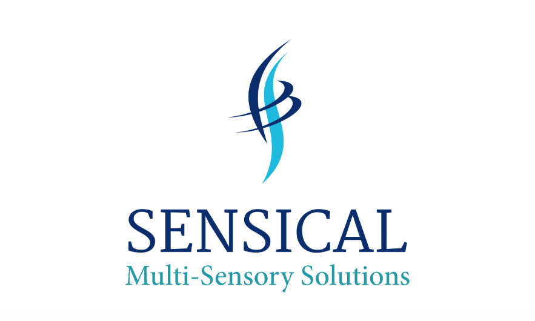
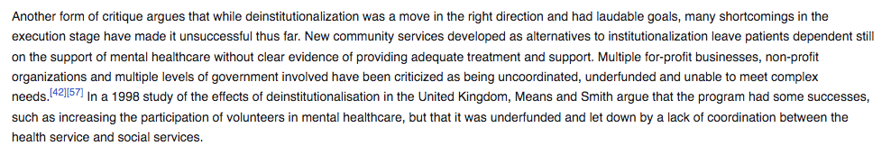
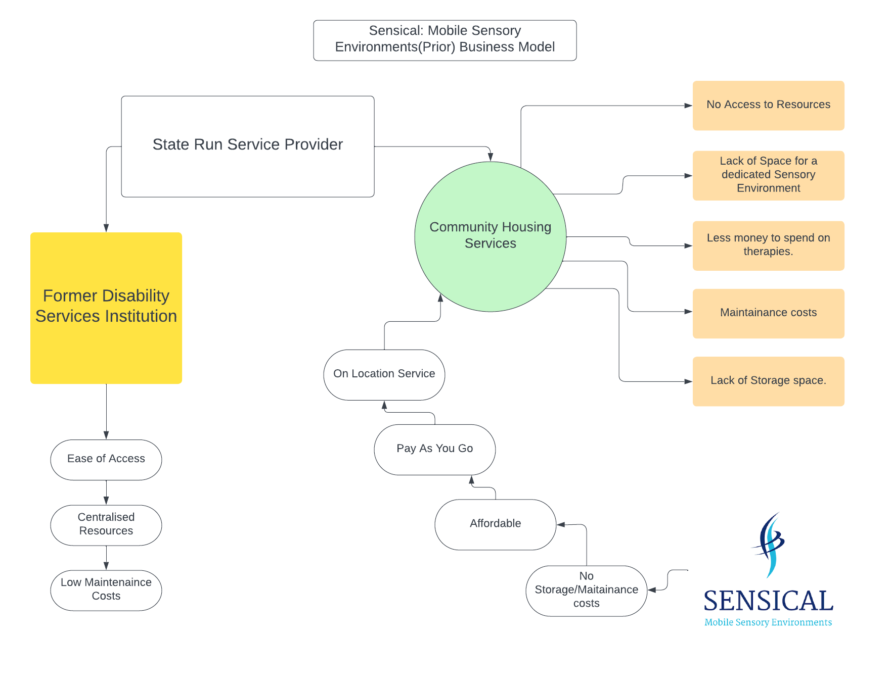
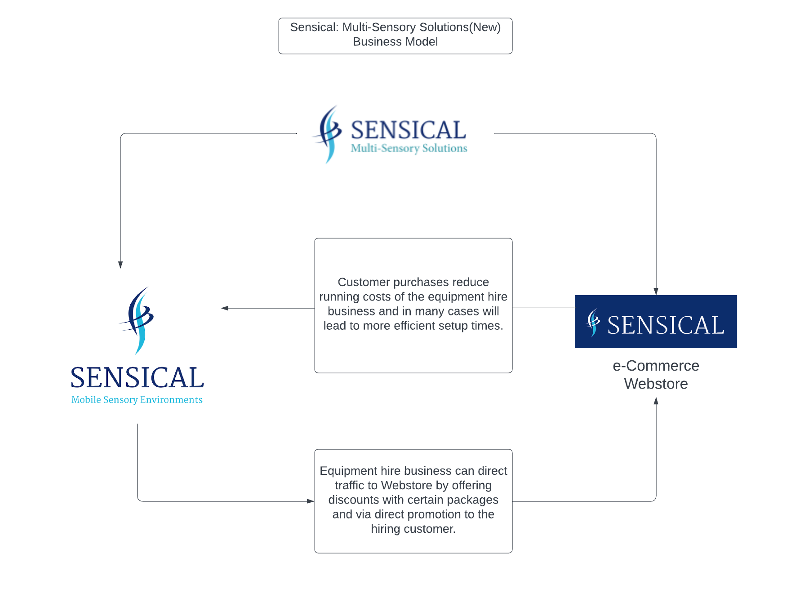

# Sensical.ie

## Overview

Sensical.ie is a full stack, eCommerce, web application offering affordable, multi-sensory products & solutions to a growing and diverse target audience.

When it comes to creating multi-sensory environments, a custom built, dedicated multi sensory space is always the optimal solution. 

Where this is not possible, Sensical Multi-Sensory Solutions can provide a pop-up style multi-sensory experience at an affordable price.

Established in 2018, the business, which operates as a business-to-client sole-tradership, was, like most small enterprises, severely impacted by the global COVID-19 pandemic.

Sensical.ie is the online promotional and business hub for Sensical Mult-Sensory Solutions, allowing users to make bookings for the service via a linked Facebook business page.

# Planning & Research

## Prior Business Model

### Primary Target Audience

I established Sensical 'Mobile-Sensory Environments' in 2018 and operated the business as a sole tradership. Throughout the rest of the project documentation, I will refer to "The Business Owner" or "Site Owner" in an attempt to make the distinction between myself as a Developer and as the owner-operator of the Sensical enterprise.

'Sensical MSE' was borne out of the real world need for low-cost multi-sensory rooms/experiences in the ever-changing landscape of care-provision in Ireland.

Having witnessed first hand the scale and impact of sweeping [deinstitutionalisation](https://en.wikipedia.org/wiki/Deinstitutionalisation) reforms within Irish State-run healthcare facilities, the business owner noticed an opportunity to provide patients and service users with affordable, sensory experiences.

Whilst agreeing that the rights and dignity of residential service users should always be paramount,there are [many issues](https://journals.sagepub.com/doi/full/10.1177/1468017318793620) that arise when deinstitutionalisation occurs.

There are two key negative consequences that affect the provision of Multi-Sensory Services as a result of this process.

* The decentralisation of resources leading to limited access/availability.

* Lack of funding for therapeutic activites due to increased cost of living

As mentioned above, there is no substitute for a purpose-built, well-maintained, fully stocked Multi-Sensory Room. Many residential care centers(institutions) would offer residents scheduled access to such a facility on a regular basis. Situated on campus grounds, the MSR would be wheelchair accessable and just a short distance from a place of residence. Moving service users into community housing severly removes or inhibits this access due to remote housing locations and trasportation issues.

There are also issues with finding the funds, physical space, and expertise to build and maintain a high-quality, sensory room within community housing.

This is where Sensical Mobile-Sensory Environments comes in. For a nominal fee, the pop-up sensory service can transform almost any room into a viable sensory space. 

This is achieved by the following. 

* Bringing the Sensory Equipment to the service user at their point of need.

* Setting up the space by safely blacking- out natural light and implimenting an custom-built, industry standard, sensory lighting system.

* Applying relaxing sensory sounds and fragrances to suit the clients needs.

* Supplying supplementary tactile items to enhance the service users enjoyment.

Benefits of the service include:

* Continuity of service. Users can enjoy the familiarity of having a recognisible service even if they move house or use the service in different areas like day care or school.

* No maintainence costs or storage issues. Sensical maintains its own equipment to the highest standard and removes it when you are finished.

* No travel or dedicated space required. Sensical systems are set up within minutes.

* No huge outlay or lengthy contract. Just pay as you go.

### Secondary Target Audience

The original business was also aimed at customers who needed sensory services in their own private residences. The service proved popular with parents and children with autistic spectrum disorder and learning disabilites. Another way customers utilised the service was block-booking sensory equipment for private residential birthday parties, where one or more of the attendees could avail of a relaxing space should they become overstimulated. 

 

_Prior business model._
  

## Drawbacks

There are of course drawbacks to any business plan and Sensical is no different.

Firstly, the business model is, in essence, part of what many dub 'the gig economy'. This means that the business will not produce revenue unless it is consistently finding new customers and providing the service on a regular basis.

Initially, this was not an immediate problem, as the business owner was higly motivated, technically minded and had a huge wealth of knowledge and transferable skills from many years working as a successful touring musician.

Unfortunately, like every other small enterprise, Sensical MSE was badly affected by the COVID 19 pandemic. Due to restrictions on movement, entering residences, social distancing guidlines, and the closure of schools and day centers, the project ground to a halt in 2020.

As with many other startup owners during Covid, the year 2020 proved to be a time of reflection and creative restructuring for the owner operator of Sensical Mobile Sensory Environments.

I have outlined in the sections below the owner's new vision for the re-imagined company, and the role they hope this e-commerce website will have in making the new business comercially successful.

 

## New Business Model

 

_New business model._

 

Updated Business Strategy
 

Adopting the principles of [concentric diversification](https://www.monash.edu/business/marketing/marketing-dictionary/c/concentric-diversification#:~:text=a%20growth%20strategy%20in%20which,customers%3B%20also%20called%20convergent%20diversification.), the business owner decided to expand the scope of the Sensical enterprise to include an online Webstore offering a range of affordable multi-sensory products that would appeal to it's established customer base as well as a more general target audience.

Growing the business in this way will provide the newly rebranded 'Sensical Multi-Sensory Solutions' with a crucial, additional revenue stream that will help the business stay profitable should any losses occur on the "Mobile Sensory Environments Hire" side of the business. 

Such loss can occur when:

* There are 'lock-down' situations in private residential/residential care settings such as localised outbreaks, epidemics or pandemics.

* The Mobile Sensory Environment Hire service is fully booked.

* The Mobile Sensory Hire Equipment is under repair.

The purpose of selling good quality, carefully selected, supplementary, products is to provide hygenic, affordable enhancements to a customers multi-sensory experience, without the risk of making our 'Mobile Sensory Environments' equipment hire service redundant.

 

e-Commerce Strategy
 

As referenced above, the business owner does not want the 'Equipment Hire' side of the business to suffer as a result of sales from the e-Commerce store. 

In order to mitigate against this, the Sensical.ie Webstore will only stock supplimentary products that can enhance a customers enjoyment during a sensory session, but can in no way recreate the unique sensory experience of a custom Mobile Sensory Environment, when used in isolation.

As [this article](https://www.ctvnews.ca/health/coronavirus/parents-are-not-ok-after-3-years-of-covid-and-a-brutal-winter-of-children-s-respiratory-illness-1.6231476) from January 2023 demonstrates, many parents and care providers are still wary of COVID (and other respiratory ilnesses) community spread.

The Sensical.ie Webstore will allow customers to purchase their own sensory items, musical instruments, accessories and more, ensuring peace of mind that all items are sanitary. This also significantly reduces the hire services maintainence and cleaning budget.

The site should make it as simple as possible for the user to identify products they wish to purchase, identify their availability, suitablity, and aspect and also seemlessly complete payment of products they have added to their shopping basket via a checkout feature.

The Webstore should encourage users to create and account in order to make return visits even easier, by storing delivery information and a wishlist of possible future purchases to their user profile.

The Webstore should be easy to navigate and offer the user the ability to see products from specific categories, subcategories and availability.

The Website (outwith the Webstore) should also include information about the Equipment Hire side of the business, and provide links to the already established Facebook Business Page to encourage purchasing customers to also make a booking. This would increas the sites rating on popular search engines like Google and Bing by underlining the legitimacy of the site, its content and subject matter. See below for how the business owner hopes the Webstore will synergise with the hire business and help maximise profitability.

 

Synergetic Approach
 

Whilst diversification for it's own sake may prove enough of a reason for the introduction of the e-Commerce Webstore, there are other benefits that may also be advantageous. To demonstrate how this might work I have created the following persona:
 
Persona Name: 
* Emma Kearns.

Age:
* 14.

Job/Role: 
* School Pupil

Status:
* Minor.

Other Information:
* Highly Functioning Autistic School Pupil.
* Loves water, marine life and the sea side.
* Struggles with concentration due to anxiety.
* Both parents are separated.
* Lives with Mum and stays sometimes with Dad.

Goals:
* To eleviate anxiety/stress
* To relax enough to think and perform tasks
* To enjoy my spare time.

Pain Point/Concerns:
* I love mu Mum, She understands me more than anyone but she seldom has time to take me to the beach or swimming anymore.
* I love my Dad but I feel like there's no relaxing space for me when mum is on nights and I stay over at his house.
* I wish I could take my water basin with me when I visit the sensory room at the solas centre but I'm not allowed.
* I love listening to the sea in sea shells I find at the beach but mum says they're too dirty to bring home.

Examining the empathetic excercise above it seems that Emma could stand to benefit from some therapeutic multi-sensory activities. 

Sensical Multi-Sensory Solutions could, hypothetically, provide Emma with a relaxing, yet stimulating underwater-themed sensory experience whether she stays with her Mum or Dad. When liasing with hiring customers, the business owner will conduct a thorough interview and determine which elements of their technical inventory would be best suited to create the perfect sensory environment.

It is at this stage however, that this particular customer and her parents could be directed towards the Sensical.ie Webstore. Emma likes to listen to the sound of the ocean but Mum is worried about hygeine? Well the Webstore currently have an 'Ocean Drum' in stock. An 'Ocean Drum' is a traditional percussion instrument that replicates the sound of the ocean in the palm of your hand... and it has a wipe-clean hygenic surface.

Should the Kearns family purchase such an item, plus say perhaps a bubble-tube lighting fixture and a heavy duty blackout blind, then not only will the Webstore generate revenue in the short term, but the Hire service will no longer have to load those item the next visit during setup time saving the customer time and providing better value for money. (Less time filling and emptying bubble tubes means more time enjoying the Sensory Environment)

When developing real-world business relationships like this, it will inform the business owners descisions when purchasing future products to sell in the Webstore. A business strategy with its own, in-built market research.

 

