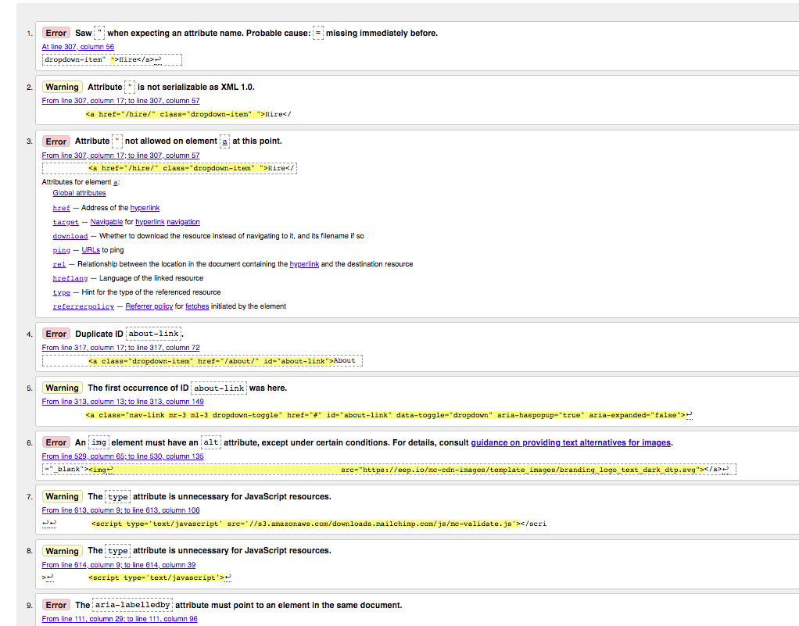
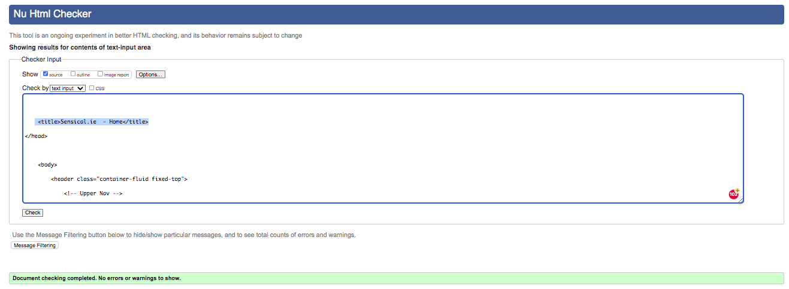
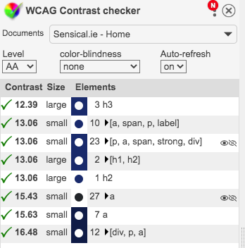
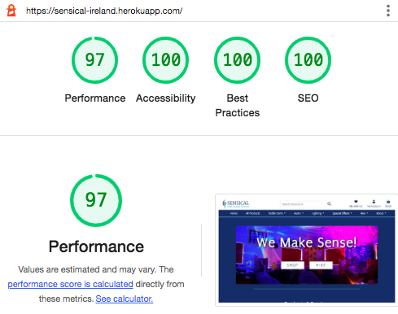
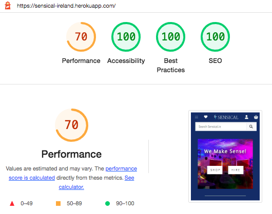
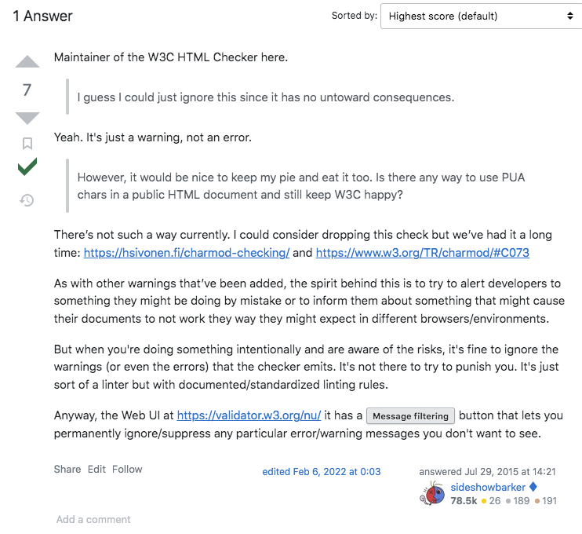
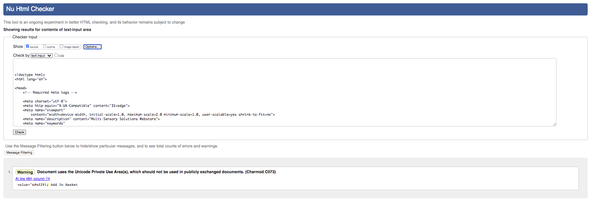
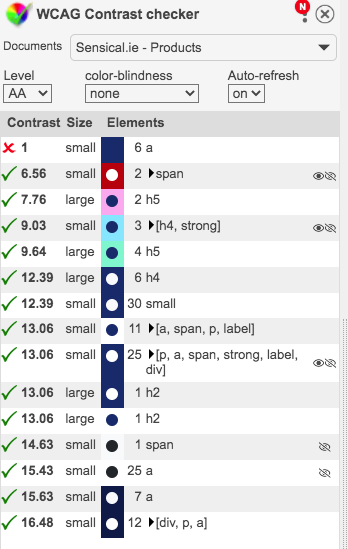
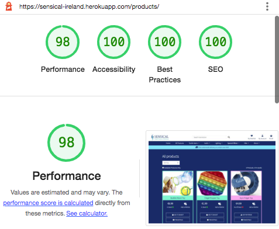
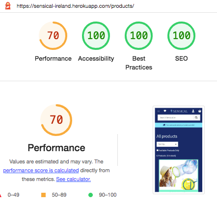

## Manual Testing

Each page, feature and link of the application has been tested.
I have used dropdown menus for each page to make the documentation more human readable.

Home Page Testing
 

The HTML Templates associated with the home page are:

* base.html
* main-nav.html
* mobile-top-header.html
* index.html
* home-cards.html
* footer.html

Each link of the Home page was tested and was marked 'pass' when the following expected behaviour was produced.

* Base Template and Footer Links -- All links direct to the correct URL and external links open in new tabs. 

* Login Redirect -- The user is directed to the correct page depending on the users authentication status upon login or when the login links in the homepage cards are clicked.

* Can Access Products Page From Hero GIF -- The user can access the Products page from the home page hero GIF.

* Can Access Hire Page -- The user can access the HIRE page from the home page hero GIF.

* Can Access Hire Page -- The user can access the Products page via the Product & Services Cards.

* Can Access Products Page -- The user can access the Products page via the Product & Services Cards.

* Can Access About Page -- The user can access the Products page via the Product & Services Cards.

 

| Auth Status     | Can Register | Can Login | Can Logout | Products Links | Hire Links | Nav/Footer Links | Profile Access | Product Manaagement Access | Wishlist Access |
|-----------------|--------------|-----------|------------|----------------|------------|------------------|----------------|----------------------------|-----------------|
| Admin           | no/pass      | no/pass   | yes/pass   | yes/pass       | yes/pass   | yes/pass         | yes/pass       | yes/pass                   | yes/pass        |
| Registered User | no/pass      | no/pass   | yes/pass   | yes/pass       | yes/pass   | yes/pass         | yes/pass       | no/pass                    | yes/pass        |
| Anonymous User  | yes/pass     | yes/pass  | no/pass    | yes/pass       | yes/pass   | yes/pass         | no/pass        | no/pass                    | no/pass         |                    |

 

Home page validator testing.

The Home page was passed through the W3C HTML Validator and returned multiple errors.

 
_W3C HTML Validator Testing Screenshot_ 

The errors were corrected and now the Validator returns no errors.

 
_W3C HTML Validator Testing Screenshot_ 

The Home page was passed through the WCAG Color contrast checker and returned no contrast errors.

 
_WCAG Validator Testing Screenshot_

The Home Page was passed through Lighthouse and returned the following performance results:

 
_Desktop Lighthouse Performance Testing Screenshot_

 
_Mobile Lighthouse Performance Testing Screenshot_

In future versions of the app I hope to significantly improve mobile performance.
 

 

Products Page Testing
 

The HTML Templates associated with the products page are:

* base.html
* main-nav.html
* mobile-top-header.html
* products
* footer.html

Each link of the Products page was tested and was marked 'pass' when the following expected behaviour was produced.

* Base Template and Footer Links -- All links direct to the correct URL and external links open in new tabs. 

* Sort selector -- The sort selector is accessible and functions correctly.

* Availability toggle -- The availability toggle is accessible and functions correctly.

* Can Add to basket -- User can add product to basket

* Message Success -- User is notified when item is in basket.

* Product Detail Access -- The user can access the Product Detail page from the Product Card Links.

* Add Product Form -- An authenticated Admin user can add an existing product.

* Update Product Form -- An authenticated Admin user can edit an existing product.

* Can Delete Product -- An authenticated Admin user can delete an existing product.

* Can Add or Remove item to wishlist -- An authenticated user can add/remove an item from the wishlist. Unathenticated users are redirected to login.

 

| Auth Status     | Sort Select | Availability Select | Can Add To Basket | Is Notified | Products Detail Links | Add Product | Edit Product | Wishlist Access |
|-----------------|-------------|---------------------|-------------------|-------------|-----------------------|-------------|--------------|-----------------|
| Admin           | yes/pass    | yes/pass            | yes/pass          | yes/pass    | yes/pass              | yes/pass    | yes/pass     | yes/pass        |
| Registered User | yes/pass    | yes/pass            | yes/pass          | yes/pass    | yes/pass              | no/pass     | no/pass      | yes/pass        |
| Anonymous User  | yes/pass    | yes/pass            | yes/pass          | yes/pass    | yes/pass              | no/pass     | no/pass      | no/pass         |
 

Products page validator testing.

The Products page was passed through the W3C HTML Validator and returned this warning.

 
_W3C HTML Validator Testing Screenshot_ 

I researched this warning and decided it coould be safely ignored.

 
_W3C HTML Validator Testing Screenshot_ 

The Products page was passed through the WCAG Color contrast checker and returned no contrast errors.

 
_WCAG Validator Testing Screenshot_

The Products Page was passed through Lighthouse and returned the following performance results:

 
_Desktop Lighthouse Performance Testing Screenshot_

 
_Mobile Lighthouse Performance Testing Screenshot_

In future versions of the app I hope to significantly improve mobile performance.
 

 

Products Page Testing
 

The HTML Templates associated with the products page are:

* base.html
* main-nav.html
* mobile-top-header.html
* products
* footer.html

Each link of the Products page was tested and was marked 'pass' when the following expected behaviour was produced.

* Base Template and Footer Links -- All links direct to the correct URL and external links open in new tabs. 

* Sort selector -- The sort selector is accessible and functions correctly.

* Availability toggle -- The availability toggle is accessible and functions correctly.

* Can Add to basket -- User can add product to basket

* Message Success -- User is notified when item is in basket.

* Product Detail Access -- The user can access the Product Detail page from the Product Card Links.

* Add Product Form -- An authenticated Admin user can add an existing product.

* Update Product Form -- An authenticated Admin user can edit an existing product.

* Can Delete Product -- An authenticated Admin user can delete an existing product.

* Can Add or Remove item to wishlist -- An authenticated user can add/remove an item from the wishlist. Unathenticated users are redirected to login.

 

| Auth Status     | Sort Select | Availability Select | Can Add To Basket | Is Notified | Products Detail Links | Add Product | Edit Product | Wishlist Access |
|-----------------|-------------|---------------------|-------------------|-------------|-----------------------|-------------|--------------|-----------------|
| Admin           | yes/pass    | yes/pass            | yes/pass          | yes/pass    | yes/pass              | yes/pass    | yes/pass     | yes/pass        |
| Registered User | yes/pass    | yes/pass            | yes/pass          | yes/pass    | yes/pass              | no/pass     | no/pass      | yes/pass        |
| Anonymous User  | yes/pass    | yes/pass            | yes/pass          | yes/pass    | yes/pass              | no/pass     | no/pass      | no/pass         |
 

Products page validator testing.

The Products page was passed through the W3C HTML Validator and returned this warning.

 
_W3C HTML Validator Testing Screenshot_ 

I researched this warning and decided it coould be safely ignored.

 
_W3C HTML Validator Testing Screenshot_ 

The Products page was passed through the WCAG Color contrast checker and returned no contrast errors.

 
_WCAG Validator Testing Screenshot_

The Products Page was passed through Lighthouse and returned the following performance results:

 
_Desktop Lighthouse Performance Testing Screenshot_

 
_Mobile Lighthouse Performance Testing Screenshot_

In future versions of the app I hope to significantly improve mobile performance.
 

## Jigsaw CSS Validation

