# Testing

## Tests during development

### User Story Tests

I tested each user story by adding acceptance criteria to every card of each of the four 'sprint' boards I created as part of the [AGILE](../docs/AGILE.md) planning process. 

No story could move to the 'done' column of each Kanban board unless all tasks had been completed and the criteria had been met.

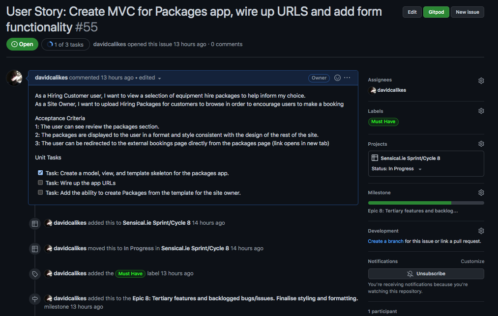 
_User Story Screenshot_ 

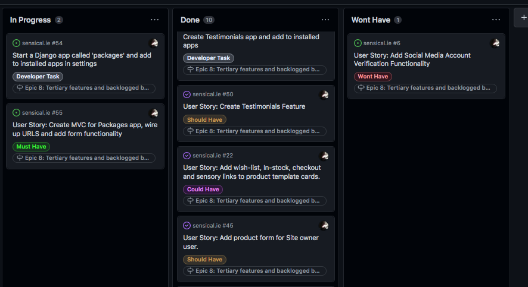 
_Kanban Board Screenshot_ 

All of the user story acceptance criteria can be inspected via the eight KANBAN boards I have linked to in the [AGILE](../docs/AGILE.md) document.

 

## Examples of Errors found during development

Below are a few problems I encountered during development. I didn't catalogue every typo or syntax error, but I included these errors to provide an overview of the main types of issue. The Webhooks issue I encountered below was by far the most difficult issue I had during the development of Sensical.ie

One of the first errors I encountered was a simple syntax error:

 
_Syntax Error Testing Screenshot_

I located the error and realised my mistake.

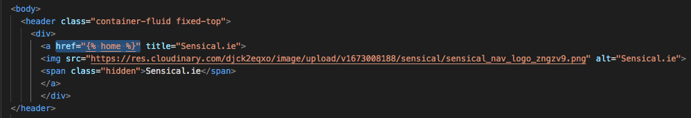 
_Syntax Error Testing Screenshot_

By Adding the correct url '' syntax I corrected the issue.

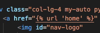 
_Syntax Error Testing Screenshot_

And the page displayed correctly.

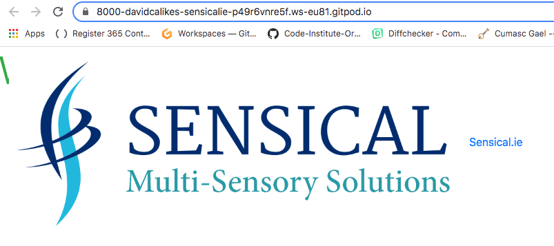 
_Syntax Error Testing Screenshot_

 

I used the console log in Google Developer Tools to test any JavaScript functions during development.

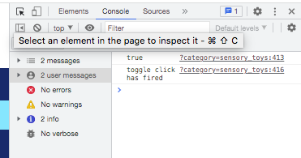 
_Console Testing Screenshot_

During a test, I encountered an Issue with the availability toggle.

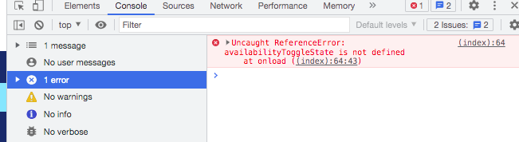 
_Console Error Screenshot_

I corrected this issue by adding Django template logic to base.html.

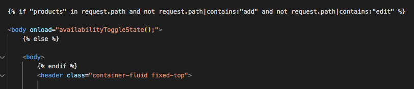 
_Console Error Screenshot_

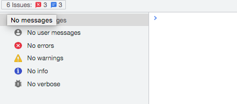 
_Console Error Screenshot_

 

When creating the checkout functionality, Django returned the following error:

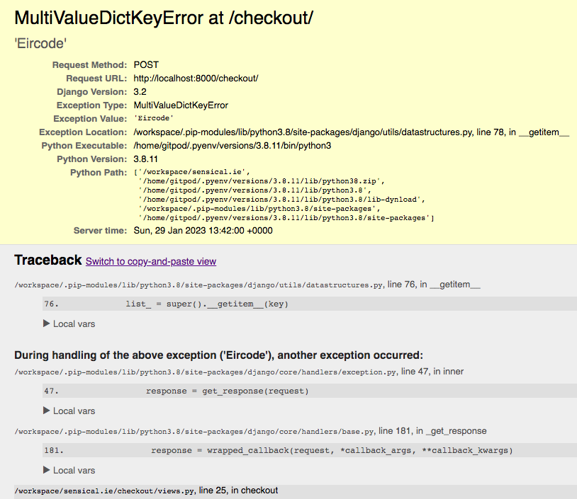 
_Typo Error Screenshot_

When I inspected the code I realised I had made an error capitalising the E in Eircode

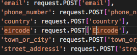 
_Typo Error Screenshot_

I fixed this by making the E lowercase.

When setting up webhooks and returning confirmation emails I recieved a Stripe payment intent error.

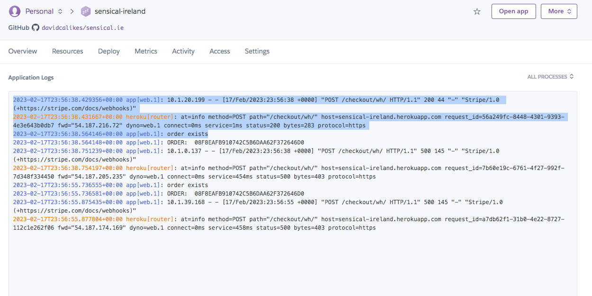 
_Webhooks Error Screenshot_

I used the application logs and print statements to try and locate the problem.

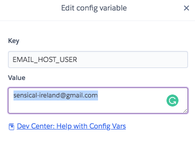 
_Webhooks Error Screenshot_

I couldn't find an issue with the source code so I checked heroku environment variables and the cause of the issue
was a typo in the EMAIL_HOST_USER email address. (hyphen instead of a period)

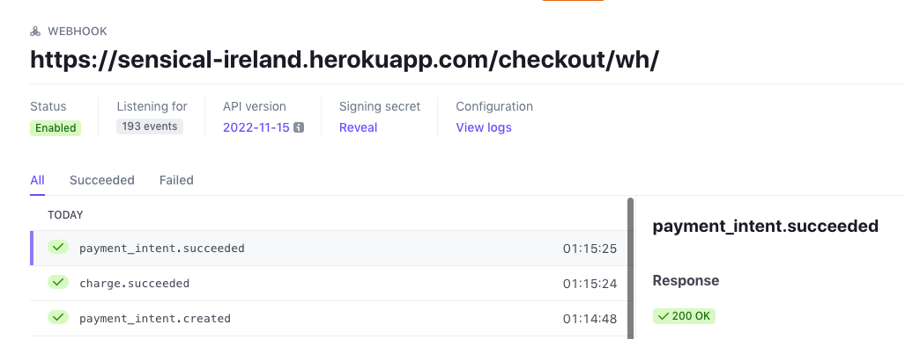 
_Webhooks Error Screenshot_

Correcting the typo solved the issue.

 

I noticed the price per item was not displaying correctly in the wishlist success message modal.

 
_Wishlist Message Error Screenshot_

I examined the code and dicovered the following:

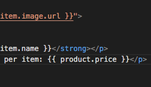 
_Wishlist Message Error Screenshot_

The price was being called incorrectly using the product prefix instead of item.

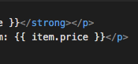 
_Wishlist Message Error Screenshot_

The functionality returned when i corrected the error.

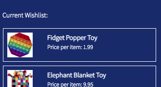 
_Wishlist Message Error Screenshot_

 

## Manual Testing

Each page, feature and link of the application has been tested.
I have used dropdown menus for each page to make the documentation more human readable.

Home Page Testing
 

The HTML Templates associated with the Home page are:

* base.html
* main-nav.html
* mobile-top-header.html
* index.html
* home-cards.html
* footer.html

Each link of the Home page was tested and was marked 'pass' when the following expected behaviour was produced.

* Base Template and Footer Links -- All links direct to the correct URL and external links open in new tabs. 

* Login Redirect -- The user is directed to the correct page depending on the users authentication status upon login or when the login links in the homepage cards are clicked.

* Can Access Products Page From Hero GIF -- The user can access the Products page from the home page hero GIF.

* Can Access Hire Page -- The user can access the HIRE page from the home page hero GIF.

* Can Access Hire Page -- The user can access the Products page via the Product & Services Cards.

* Can Access Products Page -- The user can access the Products page via the Product & Services Cards.

* Can Access About Page -- The user can access the Products page via the Product & Services Cards.

 

| Auth Status     | Can Register | Can Login | Can Logout | Products Links | Hire Links | Nav/Footer Links | Profile Access | Product Manaagement Access | Wishlist Access |
|-----------------|--------------|-----------|------------|----------------|------------|------------------|----------------|----------------------------|-----------------|
| Admin           | no/pass      | no/pass   | yes/pass   | yes/pass       | yes/pass   | yes/pass         | yes/pass       | yes/pass                   | yes/pass        |
| Registered User | no/pass      | no/pass   | yes/pass   | yes/pass       | yes/pass   | yes/pass         | yes/pass       | no/pass                    | yes/pass        |
| Anonymous User  | yes/pass     | yes/pass  | no/pass    | yes/pass       | yes/pass   | yes/pass         | no/pass        | no/pass                    | no/pass         |                    |

 

Home page validator testing.

The Home page was passed through the W3C HTML Validator and returned multiple errors.

 
_W3C HTML Validator Testing Screenshot_ 

The errors were corrected and now the Validator returns no errors.

 
_W3C HTML Validator Testing Screenshot_ 

The Home page was passed through the WCAG Color contrast checker and returned no contrast errors.

 
_WCAG Validator Testing Screenshot_

The Home Page was passed through Lighthouse and returned the following performance results:

 
_Desktop Lighthouse Performance Testing Screenshot_

 
_Mobile Lighthouse Performance Testing Screenshot_

In future versions of the app I hope to significantly improve mobile performance.
 

 

Products Page Testing
 

The HTML Templates associated with the products page are:

* base.html
* main-nav.html
* mobile-top-header.html
* products
* footer.html

Each link of the Products page was tested and was marked 'pass' when the following expected behaviour was produced.

* Base Template and Footer Links -- All links direct to the correct URL and external links open in new tabs. 

* Sort selector -- The sort selector is accessible and functions correctly.

* Availability toggle -- The availability toggle is accessible and functions correctly.

* Can Add to basket -- User can add product to basket

* Message Success -- User is notified when item is in basket.

* Product Detail Access -- The user can access the Product Detail page from the Product Card Links.

* Add Product Form -- An authenticated Admin user can add an existing product.

* Update Product Form -- An authenticated Admin user can edit an existing product.

* Can Delete Product -- An authenticated Admin user can delete an existing product.

* Can Add or Remove item to wishlist -- An authenticated user can add/remove an item from the wishlist. Unathenticated users are redirected to login.

 

| Auth Status     | Sort Select | Availability Select | Can Add To Basket | Is Notified | Products Detail Links | Add Product | Edit Product | Wishlist Access |
|-----------------|-------------|---------------------|-------------------|-------------|-----------------------|-------------|--------------|-----------------|
| Admin           | yes/pass    | yes/pass            | yes/pass          | yes/pass    | yes/pass              | yes/pass    | yes/pass     | yes/pass        |
| Registered User | yes/pass    | yes/pass            | yes/pass          | yes/pass    | yes/pass              | no/pass     | no/pass      | yes/pass        |
| Anonymous User  | yes/pass    | yes/pass            | yes/pass          | yes/pass    | yes/pass              | no/pass     | no/pass      | no/pass         |
 

Products page validator testing.

The Products page was passed through the W3C HTML Validator and returned this warning.

 
_W3C HTML Validator Testing Screenshot_ 

I researched this warning and as it provides nice feedback for the user, maintains a consistent design I decided it could be safely ignored.

 
_W3C HTML Validator Testing Screenshot_ 

The Products page was passed through the WCAG Color contrast checker and returned no contrast errors. (The error seen in the supporting image is from a table row in the WCAG table itself)

 
_WCAG Validator Testing Screenshot_

The Products Page was passed through Lighthouse and returned the following performance results:

 
_Desktop Lighthouse Performance Testing Screenshot_

 
_Mobile Lighthouse Performance Testing Screenshot_

In future versions of the app I hope to significantly improve mobile performance.
 

 

Product Detail Page Testing
 

The HTML Templates associated with the Product Detail page are:

* base.html
* main-nav.html
* mobile-top-header.html
* product-detail.html
* footer.html

Each link of the Product Detail page was tested and was marked 'pass' when the following expected behaviour was produced.

* Base Template and Footer Links -- All links direct to the correct URL and external links open in new tabs. 

* Quantity -- User Can Select Quantity

* Can Add to basket -- User can add product to basket

* Message Success -- User is notified when item is in basket.

* Message Warning -- User is notified if they have reached max allowed items.

* Back to Products -- The user can return to the Products page from the Product Detail Page.

* Can Add or Remove item to wishlist -- An authenticated user can add/remove an item from the wishlist. Unathenticated users are redirected to login.

 

| Auth Status     | Quantity | Can Add To Basket | Is Notified (Success) | Is Notified (Warning) | Back to Products | Wishlist Access |
|-----------------|----------|-------------------|-----------------------|-----------------------|------------------|-----------------|
| Admin           | yes/pass | yes/pass          | yes/pass              | yes/pass              | yes/pass         | yes/pass        |
| Registered User | yes/pass | yes/pass          | yes/pass              | yes/pass              | Yes/pass         | yes/pass        |
| Anonymous User  | yes/pass | yes/pass          | yes/pass              | yes/pass              | Yes/pass         | no/pass         |
 

Product Detail page validator testing.

The Product Detail page was passed through the W3C HTML Validator and returned this warning.

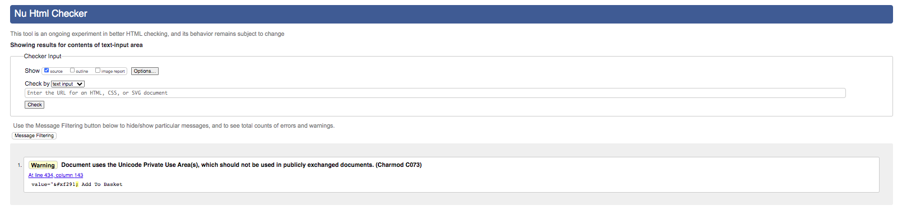 
_W3C HTML Validator Testing Screenshot_ 

I researched this warning and as it provides nice feedback for the user, maintains a consistent design I decided it could be safely ignored.

 
_W3C HTML Validator Testing Screenshot_ 

The Product Detail page was passed through the WCAG Color contrast checker and returned no contrast errors. (The error seen in the supporting image is from a table row in the WCAG table itself)

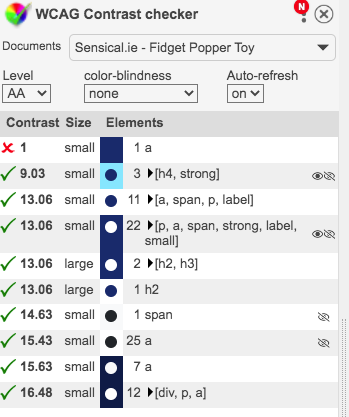 
_WCAG Validator Testing Screenshot_

The Product Detail Page was passed through Lighthouse and returned the following performance results:

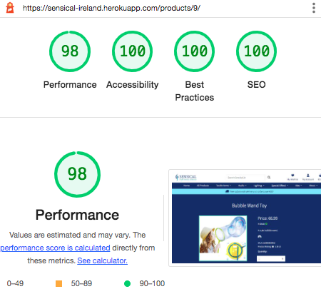 
_Desktop Lighthouse Performance Testing Screenshot_

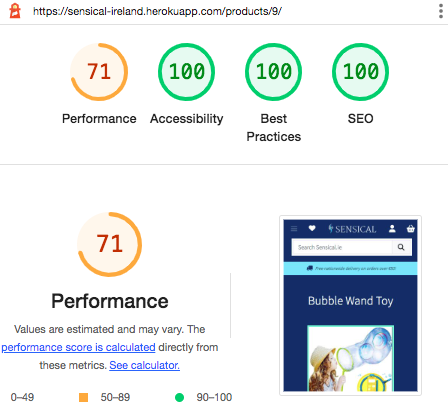 
_Mobile Lighthouse Performance Testing Screenshot_

 

 

Product Management Pages Testing
 

The HTML Templates associated with the Product Management pages are:

* base.html
* main-nav.html
* mobile-top-header.html
* add_product.html
* edit_product.html
* footer.html

Each of the Product Management Form pages were tested and was marked 'pass' when the following expected behaviour was produced.

* Base Template and Footer Links -- All links direct to the correct URL and external links open in new tabs.

* Product Management Access -- Product Management is only available to Admin users.

* Form Validation -- The form returned validation error message if form was invalid

* Cancel -- The User can cancel the action and return to products page.

* Message Success -- User is notified when a product is added.

* Message Info -- User is notified when a editing a product.

 

| Auth Status     | Can Access | Form Validation | Is Notified (Success) | Is Notified (Info) | Back to Products |
|-----------------|------------|-----------------|-----------------------|--------------------|------------------|
| Admin           | yes/pass   | yes/pass        | yes/pass              | yes/pass           | yes/pass         |
| Registered User | no/pass    | n/a             | n/a                   | n/a                | n/a              |
| Anonymous User  | no/pass    | n/a             | n/a                   | n/a                | n/a              |
 

Product Management pages validator testing.

The Product Management pages were passed through the W3C HTML Validator and returned no warnings

 
_W3C HTML Validator Testing Screenshot_ 

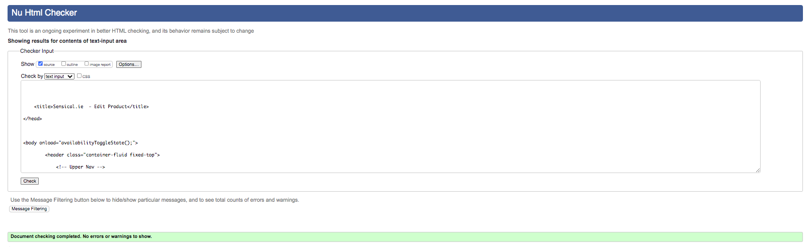 
_W3C HTML Validator Testing Screenshot_ 

The Products Management Pages were passed through the WCAG Color contrast checker and returned no contrast errors. (The error seen in the supporting image is from a table row in the WCAG table itself)

 
_WCAG Validator Testing Screenshot_

The Product Management Pages were passed through Lighthouse and returned the following performance results:

 
_Desktop Lighthouse Performance Testing Screenshot_

 
_Mobile Lighthouse Performance Testing Screenshot_

 

 

Shopping Basket Page Testing
 

The HTML Templates associated with the Shopping Basket page are:

* base.html
* main-nav.html
* mobile-top-header.html
* shopping-basket.html
* footer.html

The Shopping Basket page was tested and was marked 'pass' when the following expected behaviour was produced.

* Base Template and Footer Links -- All links direct to the correct URL and external links open in new tabs.

* Update Quantity -- The User can update the quantity of a given product from their basket.

* Remove Product -- The User can remove a given product from their basket.

* Back To Shopping -- The User can return to products page via the back to shopping button.

* Messages -- User is notified when an action is submitted or there are no products in their basket.

* Go to checkout -- User can go to the checkout page via the Secure Checkout button.

 

| Auth Status     | Update Qyt | Delete Product | Back To Shopping | Messages | Go To Checkout |
|-----------------|------------|----------------|------------------|----------|----------------|
| Admin           | yes/pass   | yes/pass       | yes/pass         | yes/pass | yes/pass       |
| Registered User | yes/pass   | yes/pass       | yes/pass         | yes/pass | yes/pass       |
| Anonymous User  | yes/pass   | yes/pass       | yes/pass         | yes/pass | yes/pass       |
 

Shopping Basket page validator testing.

The Shopping Basket page was passed through the W3C HTML Validator and returned just one justifiable warning.

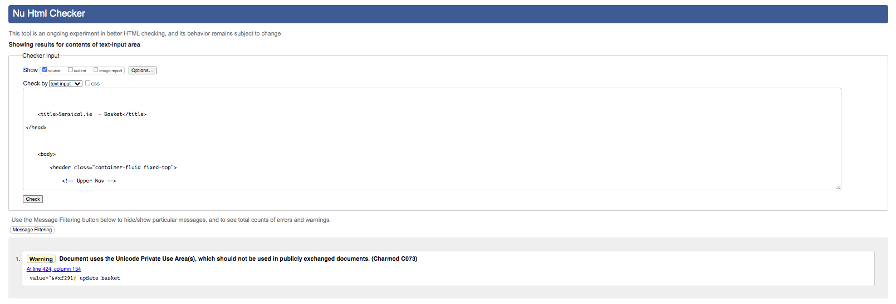 
_W3C HTML Validator Testing Screenshot_ 

 
The Shopping Basket page was passed through the WCAG Color contrast checker and returned no contrast errors. (The error seen in the supporting image is from a table row in the WCAG table itself)

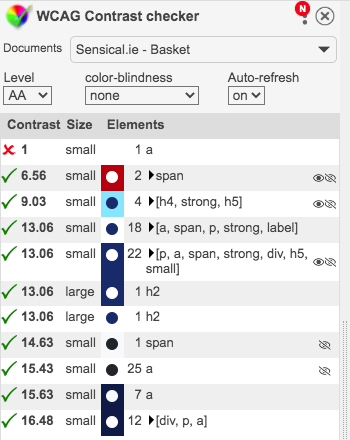 
_WCAG Validator Testing Screenshot_

The Shopping Basket page was passed through Lighthouse and returned the following performance results:

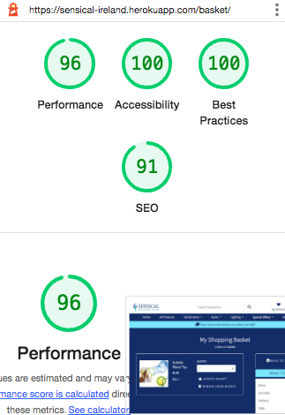 
_Desktop Lighthouse Performance Testing Screenshot_

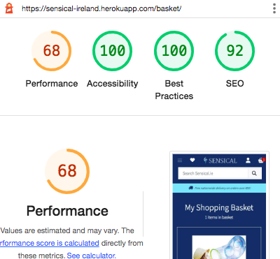 
_Mobile Lighthouse Performance Testing Screenshot_

The SEO Score was low here because the basket is included in the robots.txt file.
 

 

Checkout Pages Testing
 

The HTML Templates associated with the Chackout page are:

* base.html
* main-nav.html
* mobile-top-header.html
* checkout.html
* checkout_success.html
* footer.html

The Checkout page was tested and was marked 'pass' when the following expected behaviour was produced.

* Base Template and Footer Links -- All links direct to the correct URL and external links open in new tabs.

* Delivery Details -- Form displays saved delivery details of registered users.

* Back To Shopping -- The User can return to basket page via the back to basket button.

* Form Error Handling -- The user is informed if the form is invalid. 

* Messages -- User is notified when an action is submitted or there are no products in their basket.

* Submit order -- The User can submit an order.

 

| Auth Status     | Details Saved | Form Error Handling | Back To basket | Messages | Submit Order |
|-----------------|---------------|---------------------|----------------|----------|--------------|
| Admin           | yes/pass      | yes/pass            | yes/pass       | yes/pass | yes/pass     |
| Registered User | yes/pass      | yes/pass            | yes/pass       | yes/pass | yes/pass     |
| Anonymous User  | no/pass       | yes/pass            | yes/pass       | yes/pass | yes/pass     |
 

Checkout page validator testing.

The Checkout page was passed through the W3C HTML Validator and returned just one justifiable warning.

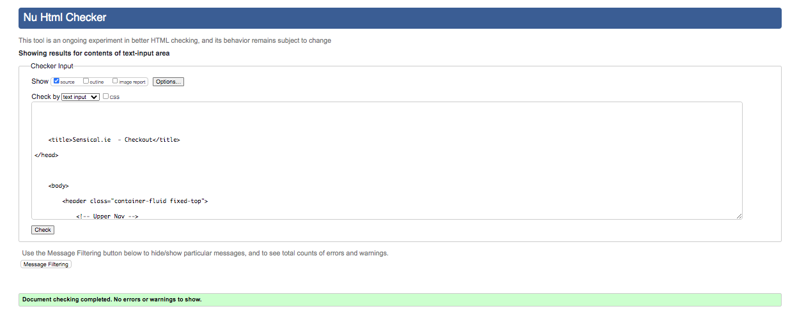 
_W3C HTML Validator Testing Screenshot_ 

 
The Checkout page was passed through the WCAG Color contrast checker and returned no contrast errors. (The error seen in the supporting image is from a table row in the WCAG table itself)

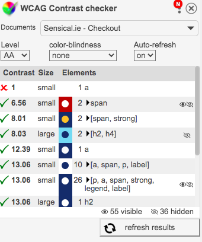 
_WCAG Validator Testing Screenshot_

The Checkout page was passed through Lighthouse and returned the following performance results:

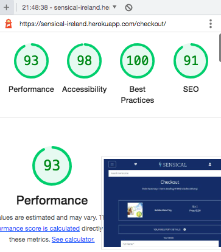 
_Desktop Lighthouse Performance Testing Screenshot_

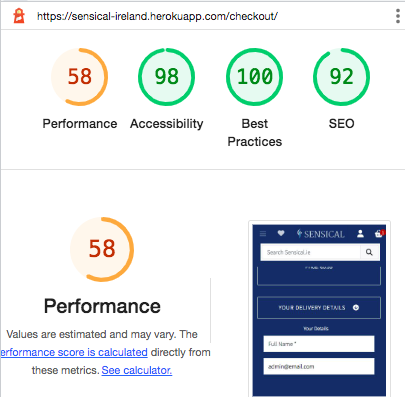 
_Mobile Lighthouse Performance Testing Screenshot_

The Checkout Success page was also tested in W3 and is fully functional.

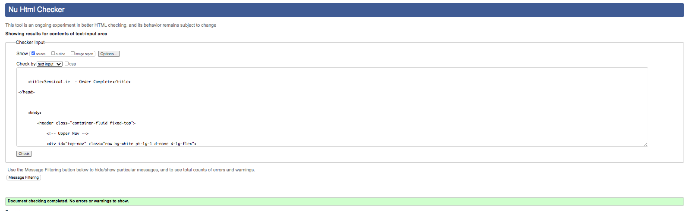 
_W3C HTML Validator Testing Screenshot_ 

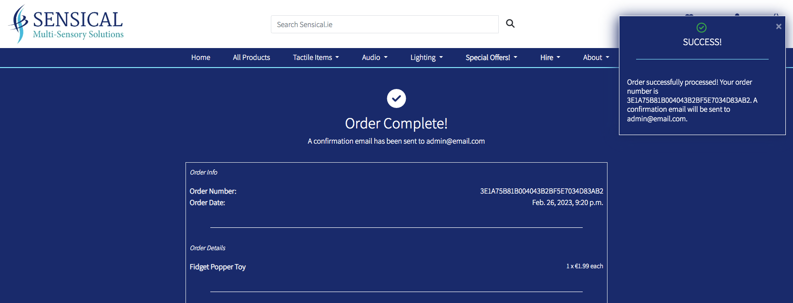 
_Checkout Success Testing Screenshot_ 
 

 

Hire Page Testing
 

The HTML Templates associated with the products page are:

* base.html
* main-nav.html
* mobile-top-header.html
* hire.html
* footer.html

The Hire page was tested and was marked 'pass' when the following expected behaviour was produced.

* Base Template and Footer Links -- All links direct to the correct URL and external links open in new tabs.

* Package Offers -- Users can view packages via the Package Offers link.

* Facebook links -- The User can visit the Facebook business page via both links (The links both open in a new tab.)

 

| Auth Status     | Packages Links | Facebook Links |
|-----------------|----------------|----------------|
| Admin           | yes/pass       | yes/pass       |
| Registered User | yes/pass       | yes/pass       |
| Anonymous User  | yes/pass       | yes/pass       |
 

Hire Page validator testing.

The Hire page was passed through the W3C HTML Validator and returned no warnings.

 
_W3C HTML Validator Testing Screenshot_ 

 
The Hire page was passed through the WCAG Color contrast checker and returned no contrast errors. (The error seen in the supporting image is from a table row in the WCAG table itself)

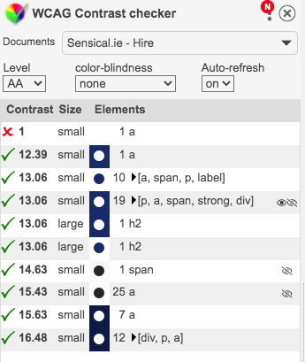 
_WCAG Validator Testing Screenshot_

The Hire page was passed through Lighthouse and returned the following performance results:

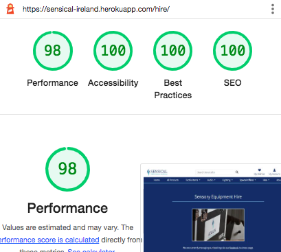 
_Desktop Lighthouse Performance Testing Screenshot_

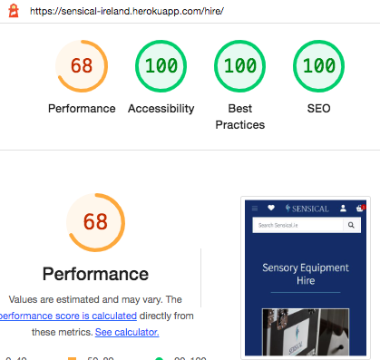 
_Mobile Lighthouse Performance Testing Screenshot_

 

 

Wishlist Page Testing
 

The HTML Templates associated with the Wishlist page are:

* base.html
* main-nav.html
* mobile-top-header.html
* wishlist.html
* footer.html

The Wishlist page was tested and was marked 'pass' when the following expected behaviour was produced.

* Base Template and Footer Links -- All links direct to the correct URL and external links open in new tabs.

* Products Link -- Users can return to products page from the Find More Products link.

* Add To Wishlist -- The User can add a product from the wishlist to the shopping basket.

* Remove From Wishlist -- The User can remove a product from the wishlist.

 

| Auth Status     | Products Links | Add to Basket | Remove From Wishlist |
|-----------------|----------------|---------------|----------------------|
| Admin           | yes/pass       | yes/pass      | yes/pass             |
| Registered User | yes/pass       | yes/pass      | yes/pass             |
| Anonymous User  | n/a            | n/a           | n/a                  |
 

Wishlist Page validator testing.

The Wishlist page was passed through the W3C HTML Validator and returned just one justifiable warning. (As referenced earlier)

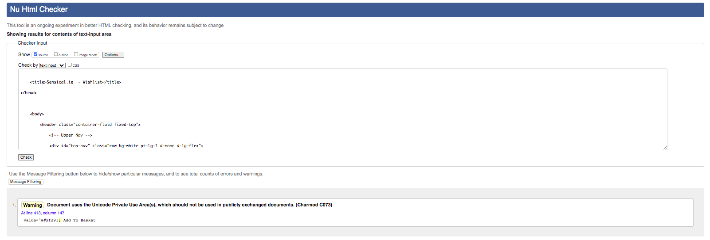 
_W3C HTML Validator Testing Screenshot_ 

 
The Wishlist page was passed through the WCAG Color contrast checker and returned no contrast errors. (The error seen in the supporting image is from a table row in the WCAG table itself)

 
_WCAG Validator Testing Screenshot_

The Wishlist page was passed through Lighthouse and returned the following performance results:

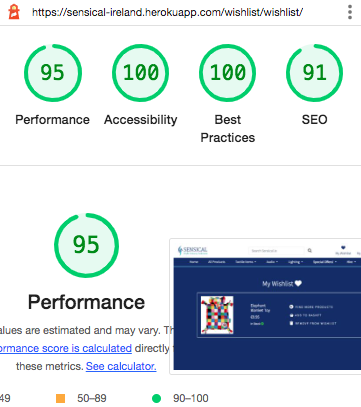 
_Desktop Lighthouse Performance Testing Screenshot_

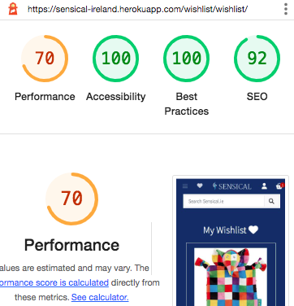 
_Mobile Lighthouse Performance Testing Screenshot_

 

 

Packages Pages Testing
 

The HTML Templates associated with the Packages page are:

* base.html
* main-nav.html
* mobile-top-header.html
* packages.html
* packages_form.html
* packages_confirm_delete.html
* package_request_form.html
* package_request_success.html
* custom_packages.html
* footer.html

In this section, I tested the main package page first and in the interest of brevity, I tested all the packages pages
and features running lighthouse in the local server.

The Packages page was tested and was marked 'pass' when the following expected behaviour was produced.

* Base Template and Footer Links -- All links direct to the correct URL and external links open in new tabs.

* About Link -- Users can go to the About page from the Packages Page.

* Facebook Link -- Users can visit the Facebook page to make a booking (opens in new tab)

* Request Package -- User can request a custom package.

* Add Package -- Admin can add a custom package via the add package link.

* View Custom Packages --  Admin Can View an remove Custom Packages from the custom package page.

 

| Auth Status     | About Link | Facebook Link | Request Package | Add Package | View/Delete Custom Packages |
|-----------------|------------|---------------|-----------------|-------------|-----------------------------|
| Admin           | yes/pass   | no/pass       | no/pass         | yes/pass    | yes/pass                    |
| Registered User | yes/pass   | yes/pass      | yes/pass        | no/pass     | no/pass                     |
| Anonymous User  | yes/pass   | yes/pass      | yes/pass        | no/pass     | no/pass                     |

Packages Page validator testing.

The Packages page was passed through the W3C HTML Validator and returned no errors.

 
_W3C HTML Validator Testing Screenshot_ 

 
The Packages page  page was passed through the WCAG Color contrast checker and returned no contrast errors. (The error seen in the supporting image is from a table row in the WCAG table itself)

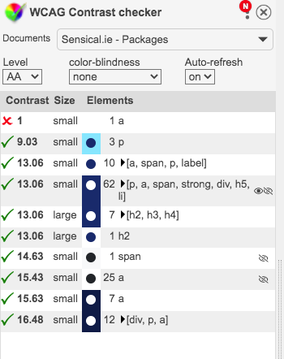 
_WCAG Validator Testing Screenshot_

The Packages page was passed through Lighthouse and returned the following performance results:

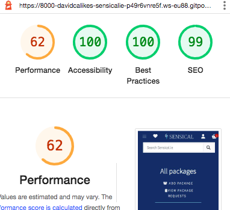 
_Desktop Lighthouse Performance Testing Screenshot_

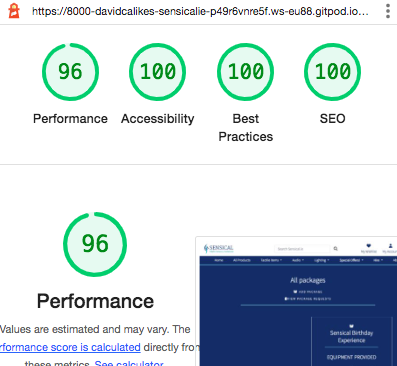 
_Mobile Lighthouse Performance Testing Screenshot_

The Custom Packages Page was also tested...

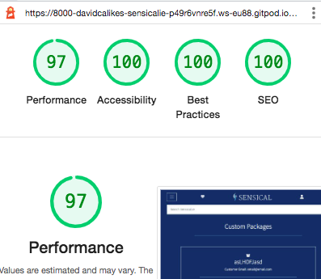 
_Desktop Lighthouse Performance Testing Screenshot_

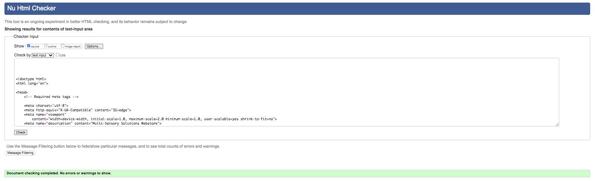 
_W3C HTML Validator Testing Screenshot_ 

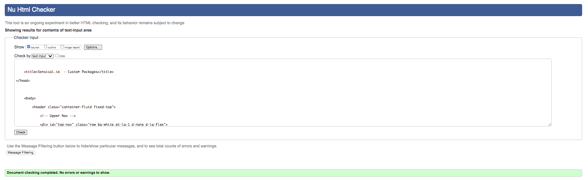 
_W3C HTML Validator Testing Screenshot_ 

 
_W3C HTML Validator Testing Screenshot_ 

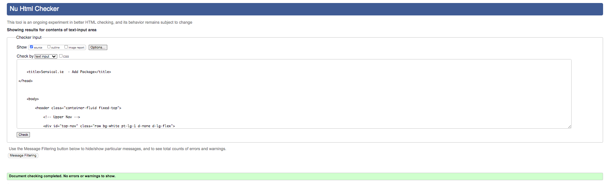 
_W3C HTML Validator Testing Screenshot_ 

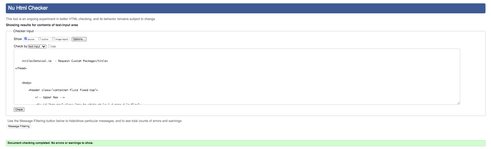 
_W3C HTML Validator Testing Screenshot_ 
 

 

Testimonials Pages Testing
 

The HTML Templates associated with the testimonials page are:

* base.html
* main-nav.html
* mobile-top-header.html
* testimonials.html
* testimonials_form.html
* clienttestimonial_confirm_delete.html
* footer.html

In this section, I tested the main Testimonials page first and in the interest of brevity, I tested it and the other templates
and features running lighthouse in the local server.

The Testimonials page was tested and was marked 'pass' when the following expected behaviour was produced.

* Base Template and Footer Links -- All links direct to the correct URL and external links open in new tabs.

* Facebook Links -- The User can access the Facebook Page to make an enquiry.

* About Page -- The User can go to the about page via the link provided.

* Add/Update Testimonial -- Admin user can add, update and delete a testimonial.

* Messages -- User is notified when an action is submitted.

 

| Auth Status     | About Link | Facebook Link | Add Testimonial | Update/Delete Testimonial |
|-----------------|------------|---------------|-----------------|---------------------------|
| Admin           | yes/pass   | no/pass       | yes/pass        | yes/pass                  |
| Registered User | yes/pass   | yes/pass      | no/pass         | no/pass                   |
| Anonymous User  | yes/pass   | yes/pass      | no/pass         | no/pass                   |
 

Testimonials page validator testing.

The Testimonials page was passed through the W3C HTML Validator and returned no errors

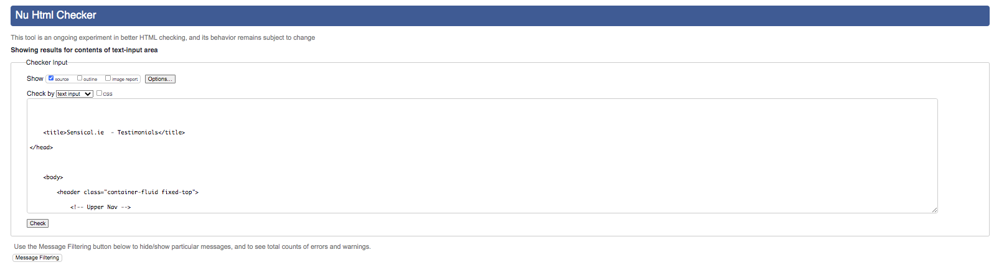 
_W3C HTML Validator Testing Screenshot_ 

 
The Testimonials page was passed through the WCAG Color contrast checker and returned no contrast errors. (The error seen in the supporting image is from a table row in the WCAG table itself)

 
_WCAG Validator Testing Screenshot_

The Testimonials page was passed through Lighthouse and returned the following performance results:

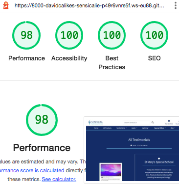 
_Desktop Lighthouse Performance Testing Screenshot_

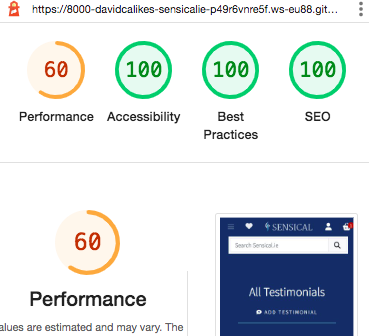 
_Mobile Lighthouse Performance Testing Screenshot_

Other Testimonials Templates

 
_W3C HTML Validator Testing Screenshot_ 

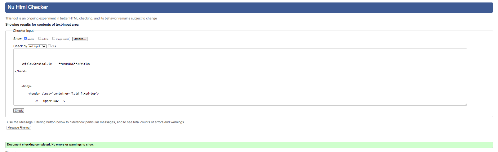 
_W3C HTML Validator Testing Screenshot_

The Form Page was also tested in lighthouse.

 
_Desktop Lighthouse Performance Testing Screenshot_

 

 

About Page Testing
 

The HTML Templates associated with the About page are:

* base.html
* main-nav.html
* mobile-top-header.html
* about.html
* footer.html

The About page was tested and was marked 'pass' when the following expected behaviour was produced.

* Base Template and Footer Links -- All links direct to the correct URL and external links open in new tabs.

* Contact Links -- The User can access the contact links banner, each link functions and opens in a new tab. (Where relevant)

* Testimonials Carousel -- The User operate the Testimonials Carousel using the arrow buttons provided

* View All Testimonials -- User can access the testimonials page from the link provided.

 

| Auth Status     | Contact Links | Carousel | Access Testimonials |
|-----------------|---------------|----------|---------------------|
| Admin           | yes/pass      | yes/pass | yes/pass            |
| Registered User | yes/pass      | yes/pass | yes/pass            |
| Anonymous User  | yes/pass      | yes/pass | yes/pass            |
 

About page validator testing.

The About page was passed through the W3C HTML Validator and returned no errors

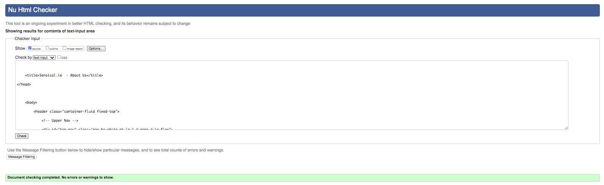 
_W3C HTML Validator Testing Screenshot_ 

 
The About page was passed through the WCAG Color contrast checker and returned some errors. The first two errors seen in the supporting image is from a table row in the WCAG table itself so could be safely ignored. I also ignored the third issue as the WCAG software thought the grey of the Carousel indicator was not visible against the background. having cycled through the images of the feature, I concluded that there are no contrast issues whatsoever and the background carousel images have good contrast with the slide indicator. 

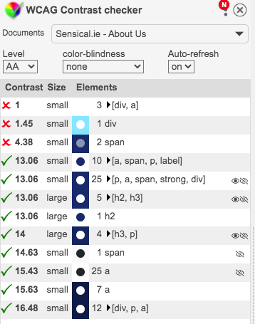 
_WCAG Validator Testing Screenshot_

The About page was passed through Lighthouse and returned the following performance results:

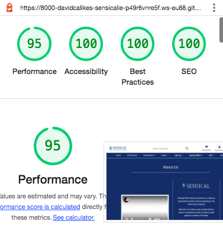 
_Desktop Lighthouse Performance Testing Screenshot_

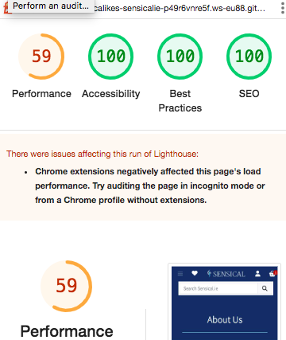 
_Mobile Lighthouse Performance Testing Screenshot_

 

 

Profile Page Testing
 

The HTML Templates associated with the Profile page are:

* base.html
* main-nav.html
* mobile-top-header.html
* profile.html
* footer.html

The Profile page was tested and was marked 'pass' when the following expected behaviour was produced.

* Base Template and Footer Links -- All links direct to the correct URL and external links open in new tabs.

* Delivery Details Accordion -- The user can access their stored delivery details.

* Order History Accordion -- The user can access their order history.

* Products link -- User can access the products page from the link provided.

 

| Auth Status     | Delivery Accordion | Order History | Products Link |
|-----------------|--------------------|---------------|---------------|
| Admin           | yes/pass           | yes/pass      | yes/pass      |
| Registered User | yes/pass           | yes/pass      | yes/pass      |
| Anonymous User  | no/pass            | no/pass       | no/pass       |
 

Profile page validator testing.

The Profile page was passed through the W3C HTML Validator and returned no errors

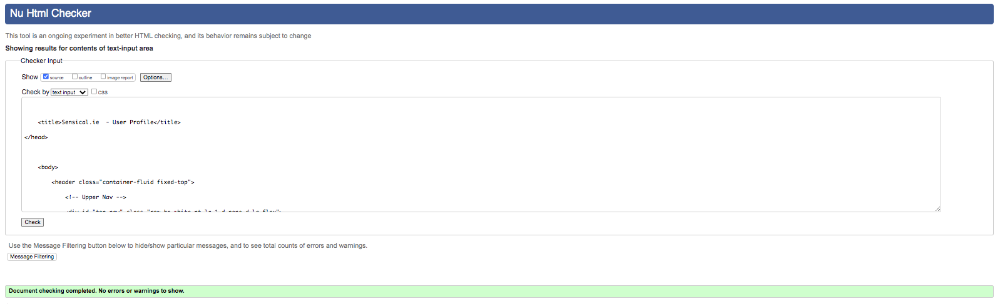 
_W3C HTML Validator Testing Screenshot_ 

 
The Profile page was passed through the WCAG Color contrast checker and returned no contrast errors. (The error seen in the supporting image is from a table row in the WCAG table itself)

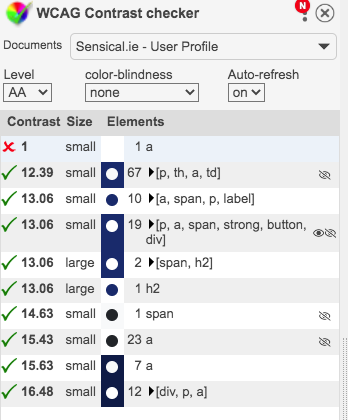 
_WCAG Validator Testing Screenshot_

The About page was passed through Lighthouse and returned the following performance results:

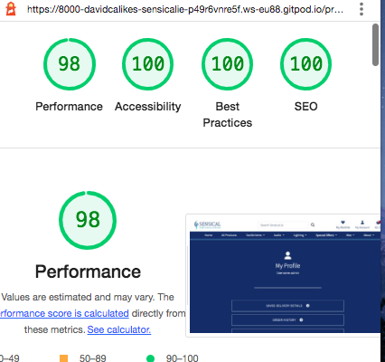 
_Desktop Lighthouse Performance Testing Screenshot_

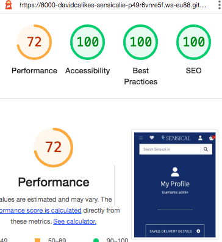 
_Mobile Lighthouse Performance Testing Screenshot_

 

 

Other Templates
 

The Remaining Templates I Tested Are:

(Allauth Templates)

* login.html
* logout.html
* signup.html

Screenshots from allauth templates:

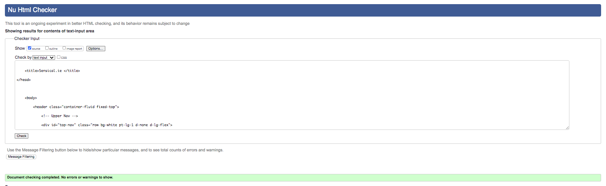 
_W3C HTML Validator Testing Screenshot_ 

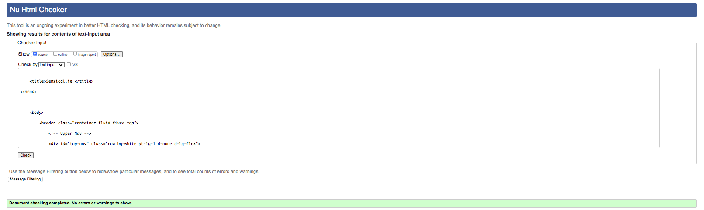 
_W3C HTML Validator Testing Screenshot_ 

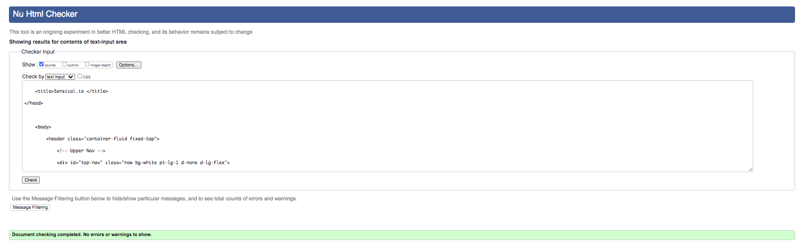 
_W3C HTML Validator Testing Screenshot_ 

Error Page Templates

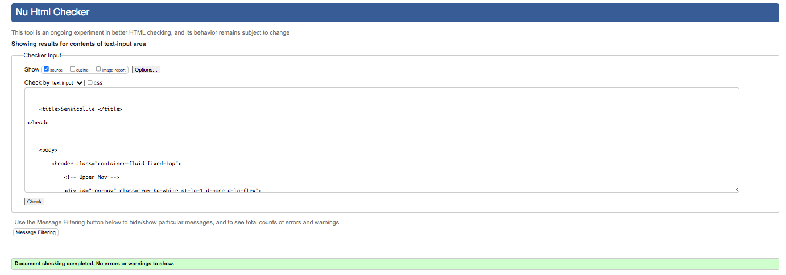 
_W3C HTML Validator Testing Screenshot_ 

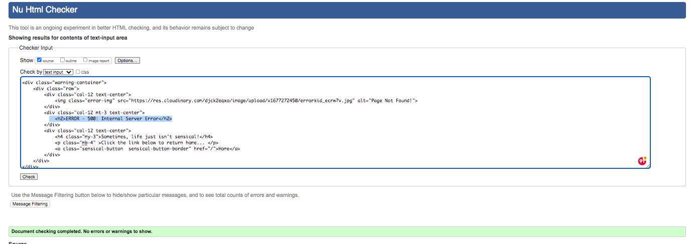 
_W3C HTML Validator Testing Screenshot_ 

 

# Jigsaw CSS Validation

The 6 CSS stylesheets were passed through the Jigsaw Validator by direct input and returned no errors.

 
_W3C Jigsaw about.css Validator Testing Screenshot_ 

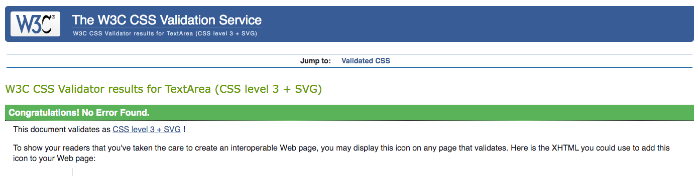 
_W3C Jigsaw checkout.css Validator Testing Screenshot_ 

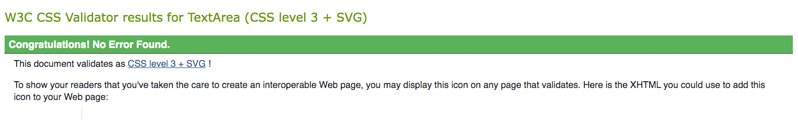 
_W3C Jigsaw packages.css Validator Testing Screenshot_ 

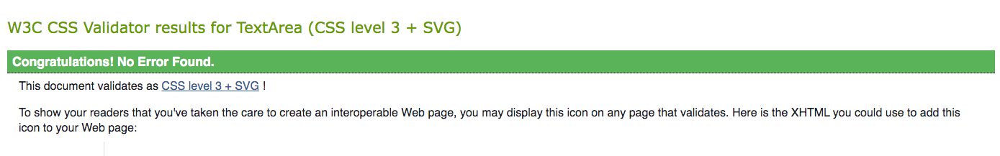 
_W3C Jigsaw profile.css Validator Testing Screenshot_ 

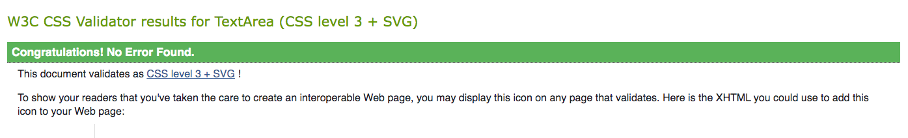 
_W3C Jigsaw base.css Validator Testing Screenshot_ 

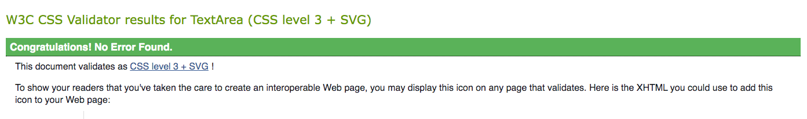 
_W3C Jigsaw testimonials.css Validator Testing Screenshot_ 

JShint JavaScript Testing

The stripe_elements.js JavaScript file was tested with JShint and returned non-critical errors.

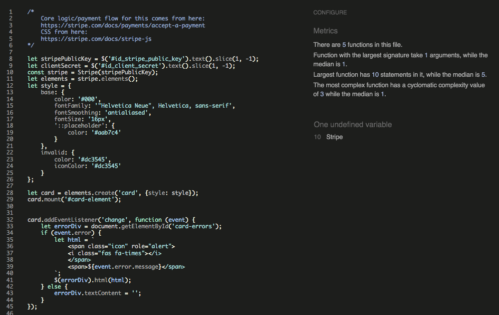 
_JShint Validator Testing Screenshot_ 

The stripe_elements.js file returns an undefined variable error that cannot be changed due to it belonging to the external Stripe API.

This was not a critical warning so I felt it could be safely ignored.

There were no other errors with this script.

 

The sort_selector script in the products.html page was tested and returns no errors.
 
_JShint Validator Testing Screenshot_ 

 

The availability toggle script in the products.html page was tested and returns no errors if the function called
from the dom is handled using the 'exported' directive at the top of the linter.

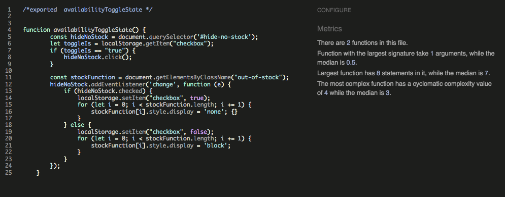 
_JShint Validator Testing Screenshot_ 

 

The mailchimp script in the base.html page also returns errors that cannot be changed due to it belonging to the external API.

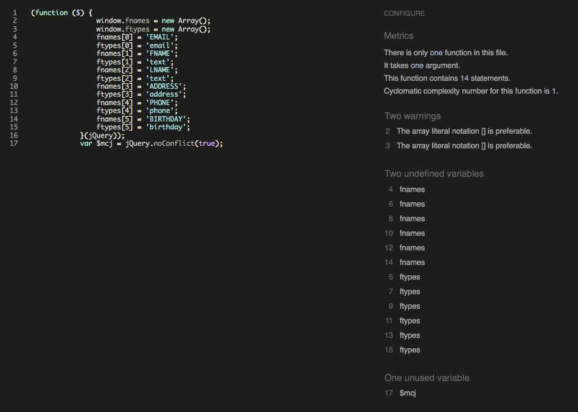 
_JShint Validator Testing Screenshot_ 

The errors were not critical warnings so I felt they could be safely ignored.

 

# Flake8 Python Validation

I validated the Python codebase using the command "python3 -m flake8" from the Gitpod terminal to run the python linter.  

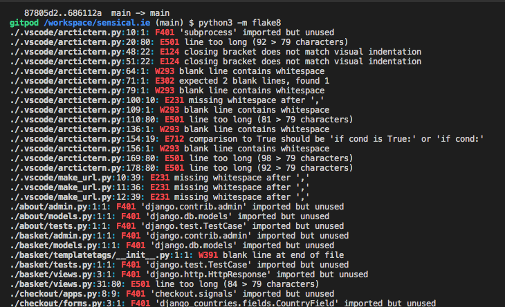 
_Flake8 Validator Testing Screenshot_

There were lots of errors and warnings initially.

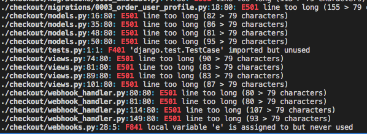 
_Flake8 Validator Testing Screenshot_

Most of the errors were "line too long" or whitespace errors". I corrected all of these errors in the 
Sensical.ie code, however some remained embedded in migration files and Django settings etc.

 
_Flake8 Validator Testing Screenshot_

There are 6 "line too long" errors in the settings.py file that are a known issue with Django.

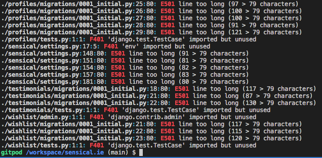 
_Flake8 Validator Testing Screenshot_

Some other import errors also remain but I left these as they were automatically created by Django.

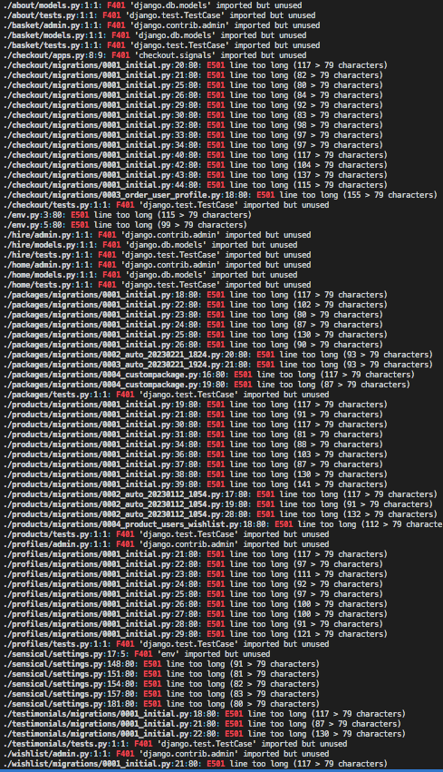 
_Flake8 Validator Testing Screenshot_

The final image shows the code is free of any warnings or errors from the code I created.

 

# Practical Testing

Every Function of Sensical.ie was tested for practical use across multiple devices.

### Mobile Testing -- Huawei P20 Pro (Android):

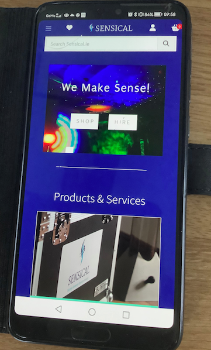 
_Mobile Testing Screenshot_

 

### Admin user tests:
 

 

* All pages displayed correctly with all information available to the user.

* All downloads links were tested and function correctly.

* Admin user can login and out successfully on mobile.

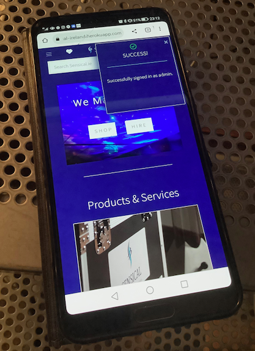 
_Mobile Testing Screenshot_

* Admin user can access the home, products, product detail, wishlist, product management, user profile, 
about, hire, testimonial, basket and checkout pages.

* Admin user can add and remove items from their wishlist. 

* Admin user can manage products and testimonials with full CRUD functionality. They can also view and delete package requests.

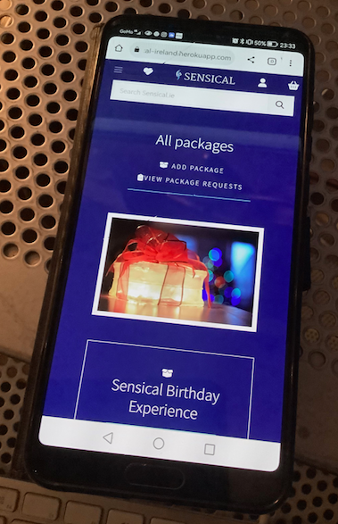 
_Mobile Testing Screenshot_

* Admin users can make purchases and save their delivery information to their user profile.

 

### Unregistered user tests:
 

* All pages displayed correctly with all information available to the user.

* All downloads links were tested and function correctly.

* Unregistered user can register, then login and out successfully on mobile.

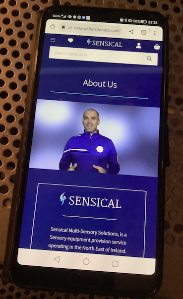 
_Mobile Testing Screenshot_

* Unregistered user can access the home, products, product detail, 
about, hire, testimonial, basket and checkout pages.

* Unregistered user cannot access the wishlist. 

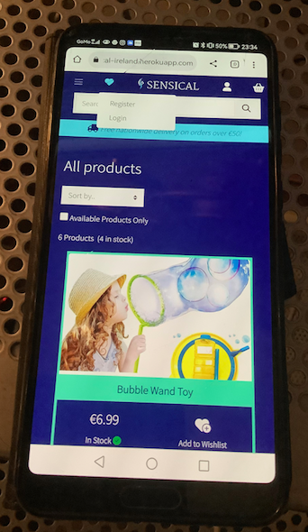 
_Mobile Testing Screenshot_

* Unregistered user can make package requests. 

* Unregistered users can make purchases.

 

### Authenticated user tests:
 

* All pages displayed correctly with all information available to the user.

* All downloads links were tested and function correctly.

* Authenticated user can login and out successfully on mobile.

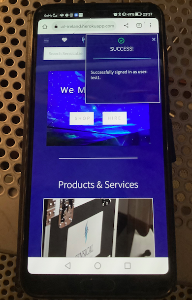 
_Mobile Testing Screenshot_

* Authenticated user can access the home, products, product detail, wishlist, user profile, 
about, hire, testimonial, basket and checkout pages.

* Authenticated user can add and remove items from their wishlist. 

* Authenticated user can make package requests. 

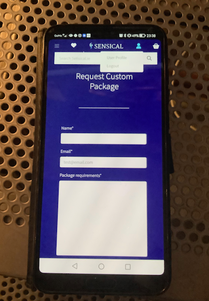 
_Mobile Testing Screenshot_

* Authenticated users can make purchases and save their delivery information to their user profile.

 

### Tablet Testing -- Ipad Mini 5 (IOS):

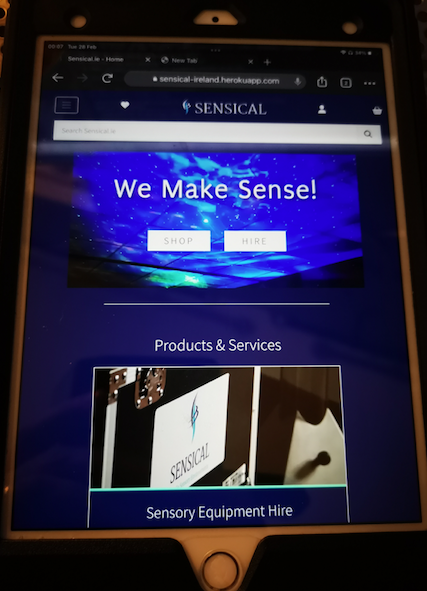 
_Tablet Testing Screenshot_

 

### Admin user tests:
 

* All pages displayed correctly with all information available to the user.

* All downloads links were tested and function correctly.

* Admin user can login and out successfully on tablet.

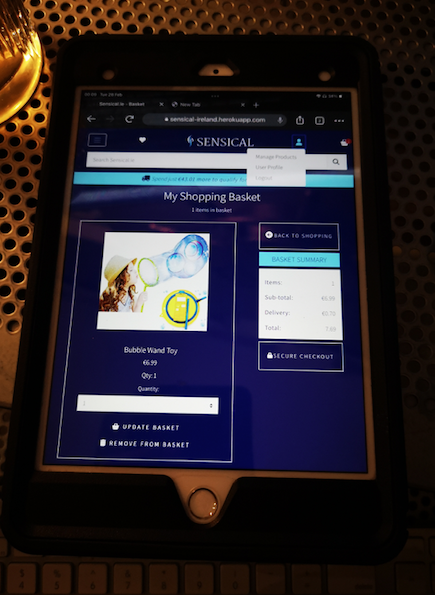 
_Tablet Testing Screenshot_

* Admin user can access the home, products, product detail, wishlist, product management, user profile, 
about, hire, testimonial, basket and checkout pages.

* Admin user can add and remove items from their wishlist. 

* Admin user can manage products and testimonials with full CRUD functionality. They can also view and delete package requests.

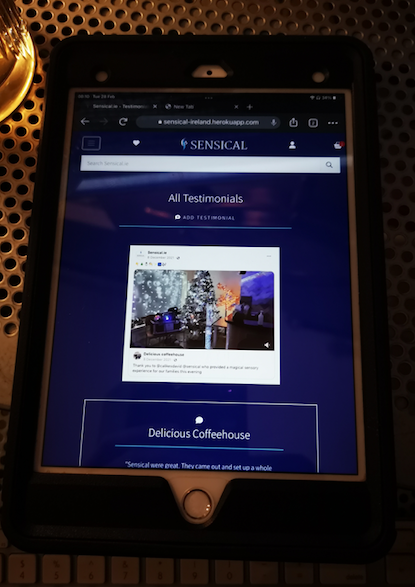 
_Tablet Testing Screenshot_

* Admin users can make purchases and save their delivery information to their user profile.

 

### Unregistered user tests:
 

* All pages displayed correctly with all information available to the user.

* All downloads links were tested and function correctly.

* Unregistered user can register, then login and out successfully on tablet.

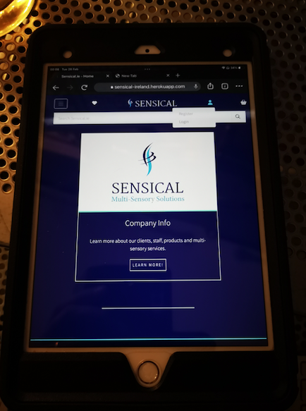 
_Tablet Testing Screenshot_

* Unregistered user can access the home, products, product detail, 
about, hire, testimonial, basket and checkout pages.

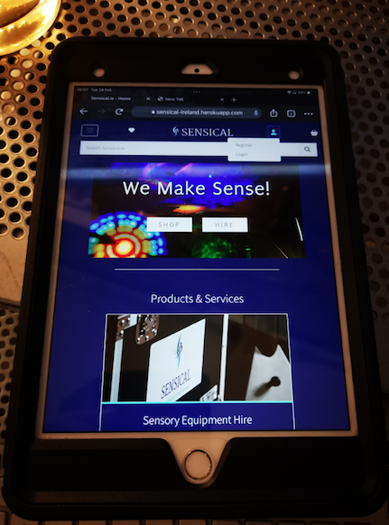 
_Tablet Testing Screenshot_

* Unregistered user cannot access the wishlist. 

* Unregistered user can make package requests.

* Unregistered users can make purchases.

 

### Authenticated user tests:
 

* All pages displayed correctly with all information available to the user.

* All downloads links were tested and function correctly.

* Authenticated user can login and out successfully on tablet.

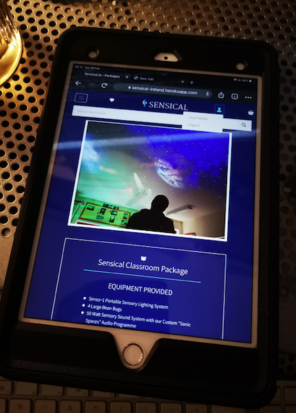 
_Tablet Testing Screenshot_

* Authenticated user can access the home, products, product detail, wishlist, user profile, 
about, hire, testimonial, basket and checkout pages.

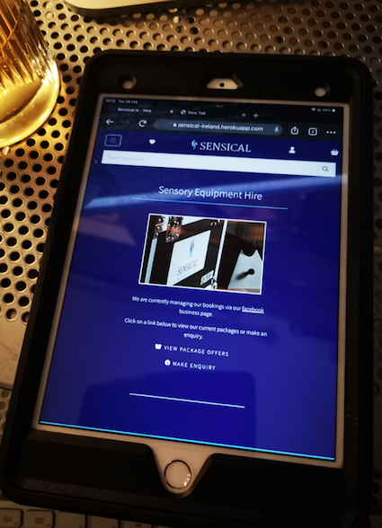 
_Tablet Testing Screenshot_

* Authenticated user can add and remove items from their wishlist. 

* Authenticated user can make package requests. 

* Authenticated users can make purchases and save their delivery information to their user profile.

 

### Desktop Testing -- Macbook Pro & HP Deskpro (OSX & Windows 10):

 
_Desktop Testing Screenshot_

 

### Admin user tests:
 

* All pages displayed correctly with all information available to the user.

* All downloads links were tested and function correctly.

* Admin user can login and out successfully on mobile.

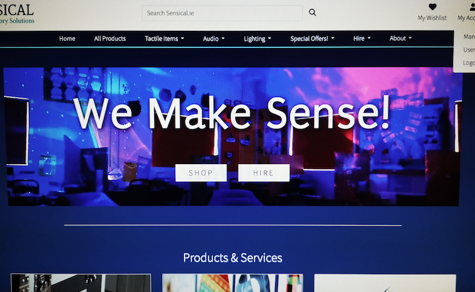 
_Desktop Testing Screenshot_

* Admin user can access the home, products, product detail, wishlist, product management, user profile, 
about, hire, testimonial, basket and checkout pages.

* Admin user can add and remove items from their wishlist. 

* Admin user can manage products and testimonials with full CRUD functionality. They can also view and delete package requests. 

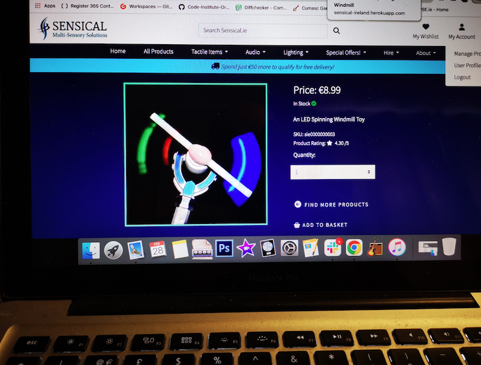 
_Desktop Testing Screenshot_

* Admin users can make purchases and save their delivery information to their user profile.

 

### Unregistered user tests:
 

* All pages displayed correctly with all information available to the user.

* All downloads links were tested and function correctly.

* Unregistered user can register, then login and out successfully on mobile.

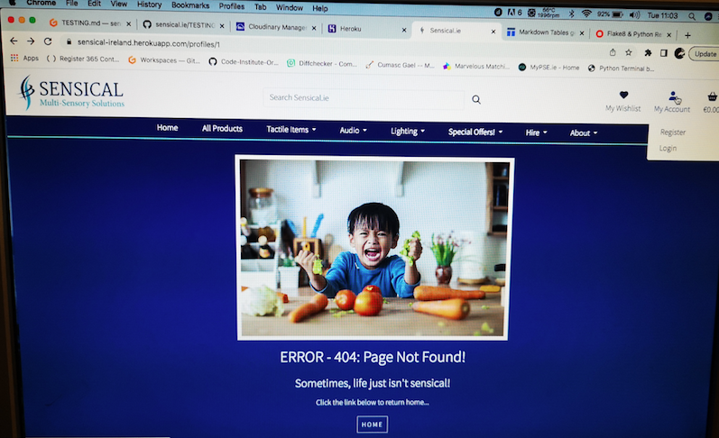 
_Desktop Testing Screenshot_

* Unregistered user can access the home, products, product detail, 
about, hire, testimonial, basket and checkout pages.

* Unregistered user cannot access the wishlist.

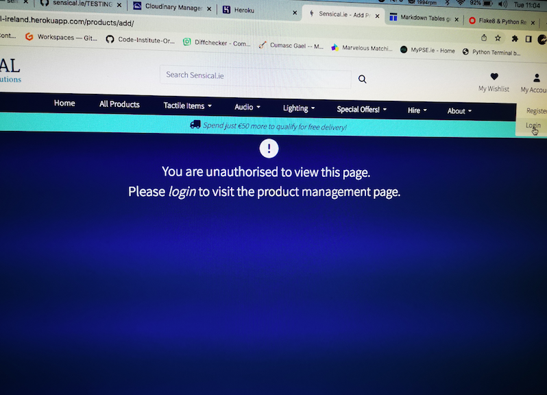 
_Desktop Testing Screenshot_

* Unregistered user can make package requests. 

* Unregistered users can make purchases.

 

### Authenticated user tests:
 

* All pages displayed correctly with all information available to the user.

* All downloads links were tested and function correctly.

* Authenticated user can login and out successfully on mobile.

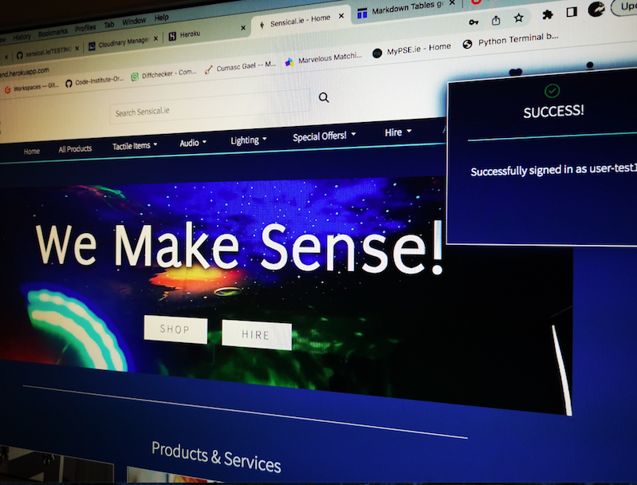 
_Desktop Testing Screenshot_

* Authenticated user can access the home, products, product detail, wishlist, user profile, 
about, hire, testimonial, basket and checkout pages.

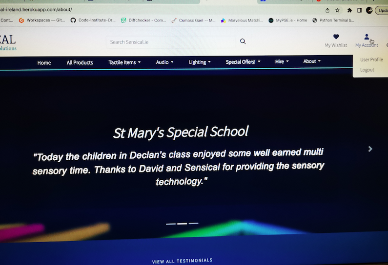 
_Desktop Testing Screenshot_

* Authenticated user can add and remove items from their wishlist. 

* Authenticated user can make package requests. 

* Authenticated users can make purchases and save their delivery information to their user profile.

## Responsivity Testing

In addition to testing the site accross multiple physical devices, I also tested the responsivity of the
site using Google Developer tools. I set the minimum acceptable width to 300px.

The site responded well during the initial testing although there were some small issues that required attention to 
improve the user experience.

### Issue caused by SEO optimisation.

 
_Responsivness Testing Screenshot_

By updating the text from 'hire' to 'sensory equipment hire' to improve Search Engine Optimisation,
an error occurred where the height of the first card would expand to accomodate the extra text. 

 
_Responsivness Testing Screenshot_

Obviously there was more than one way to fix this issue, but I felt that the 'Equipment' part of the title wasn't
actually required and due to the fairly unique concept of the business 'sensory hire' would be a sufficient title in this case
and solve the problem.

 

I also noticed the mobile dropdown menu extended to the edge of the page on one side.

 
_Responsivness Testing Screenshot_

I corrected this by overiding the default bootstrap class.

 
_Responsivness Testing Screenshot_

 

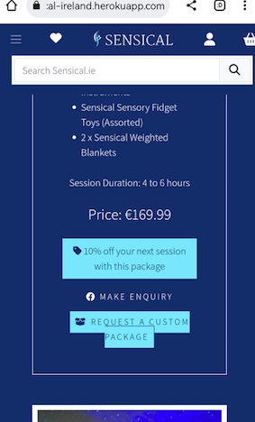 
_Responsivness Testing Screenshot_

There was another error when the test from the request a package would wrap inside the container.
I corrected this by expanding the container width and adding a media query style rule to the element.

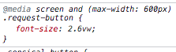 
_Responsivness Testing Screenshot_

# Bugs

I found some minor bugs in the about page iframe were the Youtube video wouldn't render the controls section properly on android mobile devices.

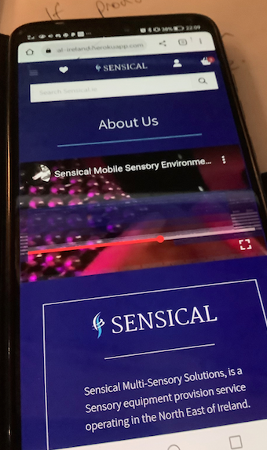 
_Bugs Testing Screenshot_

I searched google and stack overflow for posts on how to solve this issue but none were forthcoming. The problem seems to have corrected itself, and now displays correctly accross all screen widths.

 

Another problem with the about page iFrame was the volume control on the video would disappear on the smallest screen widths. 

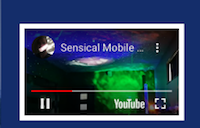 
_Bugs Testing Screenshot_

The solution to this issue was rather more complex. If I expanded the container width and removed all padding, it would negatively impact the rest of the elements in the container. Instead I added a set of style rules to a media query that hides the display of the original iframe and replaces it with another outside of the container. I felt this was a practical comprimise given time constraints and the importance of accessibility for all users.

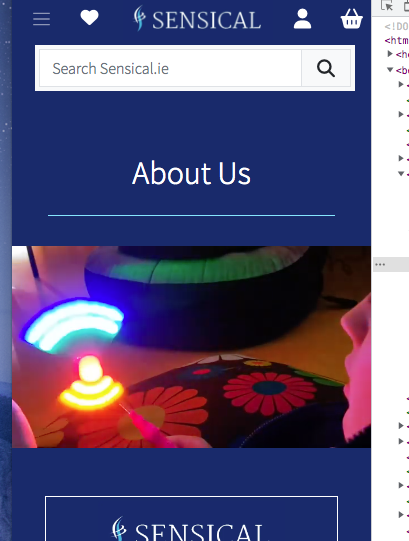 
_Bugs Testing Screenshot_

To complete the hat-trick of video related bugs, another issue I noticed was the Youtube video does not automatically load on mobile devices. This is a known issue with using an iFrame and a possible solution to this might be to use a standard video element in the future.

Outstanding Bugs

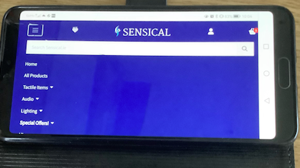 
_Bugs Testing Screenshot_

The site does not work on mobile devices in landscape mode. This is because the nav menu extends beyond the bottom edge of the screen due to the significantly reduced 
screen height. I have not yet found a solution to this problem but I will continue to look for ways to solve the problem in future releases

 

Return to main [README](https://github.com/davidcalikes/sensical.ie#testing) document.

